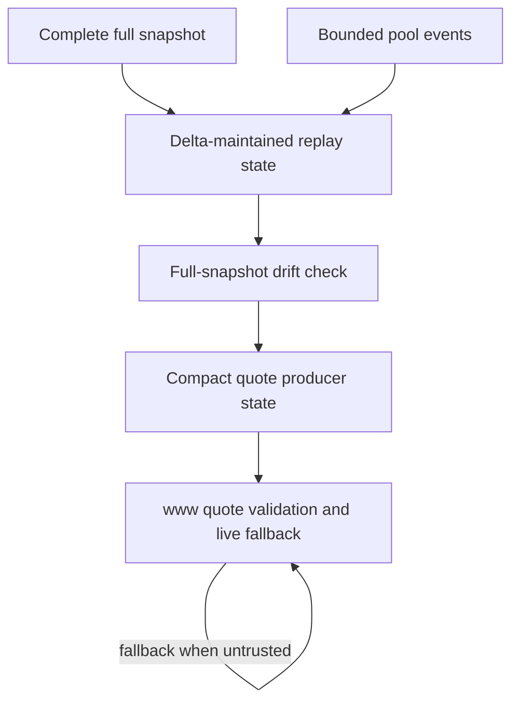

# FAME Delta CL Replay Index Requirements

## Summary

Build a delta-maintained CL replay index for the existing reviewed replay pools. Full snapshots remain the seed, checkpoint, and repair mechanism; normal trusted maintenance is earned through bounded event replay, drift checks, and explicit fallback-safe producer state.

Project identity note: `www` refers to the GitHub project `fame-lady-society/www`. On this machine, that companion checkout is cloned as `../fls-www`, not `../www`.

---

## Problem Frame

The FAME indexed quote path has already proven that complete `cl-replay-v1` snapshots can support compact CL quote rows while preserving `www` live fallback. The next pain is operational: a full replay snapshot is expensive because it reads block identity, head state, dynamic fee, bitmap words, and initialized ticks for every reviewed replay pool.

The current replay pool set is intentionally small, but the steady-state maintenance model still rereads full replay state on each indexer wake. That makes provider pressure scale with snapshot size instead of actual pool activity. The prior snapshot-first proof remains valuable as an audit tool, but it should not be the only model for keeping replay state fresh.

---

## Actors

- A1. `society-bots` pool-state indexer: Maintains reviewed indexed state and publishes producer evidence.
- A2. `society-bots` pool-state API: Serves compact quote rows and replay-state diagnostics to server-side callers.
- A3. `www` quote system: Validates producer output, keeps route and quote authority, and falls back live when indexed output is untrusted.
- A4. Operator/reviewer: Uses logs, smoke output, parity, and cost evidence to decide whether the delta lane is healthy.
- A5. Base RPC provider: Supplies block, log, and checkpoint reads whose volume and reliability shape the rollout.

---

## Key Flows

- F1. Delta state advances
  - **Trigger:** The pool-state indexer reaches a new safe Base block.
  - **Actors:** A1, A5
  - **Steps:** The indexer starts from a complete replay state, scans a bounded event range for the reviewed replay pools, applies supported CL events in chain order, records the resulting maintenance state, and advances the cursor only after the range is complete.
  - **Outcome:** Each reviewed replay pool has either fresh delta-maintained replay state or an explicit untrusted maintenance status.
  - **Covered by:** R1, R2, R3, R4, R5, R6

- F2. Drift is checked and repaired
  - **Trigger:** A scheduled checkpoint, an operator action, or a maintenance anomaly requires a full-state comparison.
  - **Actors:** A1, A4, A5
  - **Steps:** The system captures a complete full snapshot, compares it with the delta-maintained state at a comparable block, marks drift-clean state trusted, and marks mismatched state untrusted until repair reseeds it from a complete checkpoint.
  - **Outcome:** Full snapshots remain the source of audit confidence without being the ordinary maintenance algorithm.
  - **Covered by:** R7, R8, R9, R10

- F3. Compact CL quotes are consumed safely
  - **Trigger:** `www` requests compact quote rows for a route that can use a reviewed replay pool.
  - **Actors:** A2, A3
  - **Steps:** The API returns quoted rows only when replay state is fresh, complete, and drift-clean. Otherwise it returns typed unavailable evidence, and `www` keeps using live quote paths.
  - **Outcome:** User-facing quote correctness stays boring while reducer health becomes visible to operators.
  - **Covered by:** R11, R12, R13, R14

- F4. Rollout evidence is reviewed
  - **Trigger:** The delta lane is ready for promotion from shadow or operator review.
  - **Actors:** A1, A3, A4
  - **Steps:** The reviewer checks provider-read counts, event ranges, changed event counts, drift results, compact quote usage, fallback counts, parity evidence, and cost trajectory before trusting the lane.
  - **Outcome:** The feature is accepted only when it proves both correctness and reduced steady-state provider pressure.
  - **Covered by:** R15, R16, R17

---

## Requirements

**Scope and authority**

- R1. The delta lane must cover the existing reviewed `cl-replay-v1` replay pool set only; adding more CL pools is out of scope for this feature.
- R2. `society-bots` must remain the producer of replay state, maintenance provenance, and compact quote rows; `www` must remain responsible for route validation, quote safety, and live fallback.
- R3. Full replay snapshots must remain valid seed, checkpoint, and repair artifacts, but the feature must not depend on full snapshots as the normal trusted maintenance algorithm.

**Delta maintenance**

- R4. Delta maintenance must start only from complete replay state for the pool being maintained.
- R5. A normal maintenance pass must scan bounded pool-event ranges from the last trusted cursor to the safe block and apply supported CL deltas in deterministic chain order.
- R6. The maintenance cursor must advance only after the whole scanned range has been applied and the resulting replay state is complete enough for quote validation.
- R7. Event gaps, ambiguous block identity, unsupported replay-affecting events, range-limit failures, or inconsistent reducer output must make the replay state untrusted rather than fresh.

**Drift and repair**

- R8. Full snapshots must be usable as low-cadence drift checkpoints for delta-maintained state.
- R9. Drift checks must fail closed: mismatched state is not eligible for compact CL quote rows until a complete repair reseeds trusted state.
- R10. Maintenance state must distinguish at least trusted, warming, drift-failed, repairing, and event-gap conditions in a way operators and `www` diagnostics can understand.

**Quote consumption and fallback**

- R11. `/fame/pool-quotes` may return compact CL quoted rows only when the underlying replay state is fresh, complete, cursor-current, and drift-clean.
- R12. When replay state is warming, stale, drift-failed, repairing, event-gapped, malformed, outside range, or otherwise untrusted, the API must return unavailable quote evidence rather than a best-effort CL quote.
- R13. `www` must continue to fall back live whenever compact CL quote rows are unavailable, mismatched, stale, invalid, slow, or producer-untrusted.
- R14. Raw replay payloads must stay off the normal hot quote path; they remain useful for proof, parity, and diagnostics rather than ordinary quote traffic.

**Evidence and rollout**

- R15. Promotion evidence must show correctness signals: drift-check result, replay parity or equivalent quote-validation proof, compact quote used count, fallback count, and unavailable reasons.
- R16. Promotion evidence must show provider-pressure signals: full snapshot count, provider read count, scanned block ranges, event counts, applied delta counts, and an estimated steady-state cost trajectory.
- R17. Documentation and release evidence must make the claim precise: the feature proves cheaper trusted steady-state replay maintenance, not emergency spend stoppage, broad CL expansion, or a new quote authority boundary.

---

## Acceptance Examples

- AE1. **Covers R4, R5, R6.** Given a reviewed replay pool with complete seed state and a bounded event range, when the indexer applies every supported event in order, it publishes fresh trusted maintenance state and advances the cursor.
- AE2. **Covers R7, R12, R13.** Given the indexer detects an event gap or unsupported replay-affecting event, when compact quotes are requested, the producer returns unavailable evidence and `www` falls back live.
- AE3. **Covers R8, R9, R10.** Given a full checkpoint state does not match the delta-maintained state, when drift is evaluated, the pool becomes drift-failed and stays ineligible for compact CL quoted rows until repaired from a complete checkpoint.
- AE4. **Covers R11, R14.** Given delta-maintained state is fresh and drift-clean, when `/fame/pool-quotes` serves a CL quote, the row is compact and does not include raw bitmap words or initialized tick arrays.
- AE5. **Covers R15, R16, R17.** Given the feature is ready for review, when an operator reads the promotion evidence, they can see both quote correctness proof and reduced steady-state provider-read pressure.

---

## Success Criteria

- The existing reviewed replay pools can be maintained from complete seed state by applying bounded event deltas instead of relying on full replay snapshots as the ordinary trusted maintenance algorithm.
- Compact CL quote rows remain available only when replay maintenance is fresh, complete, and drift-clean; all untrusted states preserve live fallback.
- Operators can distinguish reducer health states without reading raw replay payloads or CloudWatch-only details.
- Promotion evidence demonstrates both quote correctness and materially lower steady-state provider pressure than repeated full snapshots.
- Planning can proceed without re-deciding pool scope, quote authority, fallback behavior, drift-check policy, or whether an immediate cadence brake is part of this feature.

---

## Scope Boundaries

- No emergency full-snapshot cadence brake, schedule change, or immediate spend-stop requirement.
- No broad CL replay expansion beyond the current reviewed replay pool set.
- No public historical liquidity API, analytics store, or indefinite delta journal.
- No migration of quote authority from `www` into raw indexed replay state.
- No raw replay payloads on the normal compact quote path.
- No WebSocket or pending-log ingestion requirement for this slice.
- No external dedicated indexer service unless planning proves the existing Lambda/table shape cannot safely support the reducer.

---

## Key Decisions

- Reducer-only scope: The requirements focus on delta maintenance and exclude the immediate cadence brake the ideation considered.
- Checkpoint plus reducer: Full snapshots are retained because they are the strongest existing audit and repair artifact.
- Fail closed: Incorrect or uncertain reducer state is more dangerous than unavailable indexed quotes because `www` already has live fallback.
- Current-pool scope: The feature should prove the maintenance model on the reviewed replay set before adding more CL pools.
- Cost is an acceptance gate: Reduced provider pressure is part of success, not a nice-to-have observability metric.

---

## Dependencies / Assumptions

- Existing full `cl-replay-v1` snapshots are complete enough to seed and repair the reducer.
- The current reviewed replay pool set remains the intended first delta scope.
- Base log reads can be bounded and retried by planning choices without weakening fail-closed behavior.
- The relevant CL event streams expose enough ordered data to update replay state for the supported venues.
- `www` compact quote diagnostics and live fallback behavior remain available during rollout.

---

## Outstanding Questions

### Deferred to Planning

- [Affects R5, R7][Needs research] What bounded log-range size and safe-block policy should the reducer use for Base RPC reliability?
- [Affects R5, R7][Needs research] Which exact venue-specific events affect replay state for Slipstream and Uniswap V3, including dynamic fee behavior?
- [Affects R8, R9][Technical] How should planning orchestrate comparable-block drift checks without making the full snapshot path the normal hot maintenance loop again?
- [Affects R10, R12][Technical] What is the smallest maintenance-state vocabulary that gives operators useful diagnosis without creating noisy reason-code sprawl?
- [Affects R15, R16][Technical] What command or smoke artifact should collect before/after provider-read and quote-usage evidence for promotion?
