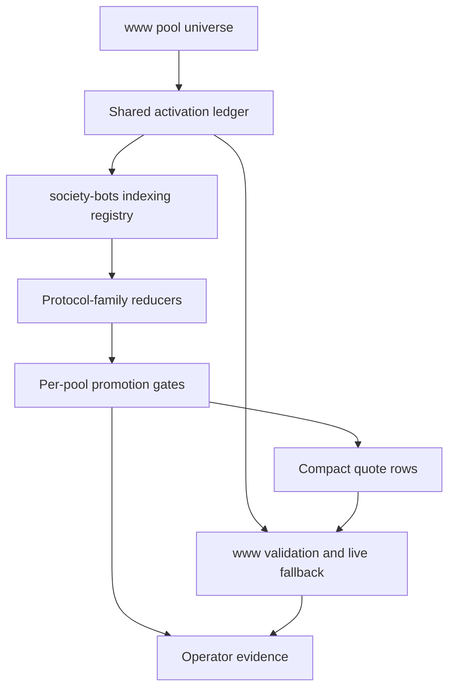

# FAME Supported Pool Activation Bundle Requirements

## Summary

Build a repeatable activation lane for the FAME pool universe from `www`: every pool gets an explicit activation status, producer and consumer compact-quote contracts stay aligned, and CL reducer support is promoted only through evidence gates. The v1 proof promotes one additional supported CL pool through compact quote serving while preserving `www` route authority and live fallback.

---

## Problem Frame

Reserve constant-product pools can already be indexed and quoted through compact rows, and the CL quote path has proven that reduced indexed quotes can work for selected replay-backed CL pools. The next problem is broader than adding one more allowlist entry: the FAME pool universe in `www` is larger than the local producer registry, pool support status is split across repos, and CL quote expansion depends on producer trust states that the consumer must parse and handle safely.

"All supported pools" should mean every upstream pool is accounted for and every quote-capable pool has passed the requirements for its protocol family. It should not mean every CL-like pool is immediately a compact quote source. Head snapshots remain indexable evidence; compact CL quote authority is earned through replay/reducer completeness, drift safety, route validation, and fallback-safe consumer behavior.

---

## Current Baseline

- The activation universe is the reviewed FAME pool artifact in `www`, not only the pools currently generated into the producer registry.
- Reserve constant-product pools are compact-quote capable and remain in scope as already-supported quote surfaces.
- The user-stated operating baseline has two reduced indexed CL quote pools working: one Aerodrome CL pool and one Uniswap V3 pool.
- The v1 bundle should promote exactly one additional CL pool beyond the current compact CL baseline.
- The known pool-universe gap must stay visible: the inspected `www` artifact has 26 pools, while the inspected producer registry has 21, including six upstream pools absent from the producer registry.

---

## Actors

- A1. `society-bots` pool-state indexer: Maintains indexed state, reducer provenance, activation evidence, and compact quote rows.
- A2. `society-bots` pool-state API: Serves compact quote rows and typed unavailable evidence to server-side consumers.
- A3. `www` FAME swap system: Owns route validation, quote safety, pool universe review, and live fallback.
- A4. Operator/reviewer: Reads activation reports, promotion evidence, route-lab output, parity output, and runtime metrics before accepting a pool.
- A5. Base RPC provider: Supplies state reads and log/event data whose cost and reliability constrain activation.

---

## Key Flows

- F1. Pool universe is classified
  - **Trigger:** The `www` pool artifact changes or an activation review starts.
  - **Actors:** A1, A3, A4
  - **Steps:** The system compares the `www` pool universe, producer registry, compact quote capability sets, and blocked/unsupported markers. Each pool receives one explicit activation status.
  - **Outcome:** Every pool is accounted for before quote expansion decisions are made.
  - **Covered by:** R1, R2, R3, R4, R5

- F2. Producer and consumer contracts align
  - **Trigger:** A compact quote response can include new quote types, unavailable reasons, or activation states.
  - **Actors:** A2, A3
  - **Steps:** The producer emits only versioned compact rows and typed unavailable evidence that the consumer accepts. Unknown or untrusted producer states remain fallback-safe.
  - **Outcome:** Activation work can produce candidate or untrusted rows without turning normal fallback into invalid-response noise.
  - **Covered by:** R6, R7, R8, R9

- F3. One additional CL pool is promoted
  - **Trigger:** Planning selects the next supported CL pool candidate.
  - **Actors:** A1, A3, A4, A5
  - **Steps:** The candidate starts from an activation-ledger status, gains a protocol-family reducer manifest, runs reducer maintenance, proves drift-clean replay state, passes route validation, and emits compact quote rows only after promotion evidence is accepted.
  - **Outcome:** v1 proves the activation lane with one real new compact CL quote pool.
  - **Covered by:** R10, R11, R12, R13, R14, R15, R16

- F4. Unsupported and not-yet-ready pools stay safe
  - **Trigger:** A route can traverse a pool that is head-only, tracked-only, blocked, unsupported, warming, stale, or producer-untrusted.
  - **Actors:** A2, A3
  - **Steps:** The producer serves typed unavailable evidence or omits quote authority according to the activation status. `www` validates the row and uses live fallback when compact quotes are not trusted.
  - **Outcome:** Pool inventory can expand without expanding user-facing quote risk.
  - **Covered by:** R17, R18, R19, R20

- F5. Activation evidence is reviewed
  - **Trigger:** A pool is ready to move from candidate to compact quote active.
  - **Actors:** A1, A3, A4
  - **Steps:** The reviewer checks pool classification, reducer support, drift/parity evidence, route-lab evidence, compact quote usage, fallback behavior, unavailable reasons, provider-read volume, event counts, and maintenance lag.
  - **Outcome:** Promotion is a reviewable decision instead of an implicit codepath side effect.
  - **Covered by:** R21, R22, R23, R24

---

## Requirements

**Pool universe and activation ledger**

- R1. The feature must use the `www` FAME pool artifact as the upstream pool universe for activation review.
- R2. Every upstream pool must have exactly one current activation status: reserve compact quote active, CL compact quote active, CL replay candidate, CL head-only, tracked-only, blocked, or unsupported.
- R3. The activation status must distinguish "not represented in the producer registry" from "represented but not quote-active."
- R4. The blocked migrating pool class must remain visible as blocked rather than disappearing from inventory or being treated as unsupported.
- R5. `society-bots` and `www` must derive their relevant quote-capability and registry decisions from the same reviewed activation data, or produce a report that shows any intentional divergence.

**Producer and consumer compact-quote contract**

- R6. The compact quote contract must define every quote type and unavailable reason the producer can emit before any additional CL compact quote pool is activated.
- R7. `producer-untrusted` must be a valid consumer-understood unavailable reason whenever reducer state exists but is not trusted for compact quote serving.
- R8. Consumer handling must remain row-scoped when possible: an untrusted or unavailable indexed row should preserve route live fallback rather than force unrelated supported pools to be discarded.
- R9. Contract versioning and validation must make quote rows, unavailable rows, stale rows, malformed rows, and producer-untrusted rows distinguishable in diagnostics.

**Protocol-family reducer support**

- R10. Each CL compact quote candidate must name its protocol-family reducer manifest before promotion.
- R11. A reducer manifest must identify the pool identity shape, fee source, event inputs, tick and bitmap requirements, replay invariants, and quote eligibility constraints for that protocol family.
- R12. Slipstream and Uniswap V3 may be supported as separate CL families even when their reducer mechanics overlap.
- R13. Slipstream2 must not inherit Slipstream support unless its factory, fee, event, and replay assumptions are explicitly reviewed.
- R14. Uniswap V4 pools must remain non-compact-quote-active until PoolManager, PoolId, hook, and fee semantics have their own reviewed reducer model.
- R15. Head snapshots may support indexing, inventory, diagnostics, and planning, but must not by themselves qualify a CL pool for compact quote rows.

**Per-pool promotion**

- R16. A CL pool must move through explicit statuses before compact quote activation: head-only or unrepresented, replay candidate, reducer-maintained, drift-clean trusted, route-validated, and compact quote active.
- R17. The v1 bundle must promote exactly one additional CL pool through this ladder.
- R18. The promoted pool must be selected during planning from the current activation ledger using evidence-readiness criteria, not hard-coded in the requirements.
- R19. A promoted pool must prove exact pool identity, token orientation, fee/factory identity, and route order so parallel same-pair pools are not collapsed.
- R20. Promotion must fail closed when replay state is stale, incomplete, event-gapped, drift-failed, source-incompatible, state-hash-incompatible, outside quote range, or producer-untrusted.

**Quote consumption and fallback**

- R21. `www` must remain the quote safety and route authority for FAME swaps.
- R22. `society-bots` must remain the producer of indexed state, reducer provenance, activation evidence, and compact quote rows.
- R23. Live fallback must remain available for every route where compact indexed quotes are absent, unavailable, invalid, stale, slow, or producer-untrusted.
- R24. Raw replay payloads must stay off the normal compact quote hot path; they remain proof, parity, and diagnostic artifacts.

**Evidence and operations**

- R25. The activation report must show the complete pool universe, current activation status, producer-registry presence, consumer quote capability, and any cross-repo deltas.
- R26. Promotion evidence must show correctness signals: drift result, route-lab result, parity or equivalent quote proof, compact quote used count, fallback count, and unavailable reasons.
- R27. Promotion evidence must show scale signals: provider reads, full checkpoint count, scanned event ranges, event counts, applied delta counts, maintenance lag, repair duration, and candidate write status.
- R28. Runtime gates must prevent a syntactically supported but operationally unhealthy pool from becoming or remaining compact quote active.
- R29. Release evidence must state exactly what changed: all pools accounted for, one additional CL pool promoted, and non-promoted pools still protected by explicit status and fallback.

---

## Acceptance Examples

- AE1. **Covers R1, R2, R3, R25.** Given the `www` artifact contains 26 pools and the producer registry contains fewer pools, when the activation report runs, every upstream pool appears with an activation status and any registry absence is classified.
- AE2. **Covers R6, R7, R8, R9.** Given a reducer-maintained CL pool is not yet trusted, when the producer emits `producer-untrusted`, the consumer accepts the row as typed unavailable evidence and falls back live.
- AE3. **Covers R10, R11, R12, R13, R14.** Given a CL pool is proposed for activation, when its protocol family lacks a reviewed manifest, the pool cannot become compact quote active.
- AE4. **Covers R16, R17, R18, R20.** Given one additional CL pool is selected during planning, when it has not passed drift-clean trusted maintenance and route validation, it remains a candidate and does not emit compact quote rows.
- AE5. **Covers R19, R21, R23.** Given two pools share a token pair but differ by fee, factory, or protocol generation, when `www` validates a route, compact quotes preserve the exact pool and direction or fall back live.
- AE6. **Covers R26, R27, R28, R29.** Given the promoted pool is ready for release review, when an operator reads the evidence, they can see correctness proof, scale health, fallback behavior, and the exact activation claim.

---

## Success Criteria

- Every FAME pool from the `www` artifact is visible in an activation report with a durable status.
- Producer and consumer compact quote contracts agree on quote types, unavailable reasons, and fallback-safe handling before the new CL pool is activated.
- One additional CL pool becomes compact quote active only after reducer support, drift/parity proof, route validation, and runtime scale gates pass.
- Reserve compact quote behavior continues to work without being reclassified or blocked by CL activation work.
- Non-promoted pools remain safe and diagnosable through explicit status, typed unavailable evidence, head-only indexing, or live fallback.
- The release claim is reviewable and bounded: v1 activates one additional CL compact quote pool and creates the repeatable lane for the rest.

---

## Scope Boundaries

- No requirement to activate every Slipstream, Slipstream2, Uniswap V3, or Uniswap V4 candidate in v1.
- No compact quote activation for Uniswap V4 without a separate v4 reducer and hook semantics proof.
- No stable-pool or non-constant-product reserve quote expansion beyond already supported reserve quote surfaces.
- No migration of quote authority from `www` to `society-bots`.
- No removal of live fallback.
- No raw replay payloads on the normal compact quote path.
- No public historical liquidity API, analytics store, or indefinite event journal.
- No broad route rewrite or token-pair-only pool normalization.

---

## Key Decisions

- Activation ledger first: The system should account for every upstream pool before widening compact quote authority.
- One-pool v1 proof: The bundle proves the lane by promoting one additional CL pool, not by trying to activate all candidates at once.
- Fail closed: Uncertain indexed state is safer as typed unavailable evidence because `www` already has live fallback.
- Protocol-family explicitness: CL-like pools are not interchangeable; each supported family needs visible reducer assumptions.
- Cross-repo contract alignment: Producer trust states are part of the product contract, not private implementation detail.

---

## Dependencies / Assumptions

- The `www` pool artifact remains the authoritative reviewed FAME pool universe.
- Reserve constant-product compact quotes remain healthy during CL activation work.
- The current CL reduced-indexed quote baseline includes one Aerodrome CL pool and one Uniswap V3 pool, as stated by the user.
- The next promoted pool can be selected during planning from the activation report and current replay/reducer readiness.
- Base RPC log and state reads can supply the event and checkpoint data needed for the selected pool's reducer proof.
- `www` live fallback remains available throughout rollout.

---

## Outstanding Questions

### Deferred to Planning

- [Affects R17, R18][Decision] Which exact CL pool should be the one additional v1 promotion candidate after the activation report is generated?
- [Affects R10, R11, R12, R13][Needs research] Which protocol-family manifest work is required for the selected pool: Slipstream, Slipstream2, or Uniswap V3?
- [Affects R26, R27][Technical] What command or smoke artifact should collect route-lab, parity, fallback, unavailable-reason, and provider-read evidence in one reviewable output?
- [Affects R5, R25][Cross-repo] Should the activation ledger live primarily in `www`, be generated into both repos, or be generated in `society-bots` from the `www` artifact during release?
- [Affects R28][Technical] What thresholds define operationally healthy reducer maintenance for the selected pool before and after promotion?

---

## Sources / Research

- Repo inventory from `../www` FAME pool artifact and `society-bots` generated registry.
- Existing FAME indexed-pool-state docs and delta CL replay requirements in this repo.
- Fresh ideation artifact: `docs/ideation/2026-05-30-fame-supported-pool-compact-quote-activation-ideation.md`.
- Uniswap V3 pool data guide: https://docs.uniswap.org/sdk/v3/guides/advanced/pool-data
- Uniswap V3 active liquidity guide: https://docs.uniswap.org/sdk/v3/guides/advanced/active-liquidity
- Uniswap V3 pool events interface: https://github.com/Uniswap/v3-core/blob/main/contracts/interfaces/pool/IUniswapV3PoolEvents.sol
- Uniswap V4 pool state documentation: https://docs.uniswap.org/contracts/v4/guides/read-pool-state
- Aerodrome/Velodrome Slipstream source and docs: https://github.com/velodrome-finance/slipstream
