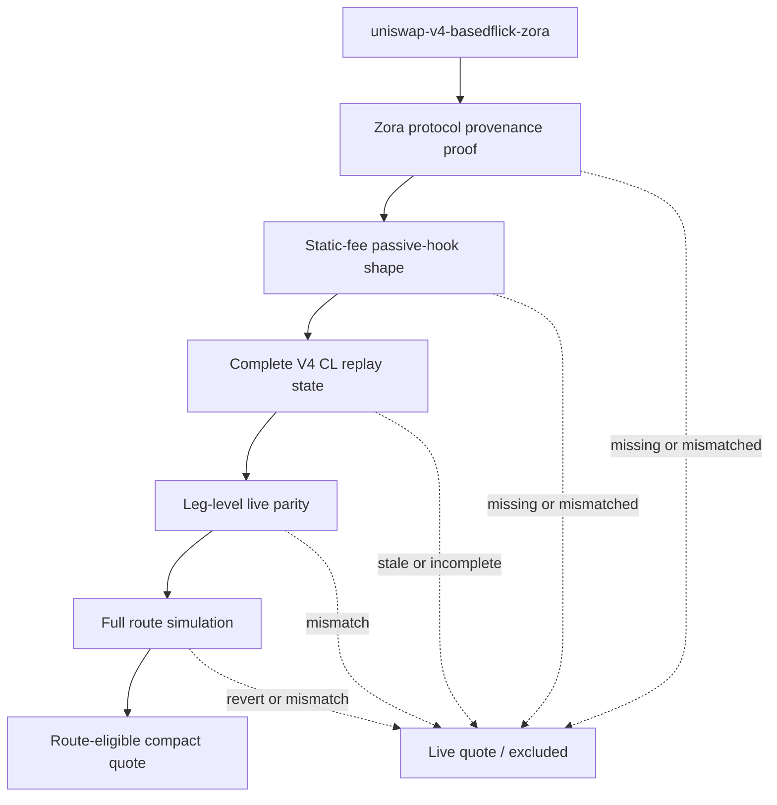

# BASEDFLICK/ZORA V4 Quoteable Pool Requirements

## Summary

Make `uniswap-v4-basedflick-zora` eligible for compact/local quote use only after it proves the specific V4 shape that makes this pool safer than generic V4: Zora protocol provenance, static 3% fee metadata, passive swap hook permissions, exact local-vs-live quote parity, and successful full-route execution simulation.

This is a direct-after-parity activation target, not a shadow-only experiment. When all gates pass, `www` may treat the local compact quote as route-eligible for this pool. When any gate is missing, stale, mismatched, or inconclusive, the pool remains live-quoted or excluded from compact quote eligibility.

---

## Problem Frame

The current FAME activation lane intentionally keeps `uniswap-v4-basedflick-zora` as a live V4 route dependency while `society-bots` provides compact quote evidence for the selected Slipstream leg. That was the right boundary before the V4 pool's fee and hook behavior were separated from broad V4 risk.

The new question is narrower: this pool appears to be a Zora protocol V4 pool with static `fee: 30000`, empty `hookData`, and hook permissions limited to `afterInitialize` and `afterSwap`. That shape can make local CL quote math feasible, but only if the activation claim stays specific. Static fee alone is not enough; the system must also prove Zora provenance, PoolKey identity, passive hook semantics, same-block quote parity, and executable route behavior.

The product outcome is lower route compute for the known BASEDFLICK/ZORA path without turning "Uniswap V4" into a supported compact quote family.

---

## Current Baseline

- `society-bots` represents `uniswap-v4-basedflick-zora` as a Uniswap V4 market-state pool with `activationStatus: "unsupported"`, `stateSurface: "cl-head-snapshot"`, and no replay surface or quote model.
- The current registry row records pool id `0x0fe6333346fcd0ffa4be3fda91f271bda52c6755f604b06483b709666d363628`, token0 ZORA, token1 BASEDFLICK, `feeBps: 300`, `tickSpacing: 200`, and StateView `0xa3c0c9b65bad0b08107aa264b0f3db444b867a71`.
- The companion `www` artifact contains the full V4 PoolKey ingredients for this pool, including PoolManager `0x498581ff718922c3f8e6a244956af099b2652b2b`, `fee: 30000`, hooks `0xd61a675f8a0c67a73dc3b54fb7318b4d91409040`, and `hookData: "0x"`.
- Decoded hook permission bits for the known hook address show `afterInitialize` and `afterSwap`, with no `beforeSwap`, `beforeSwapReturnDelta`, or `afterSwapReturnDelta`.
- Current CL head snapshots are not enough for exact CL quote replay; exact replay needs same-block tick bitmap and initialized tick state in addition to head price and liquidity.
- `uniswap-v4-usdc-eth` and `uniswap-v4-zora-eth` remain excluded from this v1 lane. Future Zora-protocol V4 pools are deferred even if they may eventually share the same family shape.

---

## Actors

- A1. `society-bots` pool-state indexer: Collects V4 state, provenance evidence, activation status, quote evidence, and unavailable reasons.
- A2. `society-bots` pool-state API: Serves compact quote rows or typed unavailable evidence to `www`.
- A3. `www` FAME swap system: Owns route selection, live quote authority, route simulation, and fallback behavior.
- A4. Operator/reviewer: Reviews provenance, classifier evidence, parity, simulation, and release claim before activation.
- A5. Base RPC / on-chain data sources: Provide Zora factory provenance, V4 PoolKey state, StateView reads, and simulation authority.

---

## Key Flows

- F1. Zora provenance is proven
  - **Trigger:** `uniswap-v4-basedflick-zora` is evaluated for compact quote activation.
  - **Actors:** A1, A4, A5
  - **Steps:** The evidence traces the relevant coin/pool creation through the Zora factory path and records the transaction or emitted factory event that binds the coin and V4 PoolKey.
  - **Outcome:** The pool is admitted to this v1 review only if provenance is conclusive.
  - **Covered by:** R1, R2, R3, R4

- F2. Static-fee passive-hook shape is classified
  - **Trigger:** Provenance has passed.
  - **Actors:** A1, A4
  - **Steps:** The activation report checks the PoolKey, static fee, hook address, hook permission bits, empty hookData, currencies, tick spacing, PoolManager, and StateView against the reviewed current-pool shape.
  - **Outcome:** The pool is eligible for V4 replay/parity work only when every shape gate matches.
  - **Covered by:** R5, R6, R7, R8, R9, R10

- F3. Local quote parity is proven
  - **Trigger:** Complete V4 replay state exists for the pool.
  - **Actors:** A1, A3, A4, A5
  - **Steps:** Local exact-input output is compared with live leg authority at the same block for both directions and representative route amounts.
  - **Outcome:** Local quote output is accepted only on exact parity; mismatch keeps the pool live-only.
  - **Covered by:** R11, R12, R13, R14

- F4. Full route execution is proven
  - **Trigger:** Leg-level parity passes.
  - **Actors:** A3, A4, A5
  - **Steps:** `www` validates the full BASEDFLICK/ZORA route with the same PoolKey and hookData, using Universal Router route simulation or equivalent execution proof.
  - **Outcome:** The compact quote can become route-eligible only if the full route succeeds.
  - **Covered by:** R15, R16, R17

- F5. Activation fails closed
  - **Trigger:** Any provenance, shape, state, parity, simulation, source, freshness, or route evidence gate fails.
  - **Actors:** A1, A2, A3
  - **Steps:** The producer emits typed unavailable evidence or withholds compact quote authority, and `www` keeps live fallback behavior.
  - **Outcome:** Missing evidence never silently becomes local quote authority.
  - **Covered by:** R18, R19, R20, R21

---

## Requirements

**Activation boundary**

- R1. The v1 feature must target only `uniswap-v4-basedflick-zora`.
- R2. The release claim must explicitly state that this is not broad Uniswap V4 compact quote support.
- R3. Future Zora-protocol V4 pools are deferred from v1, even if they are expected to pass similar gates later.
- R4. `uniswap-v4-usdc-eth`, `uniswap-v4-zora-eth`, and any other current non-target V4 pools must remain non-compact-quote-active until a separate gate is reviewed.

**Zora provenance**

- R5. The target pool must have on-chain provenance evidence showing that the coin/pool came through the Zora factory path.
- R6. Provenance evidence must bind the relevant coin address, V4 PoolKey, pool key hash or pool id, transaction/event source, and chain.
- R7. If Zora provenance cannot be proven, the pool must fail closed and remain ineligible for this lane.
- R8. A pool must not qualify for this lane from hook/address metadata alone.

**Pool shape and hook safety**

- R9. The target pool must match the reviewed PoolKey identity: PoolManager, currencies, fee, tick spacing, hooks, hookData, and pool id.
- R10. The target pool must use static `fee: 30000`; dynamic-fee sentinel values or unknown fee values must fail closed.
- R11. The target pool must have empty hookData for the route being activated.
- R12. The decoded hook permissions must show no `beforeSwap`, no `beforeSwapReturnDelta`, and no `afterSwapReturnDelta`.
- R13. The decoded `afterSwap` permission is acceptable for this pool only when route execution evidence also passes.
- R14. Hook bytecode or source verification is not a v1 release blocker, but it should remain visible as a later hardening option.

**V4 replay and quote evidence**

- R15. CL head snapshots alone must not qualify the pool for compact quote eligibility.
- R16. The replay state used for local quote parity must include the same-block V4 state needed for exact CL quote math, including PoolKey identity, head state, active liquidity, initialized tick evidence, block identity, and source registry identity.
- R17. V4 protocol-fee and LP-fee semantics must be either modeled correctly or proven irrelevant for the target pool at the evidence block.
- R18. Local quote output must match live leg authority for representative BASEDFLICK to ZORA and ZORA to BASEDFLICK exact-input amounts before route eligibility changes.
- R19. The parity authority must include both leg-level live quote comparison and full-route execution simulation.

**Route eligibility and fallback**

- R20. Once all gates pass, `www` may treat the target pool's compact/local quote as route-eligible.
- R21. If any gate is missing, stale, mismatched, or inconclusive, `www` must keep using live quote behavior or exclude the compact quote for that route.
- R22. The full route simulation must use the same PoolKey, hook address, hookData, token orientation, and route amount as the compact quote evidence.
- R23. Route eligibility must be row-scoped to the target pool so failures do not invalidate unrelated compact quote pools.
- R24. The activation report must make the current state diagnosable: provenance status, shape classification, parity status, simulation status, and fallback reason.

**Release evidence**

- R25. Release evidence must show the exact activation claim: `uniswap-v4-basedflick-zora` moved from live-only V4 dependency to route-eligible compact/local quote source after gates passed.
- R26. Release evidence must include proof for both quote directions or explain why one direction is out of scope for the activated route.
- R27. Release evidence must include provider-read scale, replay state freshness, fallback counts, unavailable reasons, and route-lab or equivalent route evidence.
- R28. The smoke or activation report must continue to account for non-target V4 pools without hardcoding this target as a broad V4 precedent.

---

## Acceptance Examples

- AE1. **Covers R1, R2, R3, R4.** Given the current FAME pool universe contains three V4 pools, when activation review runs, only `uniswap-v4-basedflick-zora` can enter the v1 V4 quoteability lane and the other V4 pools remain non-compact-quote-active.
- AE2. **Covers R5, R6, R7, R8.** Given the target pool lacks a conclusive Zora factory transaction or event binding the coin and PoolKey, when the activation report runs, the pool remains ineligible even if static fee and hook bits look correct.
- AE3. **Covers R9, R10, R11, R12, R13.** Given the target pool has the expected provenance but a dynamic fee, non-empty hookData, before-swap hook bit, or return-delta hook bit, when classification runs, compact quote eligibility fails closed.
- AE4. **Covers R15, R16, R17, R18, R19.** Given complete V4 replay state exists, when local output differs from live leg authority for a representative exact-input amount, the pool remains live-only and records the mismatch.
- AE5. **Covers R19, R20, R21, R22.** Given local leg parity passes but full-route simulation reverts or uses different PoolKey/hookData, when `www` evaluates the route, compact quote eligibility is rejected.
- AE6. **Covers R20, R23, R24, R25, R26, R27.** Given provenance, shape, parity, and route simulation all pass, when the release evidence is reviewed, the pool can become route-eligible and the report shows exactly what changed, in which directions, and with what fallback behavior.
- AE7. **Covers R14, R28.** Given hook source verification has not been added, when v1 promotion is reviewed, the absence is documented as deferred hardening rather than a blocker, because decoded hook bits and route execution evidence passed.

---

## Success Criteria

- `uniswap-v4-basedflick-zora` can move from live-only dependency to route-eligible compact/local quote source only after provenance, shape, parity, and execution gates all pass.
- The activation claim stays narrow: current pool only, no broad V4 support, no automatic admission for future Zora-protocol pools.
- Missing Zora provenance, dynamic fee, non-passive swap hook bits, non-empty hookData, incomplete V4 replay state, parity mismatch, or route simulation failure all produce fallback-safe ineligibility.
- `www` retains route authority and live fallback while accepting compact/local quote evidence for this pool only when the evidence is current and matching.
- Operators can review the activation from a single report or evidence bundle that names the pool, proof status, quote directions, route simulation result, and non-target V4 status.

---

## Scope Boundaries

- No generic Uniswap V4 compact quote support.
- No v1 activation for future Zora-protocol V4 pools.
- No v1 activation for `uniswap-v4-usdc-eth` or `uniswap-v4-zora-eth`.
- No eligibility from static fee alone.
- No eligibility from hook bit decoding alone.
- No route eligibility without full route execution proof.
- No requirement to verify hook source or bytecode before this v1 activation.
- No removal of live fallback.
- No change to reserve or existing Slipstream compact quote behavior.

---

## Key Decisions

- Direct after parity: The goal is route eligibility after proof, not a shadow-only lane.
- Current pool only for v1: The requirements acknowledge the Zora-protocol family shape but defer future Zora pools.
- Provenance is mandatory: The pool must be proven to come through the Zora factory path, or it fails closed.
- Execution evidence substitutes for hook source review in v1: Decoded passive hook bits plus full-route simulation are sufficient for this pool.
- Two-part parity authority: Leg-level live quote comparison and full-route simulation are both release-blocking.
- Broad V4 remains closed: Other V4 pools need separate gates before compact quote activation.

---

## Dependencies / Assumptions

- The companion `www` FAME pool artifact remains the source of PoolKey, hook, and hookData metadata for route materialization.
- Base RPC and block explorer or equivalent on-chain data can supply enough Zora factory provenance to bind BASEDFLICK/ZORA to the Zora protocol creation path.
- A live V4 quote authority and Universal Router route simulation path are available for representative parity and execution evidence.
- V4 StateView and tick reads can supply complete same-block replay state for the target pool.
- The known `fee: 30000` is the target PoolKey fee for this pool; any contradictory fee evidence fails closed until resolved.
- `www` live fallback remains available throughout rollout and after activation.

---

## Outstanding Questions

### Deferred to Planning

- [Affects R5, R6][Technical] What exact on-chain evidence source should prove Zora provenance: deployment transaction trace, Zora factory event, protocol deployment registry, or a combination?
- [Affects R16, R17][Technical] What precise V4 state capsule shape is needed to make local CL quote parity exact for this pool?
- [Affects R18, R19][Technical] Which representative amounts and route directions are release-blocking for parity?
- [Affects R19, R22][Cross-repo] Which existing `www` route-lab or fork simulation command should become the full-route execution authority?
- [Affects R24, R27][Operational] Where should the final evidence bundle live so both repos can consume it without duplicating activation policy?

---

## Sources / Research

- Ideation origin: `docs/ideation/2026-06-01-uniswap-v4-basedflick-zora-quoteable-pool-ideation.md`
- Prior activation requirements: `docs/brainstorms/2026-05-30-fame-supported-pool-activation-bundle-requirements.md`
- Current pool registry: `src/fame-swap-pool-state/registry/base-v1-pools.json`
- Current reducer manifest pattern: `src/fame-swap-pool-state/cl-reducer-manifests.ts`
- Zora protocol docs: https://docs.zora.co/
- Zora protocol repository: https://github.com/ourzora/zora-protocol
- Zora factory interface: https://github.com/ourzora/zora-protocol/blob/main/packages/coins/src/interfaces/IZoraFactory.sol
- Uniswap v4 hook permissions: https://github.com/Uniswap/v4-core/blob/main/src/libraries/Hooks.sol
- Uniswap v4 LP fee library: https://github.com/Uniswap/v4-core/blob/main/src/libraries/LPFeeLibrary.sol
- Uniswap v4 pool data guide: https://developers.uniswap.org/docs/sdks/v4/guides/pool-data
