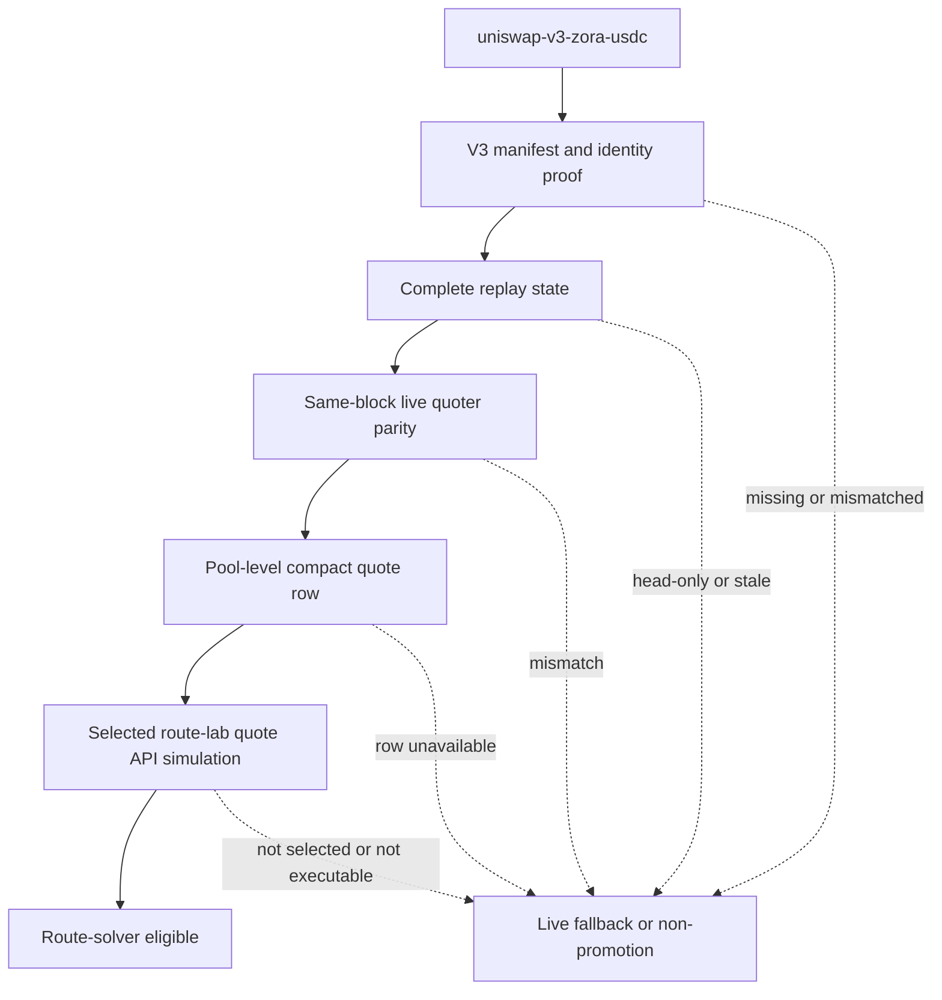

# Uniswap V3 ZORA Connector Compact Quote Requirements

## Summary

Promote `uniswap-v3-zora-usdc` as the next narrow FAME compact CL quote candidate, with `uniswap-v3-zora-weth` and other Uniswap V3 pools deferred until the first ZORA connector proves the V3 manifest, replay, parity, quote API, and route-lab gates.

This is a pool-level compact quote activation slice first. `www` may use the indexed row in live user swap selection only after route evidence proves the selected route still uses that pool, uses the compact row without unexplained fallback, and passes executable route simulation.

Project identity note: `www` refers to GitHub `fame-lady-society/www`. On this machine, the companion checkout is `../fls-www`.

---

## Problem Frame

The BASEDFLICK/ZORA activation lane now has live dev evidence for `solver-fame-basedflick-zora-usdc`: compact quote rows are used for `slipstream-basedflick-fame` and the approved `uniswap-v4-basedflick-zora`, with route-lab simulation passing after the deadline refresh fix in `../fls-www` commit `ef5d3f7`.

The remaining live connector in that selected route family is `uniswap-v3-zora-usdc`. Activating this pool has stronger route impact than a generic easy pool because it closes the last non-compact leg in the current FAME -> BASEDFLICK -> ZORA -> USDC route. The risk is that Uniswap V3 looks CL-like but is not interchangeable with Slipstream, Slipstream2, or V4. It needs its own explicit identity, fee, source, state, and parity gates.

The core product boundary is two-step:

- Pool-level quote API support means `/fame/pool-quotes` can return a fresh compact row for `uniswap-v3-zora-usdc`.
- Route-solver eligibility means `www` may rely on that row in live user swaps for a selected, simulated route.

---

## Current Baseline

- `society-bots` represents `uniswap-v3-zora-usdc` as `cl-head-only` with `stateSurface: "cl-head-snapshot"`, no replay surface, and no quote model.
- `../fls-www` route metadata identifies `uniswap-v3-zora-usdc` as a Uniswap V3 pool at `0xedc625b74537ee3a10874f53d170e9c17a906b9c`, token0 ZORA, token1 USDC, `fee: 3000`, and tick spacing `60`.
- The producer registry records the same pool as 30 bps display fee metadata. The activation slice must preserve the distinction between route metadata fee pips and display fee bps.
- `solver-fame-basedflick-zora-usdc` uses `slipstream-basedflick-fame`, `uniswap-v4-basedflick-zora`, and `uniswap-v3-zora-usdc`.
- `solver-usdc-zora-basedflick-fame` also uses `uniswap-v3-zora-usdc` in the reverse direction.
- `uniswap-v3-zora-weth` appears in one route artifact and shares useful V3-family learnings, but it is not part of the first activation target.
- Existing live Uniswap V3 quote behavior in `../fls-www` remains the fallback authority while indexed quote support is being proven.

---

## Actors

- A1. `society-bots` pool-state indexer: Maintains indexed Uniswap V3 state, source registry identity, freshness, and activation evidence.
- A2. `society-bots` pool-state API: Serves compact quote rows or typed unavailable evidence to `www`.
- A3. `www` FAME swap system: Owns route selection, live fallback, public quote behavior, route-lab proof, and executable route simulation.
- A4. Operator/reviewer: Reviews the activation boundary, parity output, quote API evidence, route-lab simulation, and non-promotion evidence.
- A5. Base RPC / on-chain data sources: Provide pool state, initialized tick data, quoter output, and simulation authority.

---

## Key Flows

- F1. V3 connector is admitted as the target
  - **Trigger:** The next FAME pool activation slice starts from the ranked ideation artifact.
  - **Actors:** A1, A3, A4
  - **Steps:** The activation lane selects `uniswap-v3-zora-usdc` as the only first V3 ZORA connector target and records all other V3 pools as non-promoted.
  - **Outcome:** The release claim is narrow before any producer or consumer behavior changes.
  - **Covered by:** R1, R2, R3, R4

- F2. Pool-level compact quote support is proven
  - **Trigger:** Complete Uniswap V3 replay state exists for the target pool.
  - **Actors:** A1, A2, A4, A5
  - **Steps:** The producer validates V3 identity, state freshness, token orientation, fee semantics, initialized ticks, source registry identity, and same-block quote parity against live V3 authority.
  - **Outcome:** `/fame/pool-quotes` may return a compact row for the target pool only when the pool-level evidence passes.
  - **Covered by:** R5, R6, R7, R8, R9, R10, R11

- F3. `www` validates indexed rows without losing fallback
  - **Trigger:** `www` requests indexed quote rows for a route that can traverse `uniswap-v3-zora-usdc`.
  - **Actors:** A2, A3
  - **Steps:** The consumer accepts the row only when it matches local route metadata, amount, direction, freshness, source, and registry identity. Otherwise it falls back live for that edge.
  - **Outcome:** Pool-level indexed support improves normal quote behavior without turning bad rows into route failures.
  - **Covered by:** R12, R13, R14, R15

- F4. Route-solver eligibility is separately proven
  - **Trigger:** Pool-level compact quotes pass for route-relevant amounts.
  - **Actors:** A3, A4, A5
  - **Steps:** Route-lab runs in quote API mode with simulation for `solver-fame-basedflick-zora-usdc`, verifies selected compact quote attribution for all indexed legs, and confirms the protected executable route.
  - **Outcome:** `www` may treat the indexed V3 row as route-eligible only for routes that pass this route-level gate.
  - **Covered by:** R16, R17, R18, R19, R20

- F5. Non-target V3 pools stay visible but inactive
  - **Trigger:** Activation reports or smoke tests account for the wider V3 pool set.
  - **Actors:** A1, A3, A4
  - **Steps:** `uniswap-v3-zora-weth`, `uniswap-v3-usdc-weth-5bps`, and `uniswap-v3-usdc-weth-30bps` remain represented as head-only or non-promoted unless a separate activation slice promotes them.
  - **Outcome:** The first V3 ZORA connector does not become broad Uniswap V3 compact quote support.
  - **Covered by:** R21, R22, R23

---

## Key Decisions

- **Route value over easiest class unlock:** `uniswap-v3-zora-usdc` outranks lower-friction Slipstream work because it is the remaining connector in the now-passing BASEDFLICK/ZORA route family.
- **One V3 pool first:** The slice proves the V3 connector path on one selected pool before widening to `uniswap-v3-zora-weth` or WETH/USDC V3 pools.
- **Two separate gates:** Pool-level quote API support is necessary but not sufficient for live route-solver selection.
- **V3 is not Slipstream by inheritance:** Shared CL math does not remove the need for V3-specific identity, source, fee, tick, and parity evidence.
- **Live fallback remains authority while evidence matures:** Indexed rows should improve selected routes only when current and matching, not replace the fallback safety model.

---

## Requirements

**Activation boundary**

- R1. The first activation target must be `uniswap-v3-zora-usdc`.
- R2. The release claim must explicitly state that the slice is not broad Uniswap V3 compact quote support.
- R3. `uniswap-v3-zora-weth` must be documented as the paired follow-up candidate, not silently included in v1.
- R4. `uniswap-v3-usdc-weth-5bps`, `uniswap-v3-usdc-weth-30bps`, and every non-target V3 pool must remain non-promoted unless a separate activation decision changes their status.

**Pool-level quote API support**

- R5. The target pool must have a reviewed Uniswap V3 manifest covering chain, pool address, router/quoter family, token orientation, fee pips, tick spacing, source registry identity, and supported directions.
- R6. CL head snapshots alone must not qualify the pool for compact quote rows.
- R7. The indexed state used for quote replay must include the Uniswap V3 state needed for exact offchain replay, including head state, active liquidity context, initialized tick evidence, tick bitmap evidence, block identity, and source registry identity.
- R8. Fee semantics must preserve the reviewed V3 route fee pips for quote and route identity; display fee bps must not substitute for executable V3 fee identity.
- R9. Same-block parity must match live Uniswap V3 quote authority for ZORA -> USDC and USDC -> ZORA at representative route amounts before the pool becomes compact quote active.
- R10. `/fame/pool-quotes` must return typed unavailable evidence, not unhandled user-facing failures, when state is missing, stale, malformed, source-mismatched, direction-mismatched, outside the indexed range, or parity-untrusted.
- R11. A successful pool-level row must carry enough evidence for a reviewer to distinguish a Uniswap V3 replay-backed row from Slipstream, Slipstream2, V4, reserve, or live fallback evidence.

**Consumer validation and fallback**

- R12. `www` must accept a compact row for the target pool only when it matches local route metadata for chain, pool address, token direction, amount, fee identity, source registry, freshness, and quote kind.
- R13. `www` must fall back live for the target edge when the indexed row is unavailable, invalid, stale, mismatched, slow, malformed, source-incompatible, or registry-incompatible.
- R14. Indexed quote diagnostics must stay row-scoped so one rejected V3 row does not discard unrelated compact quote rows for the same route.
- R15. Normal public quote flow must continue to use compact quote rows plus live fallback; raw replay state remains proof, parity, and debug tooling.

**Route-solver eligibility**

- R16. Pool-level quote API success must not by itself make `uniswap-v3-zora-usdc` eligible for live user route selection.
- R17. `solver-fame-basedflick-zora-usdc` must pass route-lab in quote API mode with executable simulation before the indexed V3 row can be considered route-eligible for that route.
- R18. Route evidence must show selected compact quote attribution for `uniswap-v3-zora-usdc`, `uniswap-v4-basedflick-zora`, and `slipstream-basedflick-fame`, with no unexplained unavailable rows or fallback for the selected route.
- R19. The route simulation must use the same token orientation, fee identity, pool identity, route amount, account context, and protected minimum semantics as the quote evidence.
- R20. Reverse-route eligibility for `solver-usdc-zora-basedflick-fame` must require its own direction-specific quote parity and route-lab simulation evidence.

**Activation evidence and non-promotion**

- R21. The activation report must show `uniswap-v3-zora-usdc` moving through explicit statuses from head-only to pool-level quote active to route-eligible only after the relevant gates pass.
- R22. The report must show non-promotion evidence for `uniswap-v3-zora-weth` and non-target V3 pools without relying on hardcoded exclusion lists.
- R23. Release evidence must preserve the narrow BASEDFLICK/ZORA V4 boundary: the approved `uniswap-v4-basedflick-zora` compact quote lane remains a current-pool exception, not a precedent for broad V4 enablement.
- R24. Runtime and smoke evidence must show fallback counts, unavailable reasons, source registry id, observed block or evidence id, provider-read scale, and route-lab simulation result for the target route.

---

## Acceptance Examples

- AE1. **Covers R1, R2, R3, R4.** Given the FAME universe contains several represented V3 pools, when this activation slice runs, only `uniswap-v3-zora-usdc` can become a first target and the other V3 pools remain non-promoted.
- AE2. **Covers R5, R6, R7, R8.** Given the pool has only CL head state or display fee metadata, when compact quote eligibility is evaluated, the pool remains ineligible until full V3 replay state and executable fee identity are proven.
- AE3. **Covers R9, R10, R11.** Given complete indexed V3 state exists but same-block live quoter output differs for a representative ZORA -> USDC amount, when parity runs, `/fame/pool-quotes` must not promote the row as trusted compact quote evidence.
- AE4. **Covers R12, R13, R14, R15.** Given `/fame/pool-quotes` returns a V3 row with a stale source registry id or a source that belongs to another CL family, when `www` validates the route, it rejects that row and falls back live for the V3 edge.
- AE5. **Covers R16, R17, R18, R19.** Given pool-level compact quotes pass but route-lab no longer selects `solver-fame-basedflick-zora-usdc` or simulation fails, when route eligibility is reviewed, the pool remains pool-level quote active but not public-route eligible.
- AE6. **Covers R17, R18, R19, R24.** Given quote API mode reports compact rows for the selected Slipstream, V4, and V3 legs and route simulation passes with the protected minimum, when release evidence is reviewed, `solver-fame-basedflick-zora-usdc` can use the indexed V3 connector.
- AE7. **Covers R20.** Given forward-route evidence passes but reverse-route parity or simulation has not run, when `solver-usdc-zora-basedflick-fame` is evaluated, reverse solver eligibility remains pending.
- AE8. **Covers R21, R22, R23.** Given the activation report includes V3 and V4 non-target pools, when smoke validation runs, non-promotion comes from report status and evidence rather than hardcoded pool exclusions.

---

## Success Criteria

- `/fame/pool-quotes` can return fresh, validated compact quote evidence for `uniswap-v3-zora-usdc` in route-relevant directions.
- Same-block parity proves indexed output against live Uniswap V3 quote authority for representative ZORA/USDC amounts before pool-level promotion.
- `www` accepts the indexed row only when it matches local route metadata and falls back live for every stale, unavailable, malformed, or mismatched case.
- `solver-fame-basedflick-zora-usdc` passes quote API route-lab simulation with selected compact quote attribution for all compact-capable legs before public route-solver eligibility changes.
- Non-target V3 pools and additional V4 pools remain visible, non-promoted, and fallback-safe.
- The final activation evidence lets a reviewer tell whether a claim is pool-level quote support, route-solver eligibility, or both.

---

## Scope Boundaries

- No broad Uniswap V3 compact quote activation.
- No first-slice activation for `uniswap-v3-zora-weth`.
- No first-slice activation for V3 WETH/USDC pools.
- No stable-pool quote model work.
- No Slipstream2 / Gauge Caps compact quote work.
- No additional V4 pool activation.
- No route eligibility from pool-level quote API success alone.
- No removal of live fallback.
- No raw replay payloads on the normal public quote hot path.
- No hardcoded non-promotion exclusions in smoke or activation evidence.

---

## Dependencies / Assumptions

- The `../fls-www` pool artifact remains the reviewed route metadata source for V3 pool identity, route fee pips, token orientation, and solver route artifacts.
- The current `society-bots` producer registry remains aligned with `../fls-www` for `uniswap-v3-zora-usdc` pool identity before promotion.
- Base RPC can provide the Uniswap V3 state reads needed for exact same-block replay within an acceptable read budget.
- Existing `../fls-www` live Uniswap V3 quote behavior remains available as fallback and parity authority during rollout.
- The approved `uniswap-v4-basedflick-zora` lane stays narrow and already validated for the target route family.
- Route-lab can emit enough quote API diagnostics to separate compact quote usage, unavailable rows, fallback rows, selected pools, simulation account, output, and protected minimum.

---

## Outstanding Questions

### Deferred to Planning

- [Affects R7, R9][Technical] What exact V3 replay capsule and source value should the producer expose so V3 rows are distinguishable from Slipstream rows without inventing a new quote kind?
- [Affects R9, R17, R20][Decision] Which exact amount bands are release-blocking for forward and reverse route parity?
- [Affects R17, R18, R19][Cross-repo] Which route-lab command and saved output should become the canonical route-solver eligibility proof?
- [Affects R21, R22, R24][Operational] Where should the activation evidence bundle live so non-promotion, provider-read scale, and route-lab output are reviewable across both repos?
- [Affects R20][Decision] Should reverse-route eligibility ship in the same implementation slice after parity passes, or remain a follow-up activation even though it uses the same pool?

---

## Sources / Research

- Ranked ideation source: `docs/ideation/2026-06-06-next-fame-pool-activation-slice-ideation.md`
- Prior activation bundle: `docs/brainstorms/2026-05-30-fame-supported-pool-activation-bundle-requirements.md`
- Prior BASEDFLICK/ZORA V4 requirements: `docs/brainstorms/2026-06-03-uniswap-v4-basedflick-zora-quoteable-pool-requirements.md`
- Producer registry: `src/fame-swap-pool-state/registry/base-v1-pools.json`
- Producer CL quote gate: `src/fame-swap-pool-state/cl-quote.ts`
- Companion route pool artifact: `../fls-www/src/features/fame-swap/artifacts/base-v1-pools.json`
- Companion route artifacts: `../fls-www/src/features/fame-swap/artifacts/base-v1-solver-routes.json`
- Companion V3 live quote fallback: `../fls-www/src/features/fame-swap/solver/quotes/liveAdapters.ts`
- Companion route execution payloads: `../fls-www/src/features/fame-swap/router/buildLegPayload.ts`
- Earlier V3 compact quote plan: `../fls-www/docs/plans/2026-05-27-001-feat-fame-uniswap-v3-compact-quote-slice-plan.md`
- Uniswap V3 pool data guide: https://developers.uniswap.org/docs/sdks/v3/guides/pool-data
