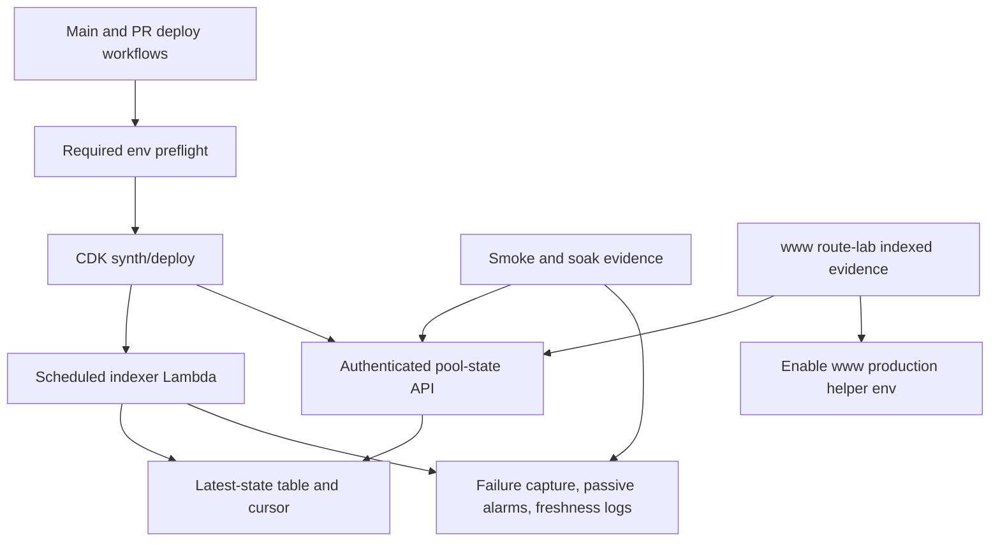

# feat: Harden FAME Pool-State Release Readiness

## Summary

Harden the new FAME pool-state indexer and authenticated helper API so the PR is ready for review, merge, and the main-branch auto-deploy path. The implementation should turn the current release-readiness findings into deterministic deploy gates, typed helper failures, complete DynamoDB read semantics, indexer operational visibility, and durable smoke/route-lab evidence.

Project identity note: `www` refers to the GitHub project `fame-lady-society/www`. On this machine, that companion checkout is cloned as `../fls-www`, not `../www`.

---

## Problem Frame

The dirty worktree adds a scheduled Base indexer, DynamoDB latest-state storage, and `POST /fame/pool-state` for server-side `www` quote solving. Because `main` auto-deploys to production, the release cannot rely on local unit tests alone or on chat-only operational checks.

The main risk is not quote math moving into `society-bots`; `www` remains quote authority. The risk is a helper that deploys with missing configuration, returns ambiguous failures, silently treats partial DynamoDB reads as complete, or lacks visible proof that indexed state is fresh enough for `www` to consume safely.

---

## Requirements

- R1. Fail before CDK deployment when required FAME pool-state deployment configuration is missing or empty.
- R2. Provide environment-scoped FAME pool-state service tokens through the main deploy workflow and PR deploy workflow without exposing the production token to PR-controlled code.
- R3. Prevent root test execution from accidentally compiling deploy/CDK tests under the root TypeScript configuration.
- R4. Keep deploy/CDK tests explicitly runnable as release validation.
- R5. Distinguish malformed requests and failed auth from dependency or internal helper failures.
- R6. Preserve `fresh`, `stale`, `unknown`, and `unsupported` as normal per-pool response statuses.
- R7. Never treat DynamoDB `UnprocessedKeys` as a complete successful batch read.
- R8. Give the scheduled indexer an operator-visible failure path for async failures, repeated failures, or missed progress.
- R9. Include freshness evidence based on `observedThroughBlock`, not only Lambda invocation success.
- R10. Record deployed smoke evidence for authenticated API access, response shape, and at least one fresh quote-model pool.
- R11. Record a short schedule/RPC soak or equivalent operational proof.
- R12. Gate production `www` quote consumption on route-lab indexed mode against the deployed helper.
- R13. Ensure route-lab evidence covers indexed success and fallback-relevant cases.
- R14. Capture route-lab evidence location in the release checklist.

**Origin actors:** A1 release owner, A2 `www` quote solver, A3 production operator, A4 downstream planner/implementer.
**Origin flows:** F1 PR readiness validation, F2 deployed helper health proof, F3 cross-repo quote consumption proof.
**Origin acceptance examples:** AE1 deployment config gate, AE2 root/deploy test separation, AE3 API failure contract, AE4 partial DynamoDB read handling, AE5 freshness/failure visibility, AE6 smoke/soak evidence, AE7 route-lab evidence.

---

## Scope Boundaries

- Do not move quote authority, route selection, or quote parity ownership from `www` into `society-bots`.
- Do not add stable-pool, concentrated-liquidity, native-wrap, Uniswap V3, or Uniswap V4 local reserve replay in this pass.
- Do not hand-edit the generated pool registry artifact; registry ownership remains in `www`.
- Do not require fully automated cross-repo CI for the first release gate. Durable manual or semi-automated evidence is acceptable.
- Do not fix unrelated pre-existing env/RPC-dependent root test failures unless they are part of the current CI gate for this PR.

### Deferred to Follow-Up Work

- GitHub OIDC migration for AWS credentials: worthwhile deployment hardening, but not required for this FAME pool-state readiness PR.
- Fully automated `www` route-lab CI against a deployed helper: useful after the manual evidence gate proves the release workflow.
- Longer-running canary or incident-management workflow: useful after the first production helper deployment is stable.
- New `www` route-lab implementation work, if the companion repo cannot already produce the fallback evidence described here.

---

## Context & Research

### Relevant Code and Patterns

- `.github/workflows/cdk-deploy.yml` and `.github/workflows/pr-deploy.yml` are the merge and PR deploy paths. Both currently provide Base RPC configuration but not the new FAME pool-state service token.
- `deploy/lib/deploy-stack.ts` passes FAME pool-state deploy configuration into `FamePoolState`, and `deploy/lib/fame-pool-state.ts` already fails fast for an empty service token or Base RPC configuration.
- `jest.config.js` has broad discovery, while `deploy/jest.config.js` already scopes deploy tests to `deploy/test`.
- `src/fame-swap-pool-state/api.ts` owns request parsing, per-pool response status semantics, and the bounded batch API behavior.
- `src/fame-swap-pool-state/lambdas/api.ts` owns transport mapping, auth, structured API logging, and currently maps all runtime errors in the request handler to `400`.
- `src/fame-swap-pool-state/dynamodb/pool-state.ts` owns `BatchGetCommand` reads and currently maps only `Responses`, ignoring `UnprocessedKeys`.
- `src/fame-swap-pool-state/indexer.ts` and `src/fame-swap-pool-state/lambdas/indexer.ts` already return and log `observedThroughBlock`; this should become the center of smoke/soak evidence.
- `deploy/lib/events-lambdas.ts` shows existing CDK patterns for SQS queues, scheduled Lambda rules, and release outputs that the new construct can mirror.
- `docs/fame-pool-state-handoff.md` and `docs/fame-pool-state-index.md` already define cross-repo ownership, freshness semantics, and the rollout checklist.

### Institutional Learnings

- No `docs/solutions/` directory exists in this repo, so there are no institutional learning docs to carry forward.

### External References

- DynamoDB `BatchGetItem` can return a successful partial result with `UnprocessedKeys`; callers must retry those keys or handle partial reads explicitly.
- Lambda scheduled/event-driven invocation is asynchronous, and function errors, timeouts, throttles, and expired events need explicit retry/failure visibility.
- CloudWatch alarms are the AWS-native surface for operator-visible thresholds and state changes.
- GitHub Actions secrets resolve to empty strings when unset, so the workflow must preflight required secrets before CDK deploy.

---

## Key Technical Decisions

- **Workflow preflight stays separate from CDK fail-fast:** Keep `FamePoolState` constructor validation, and add a workflow-level required-env preflight before CDK deploy. This catches missing secrets before infrastructure changes begin and gives reviewers a clear failure signal.
- **Root/deploy tests stay split:** Scope root Jest to root source tests and keep deploy tests under the deploy package config. A multi-project root Jest setup is unnecessary for this release gate.
- **API transport failures become typed:** Validation/JSON parsing errors map to request failures, auth remains unauthorized, and dependency/internal failures map to server failures with structured logs. Per-pool `fresh`, `stale`, `unknown`, and `unsupported` remain successful batch response entries.
- **DynamoDB partial batch reads fail loud in v1:** Surface any `UnprocessedKeys` as an incomplete helper read instead of adding in-request retry. This favors predictable quote latency and safe `www` fallback over hiding DynamoDB pressure behind a helper response that looks complete.
- **Indexer proof uses modest passive health signals:** Add failure capture for async indexer invocations and passive CloudWatch alarms for obvious failure surfaces, with no notification action by default. Include missed scheduled invocations through AWS-native metrics, while keeping `observedThroughBlock` freshness proof in release evidence rather than a custom metric.
- **First release uses short soak evidence:** Treat at least five scheduled intervals with successful runs and non-regressing `observedThroughBlock` as persuasive initial proof. Longer canaries are follow-up work.
- **Route-lab evidence is a release gate, not an implementation dependency here:** The plan records the required `www` route-lab proof and evidence shape; any missing `www` route-lab behavior should become a companion `www` task in `fame-lady-society/www` (local checkout `../fls-www`) rather than expanding `society-bots` quote authority.

---

## Open Questions

### Resolved During Planning

- Required-env mechanism: workflow env plus a pre-CDK preflight step, backed by CDK constructor validation.
- API transport shape: keep expected pool statuses in `200` batch responses; map malformed input to `400`, unauthorized to `401`, and dependency/internal failures to `5xx`.
- DynamoDB `UnprocessedKeys`: fail loud in this first release rather than retrying inside the quote-adjacent API request.
- Freshness threshold: initial release evidence should align with the producer freshness default and require at least five scheduled intervals of successful progress for release proof; do not add a custom freshness metric or freshness alarm in v1 unless implementation shows it is necessary.
- Soak length: use five scheduled intervals as the minimum first-release soak, unless runtime evidence shows RPC latency or throttling needs a longer window.
- Route-lab evidence format: record timestamped output or PR notes containing helper endpoint environment, indexed success summary, fallback-case summary, and pass/fail conclusion.

### Deferred to Implementation

- Exact helper/type names for the API error taxonomy.
- Exact passive alarm resource names after fitting the CDK code style.
- Whether the existing `www` route-lab indexed mode already covers every fallback case, or whether a companion `www` PR is needed in `fame-lady-society/www` (local checkout `../fls-www`).
- Exact release evidence location, because this may be a PR comment, checklist section, or linked artifact depending on how the PR is opened.

---

## High-Level Technical Design

> *This illustrates the intended approach and is directional guidance for review, not implementation specification. The implementing agent should treat it as context, not code to reproduce.*

---

## Implementation Units

### U1. Deployment And Test Discovery Gates

**Goal:** Make the deploy path fail clearly before CDK deploy when required FAME pool-state config is missing, and make root/deploy test discovery deterministic.

**Requirements:** R1, R2, R3, R4; covers AE1 and AE2.

**Dependencies:** None.

**Files:**
- Modify: `.github/workflows/cdk-deploy.yml`
- Modify: `.github/workflows/pr-deploy.yml`
- Modify: `jest.config.js`
- Modify: `deploy/test/fame-pool-state.test.ts`
- Test: `deploy/test/fame-pool-state.test.ts`

**Approach:**
- Add `FAME_POOL_STATE_SERVICE_TOKEN` to the main deploy workflow and `FAME_POOL_STATE_PR_SERVICE_TOKEN` to the PR deploy workflow.
- Add a pre-CDK validation step that names missing FAME pool-state deployment env before any deploy command runs and rejects malformed, empty, or blank-entry `BASE_RPCS_JSON`.
- Keep constructor-level validation in `FamePoolState`; expand deploy assertions to cover missing and malformed Base RPC configuration as well as missing service token.
- Ensure PR deploys use `STAGE=PR-<number>` and cleanup targets only the matching PR CloudFormation stacks.
- Scope root Jest so it no longer discovers `deploy/test`, while leaving deploy package Jest as the explicit CDK validation path.

**Execution note:** Start with the failing discovery/config cases so the fix proves the current release blockers are gone.

**Patterns to follow:**
- `deploy/lib/fame-pool-state.ts` `requiredNonEmpty` constructor validation.
- `deploy/jest.config.js` package-local test scoping.

**Test scenarios:**
- Covers AE1. Error path: a deploy workflow run with an empty FAME pool-state service token fails in the preflight before CDK deploy.
- Error path: constructing `FamePoolState` with empty Base RPC configuration throws a clear configuration error.
- Covers AE2. Integration: root test discovery does not compile deploy/CDK tests under the root TypeScript config.
- Covers AE2. Integration: deploy package test execution still runs the FAME pool-state CDK assertions.

**Verification:**
- The PR can show root validation without the new deploy false positive.
- Deploy validation still synthesizes the FAME pool-state infrastructure and catches missing required config.

### U2. Typed API Failure Contract

**Goal:** Make helper transport failures safe and diagnosable while preserving expected per-pool fallback statuses as normal response data.

**Requirements:** R5, R6; covers AE3.

**Dependencies:** U1 can run independently; U3 should reuse the failure contract produced here.

**Files:**
- Modify: `src/fame-swap-pool-state/api.ts`
- Modify: `src/fame-swap-pool-state/lambdas/api.ts`
- Modify: `src/fame-swap-pool-state/api.test.ts`
- Create: `src/fame-swap-pool-state/lambdas/api.test.ts`
- Test: `src/fame-swap-pool-state/api.test.ts`
- Test: `src/fame-swap-pool-state/lambdas/api.test.ts`

**Approach:**
- Introduce a narrow typed request-validation failure path for parse and batch-limit errors.
- Keep authorization outside the request handler body and preserve its unauthorized transport response.
- Map unexpected dependency/internal errors to server-failure transport responses and structured logs.
- Keep `stale`, `unknown`, and `unsupported` inside successful batch responses so `www` can apply existing fallback behavior.

**Patterns to follow:**
- Existing `api.ts` parser helpers and response entry discriminated unions.
- Existing structured JSON logs in `src/fame-swap-pool-state/lambdas/api.ts`.

**Test scenarios:**
- Covers AE3. Error path: malformed JSON returns a request failure and does not call DynamoDB.
- Covers AE3. Error path: structurally invalid payload returns a request failure and names the invalid request path.
- Error path: invalid or missing token returns unauthorized and does not call DynamoDB.
- Error path: a DynamoDB/client exception returns a server failure and logs a helper failure event.
- Covers AE3. Happy path: valid stale, unsupported, and unknown pools remain normal `200` response entries with per-pool statuses.

**Verification:**
- `www` can treat malformed helper transport, unauthorized, and server failure as non-authoritative helper output.
- Operators can tell caller mistakes from service degradation in logs and status codes.

### U3. DynamoDB Batch Read Completeness

**Goal:** Prevent partial DynamoDB batch reads from masquerading as complete helper responses.

**Requirements:** R7; covers AE4.

**Dependencies:** U2 for shared failure mapping.

**Files:**
- Modify: `src/fame-swap-pool-state/dynamodb/pool-state.ts`
- Modify: `src/fame-swap-pool-state/dynamodb/pool-state.test.ts`
- Modify: `src/fame-swap-pool-state/api.test.ts`
- Test: `src/fame-swap-pool-state/dynamodb/pool-state.test.ts`
- Test: `src/fame-swap-pool-state/api.test.ts`

**Approach:**
- Extend the typed DynamoDB response surface to include `UnprocessedKeys`.
- Detect any unprocessed keys from `BatchGetCommand` and throw an explicit incomplete-read failure.
- Let the API layer map that failure through the typed server-failure path from U2.
- Leave a future retry policy out of v1 so the helper fails safely under DynamoDB pressure instead of adding hidden quote-path latency.

**Patterns to follow:**
- Existing `PoolStateDocumentClient` fake-client tests in `api.test.ts` and `pool-state.test.ts`.
- Existing fail-fast style in `config.ts` and `deploy/lib/fame-pool-state.ts`.

**Test scenarios:**
- Covers AE4. Error path: a batch response with `UnprocessedKeys` rejects rather than returning only processed items.
- Covers AE4. Integration: the API maps incomplete batch reads to a server failure, not a successful batch with missing pool entries.
- Happy path: a complete batch response still maps returned items to latest pool states.
- Edge case: an empty pool list still returns an empty state list without calling DynamoDB.

**Verification:**
- No successful helper response can silently ignore unprocessed DynamoDB keys.

### U4. Indexer Failure Envelope And Freshness Signal

**Goal:** Make indexer failure and missed progress visible to operators before `www` relies on stale indexed state.

**Requirements:** R8, R9; covers AE5.

**Dependencies:** U1 for deploy validation foundations.

**Files:**
- Modify: `deploy/lib/fame-pool-state.ts`
- Modify: `deploy/test/fame-pool-state.test.ts`
- Modify: `src/fame-swap-pool-state/indexer.ts`
- Modify: `src/fame-swap-pool-state/lambdas/indexer.ts`
- Modify: `src/fame-swap-pool-state/indexer.test.ts`
- Test: `deploy/test/fame-pool-state.test.ts`
- Test: `src/fame-swap-pool-state/indexer.test.ts`

**Approach:**
- Add async failure capture for the scheduled indexer Lambda, using an SQS-backed failure destination or DLQ pattern that can be asserted in CDK tests.
- Add passive standard CloudWatch alarms for indexer Lambda errors, indexer Lambda throttles, missed indexer invocations, and non-empty failure queue depth. Leave alarm actions empty by default so this provides an inspectable health surface without paging or email.
- Do not add a custom freshness metric or freshness alarm in v1. Preserve successful-run logs that include `observedThroughBlock`, registry id, scanned block range, and duration, then use the release checklist to verify freshness manually.
- Output enough operational resource names for release owners to find the failure queue, passive alarms, and recent success evidence.

**Patterns to follow:**
- SQS queue and scheduled Lambda CDK patterns in `deploy/lib/events-lambdas.ts`.
- Existing indexer result object and `fame-pool-state-indexed` structured log.

**Test scenarios:**
- Covers AE5. CDK integration: the FAME pool-state construct synthesizes failure-capture resources for the indexer.
- Covers AE5. CDK integration: the construct synthesizes passive operator-visible alarms for Lambda errors, Lambda throttles, missed invocations, and failure queue depth, with no notification action configured by default.
- Happy path: successful indexer logs still include `observedThroughBlock`, source registry id, block range, event counts, and observed pool count.
- Edge case: indexer failures before cursor advancement remain fatal and do not advance the cursor.
- Integration: operational outputs expose the resource names a release owner needs for smoke/soak evidence.

**Verification:**
- A stopped or failing indexer has a visible AWS-side signal before `www` production helper env is enabled, and non-advancing freshness is covered by release smoke/soak evidence unless a later iteration adds a custom metric.

### U5. Deployed Smoke And Short Soak Evidence

**Goal:** Make the live release proof durable enough for PR review without requiring every proof step to be fully automated in this pass.

**Requirements:** R9, R10, R11, R14; covers AE6.

**Dependencies:** U2, U3, U4.

**Files:**
- Modify: `docs/fame-pool-state-index.md`
- Modify: `docs/fame-pool-state-handoff.md`

**Approach:**
- Extend the rollout checklist with a smoke evidence template: endpoint/environment, timestamp, authenticated request result, current block, at least one fresh quote-model pool, and returned `observedThroughBlock`.
- Add a short soak template requiring at least five scheduled intervals, recent success logs or metrics, non-regressing `observedThroughBlock`, and notes on timeouts/throttles/errors.
- Document the expected failure interpretation: stale/unknown/unsupported are valid helper statuses, while malformed transport/server failure should keep `www` on live fallback.

**Patterns to follow:**
- Existing rollout checklist in `docs/fame-pool-state-index.md`.
- Existing cross-repo verification checklist in `docs/fame-pool-state-handoff.md`.

**Test scenarios:**
- Test expectation: none - documentation/evidence checklist only.

**Verification:**
- A reviewer can locate the smoke and soak evidence fields without reconstructing them from chat history.

### U6. `www` Route-Lab Evidence Gate

**Goal:** Ensure production quote consumption is enabled only after `www` route-lab indexed mode proves success and fallback behavior against the deployed helper.

**Requirements:** R12, R13, R14; covers AE7.

**Dependencies:** U5.

**Files:**
- Modify: `docs/fame-pool-state-index.md`
- Modify: `docs/fame-pool-state-handoff.md`

**Approach:**
- Make route-lab indexed proof the final documented gate before setting `www` production helper env.
- Require evidence for indexed success plus fallback-relevant malformed, stale, unknown, unsupported, and unavailable-helper cases.
- Record the evidence location in the release checklist so reviewers can inspect the proof without rerunning route-lab.
- Keep any missing `www` route-lab capability as a companion-repo follow-up, not an expansion of `society-bots` responsibilities.

**Patterns to follow:**
- Cross-repo contract in `docs/fame-pool-state-handoff.md`.
- Rollout check in `docs/fame-pool-state-index.md`.

**Test scenarios:**
- Test expectation: none - cross-repo release evidence gate only.

**Verification:**
- Production `www` helper env is documented as blocked until route-lab evidence is attached.

---

## System-Wide Impact

- **Interaction graph:** GitHub Actions deploy workflows feed CDK, CDK provisions the indexer/API/table/ops resources, the indexer writes state, the API reads state, and `www` consumes only the authenticated helper API after route-lab proof.
- **Error propagation:** Request/auth failures remain caller-facing; DynamoDB partial reads and unexpected service failures propagate as helper server failures so `www` falls back instead of trusting partial state.
- **State lifecycle risks:** Cursor advancement must remain after successful processing only. Batch read failures must not mutate state. Failure-capture resources must not change the indexer write path.
- **API surface parity:** `www` must see the same per-pool status semantics after the failure-contract changes; only transport-level failure classification changes.
- **Integration coverage:** Unit tests prove parser/storage/indexer behavior; deploy assertions prove CDK wiring; smoke/soak and route-lab evidence prove live AWS, RPC, auth, freshness, and consuming quote-path behavior.
- **Unchanged invariants:** `observedThroughBlock` remains the freshness basis, registry metadata remains generated from `www`, and unsupported venue families remain unsupported rather than partially replayed.

---

## Risks & Dependencies

| Risk | Mitigation |
|------|------------|
| The service token secret is not provisioned for main or PR deploys. | Add workflow preflight and document secret provisioning as a release prerequisite. |
| Fail-loud `UnprocessedKeys` causes more live fallback during DynamoDB pressure. | Accept for v1 because quote correctness and non-authoritative helper behavior matter more than hiding incomplete reads. |
| Passive CloudWatch alarms are visible but do not notify anyone. | This is intentional for a free community project; output alarm/failure resources and require release evidence that the release owner can inspect the failure path before production enablement. |
| Existing unrelated root tests still fail due env/RPC assumptions. | Keep this plan scoped to removing the new deploy discovery false positive; handle legacy test instability separately if it blocks PR CI. |
| Route-lab indexed mode in `www` lacks one fallback case. | Record a companion `www` task and keep production helper env disabled until the route-lab evidence is complete. |
| Operational thresholds are too strict for the first Base RPC provider. | Start with producer-freshness-aligned thresholds and let the soak evidence drive any threshold adjustment before production enablement. |

---

## Alternative Approaches Considered

- **Fix only the current PR blockers:** Rejected because merge-to-main auto-deploy means deploy config, runtime failure semantics, and operational proof are all release readiness concerns.
- **Retry DynamoDB `UnprocessedKeys` inside the helper request:** Deferred because it adds quote-path latency and retry-policy complexity before the first release has production evidence.
- **Automate route-lab as cross-repo CI now:** Deferred because the brainstorm explicitly accepts manual or semi-automated durable evidence for the first pass.
- **Migrate deploy AWS auth to GitHub OIDC now:** Deferred as broader deploy hardening; it is not necessary to make this helper PR reviewable.

---

## Success Metrics

- Main and PR deploy workflows expose and preflight FAME pool-state required env before CDK deploy.
- Root test discovery no longer picks up deploy/CDK tests; deploy tests remain explicitly runnable.
- API tests prove request failures, unauthorized requests, dependency failures, and per-pool fallback statuses are distinguishable.
- DynamoDB tests prove incomplete batch reads do not produce successful helper data.
- CDK tests prove indexer failure capture and alarms are synthesized.
- Release docs contain smoke, soak, and route-lab evidence fields that a reviewer can use for the PR merge decision.

---

## Dependencies / Prerequisites

- `FAME_POOL_STATE_SERVICE_TOKEN` must be available to the main deploy context, and `FAME_POOL_STATE_PR_SERVICE_TOKEN` must be available to the PR deploy context.
- A deployed helper endpoint and service token must be available before smoke, soak, and route-lab evidence can be captured.
- The release owner must be able to inspect CloudWatch alarms/logs and the indexer failure destination for the deployed stack.
- The companion `www` route-lab indexed mode must be available from `fame-lady-society/www` (local checkout `../fls-www`), or a companion `www` task must be completed before production helper env is enabled.

---

## Phased Delivery

- **Phase 1 - Deterministic PR gates:** U1 removes known deploy/test-readiness blockers.
- **Phase 2 - Runtime safety:** U2 and U3 make helper failure semantics safe for `www` fallback and operator diagnosis.
- **Phase 3 - Operational proof:** U4 adds modest passive failure visibility for the scheduled indexer and keeps freshness proof in smoke/soak evidence.
- **Phase 4 - Release evidence:** U5 and U6 make live smoke/soak and route-lab parity reviewable before production consumption.

---

## Documentation / Operational Notes

- Update `docs/fame-pool-state-index.md` so the rollout checklist names the exact evidence reviewers need before production helper env is enabled.
- Keep `docs/fame-pool-state-handoff.md` aligned with the final API failure semantics and route-lab evidence expectations.
- Treat the first PR as ready for review only when local validation, deploy validation, smoke/soak expectations, and route-lab evidence expectations are all visible in the PR description or linked checklist.

---

## Sources & References

- **Origin document:** [docs/brainstorms/2026-05-18-fame-pool-state-release-readiness-requirements.md](../brainstorms/2026-05-18-fame-pool-state-release-readiness-requirements.md)
- **Ideation source:** [docs/ideation/2026-05-18-fame-pool-state-release-readiness-ideation.md](../ideation/2026-05-18-fame-pool-state-release-readiness-ideation.md)
- **Handoff:** [docs/fame-pool-state-handoff.md](../fame-pool-state-handoff.md)
- **Operational docs:** [docs/fame-pool-state-index.md](../fame-pool-state-index.md)
- **Deploy workflows:** `.github/workflows/cdk-deploy.yml`, `.github/workflows/pr-deploy.yml`
- **CDK construct/tests:** `deploy/lib/fame-pool-state.ts`, `deploy/test/fame-pool-state.test.ts`
- **API/indexer/storage code:** `src/fame-swap-pool-state/api.ts`, `src/fame-swap-pool-state/lambdas/api.ts`, `src/fame-swap-pool-state/dynamodb/pool-state.ts`, `src/fame-swap-pool-state/indexer.ts`, `src/fame-swap-pool-state/lambdas/indexer.ts`
- **AWS DynamoDB BatchGetItem:** [BatchGetItem API Reference](https://docs.aws.amazon.com/amazondynamodb/latest/APIReference/API_BatchGetItem.html)
- **AWS DynamoDB errors:** [Error handling with DynamoDB](https://docs.aws.amazon.com/amazondynamodb/latest/developerguide/Programming.Errors.html)
- **AWS Lambda async errors:** [How Lambda handles errors and retries with asynchronous invocation](https://docs.aws.amazon.com/lambda/latest/dg/invocation-async-error-handling.html)
- **AWS Lambda scheduled invocation:** [Invoke a Lambda function on a schedule](https://docs.aws.amazon.com/lambda/latest/dg/with-eventbridge-scheduler.html)
- **AWS CloudWatch alarms:** [Using Amazon CloudWatch alarms](https://docs.aws.amazon.com/AmazonCloudWatch/latest/monitoring/CloudWatch_Alarms.html)
- **GitHub Actions secrets:** [Using secrets in GitHub Actions](https://docs.github.com/en/actions/how-tos/write-workflows/choose-what-workflows-do/use-secrets)
