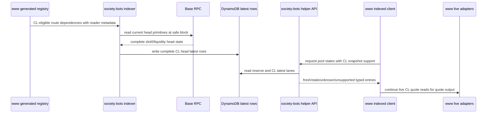

# feat: Add FAME CL Head Snapshots

**Target repos:** `society-bots` and the sibling `fls-www` checkout of GitHub `fame-lady-society/www`. Paths below are repo-relative within the repo named in each file list.

## Summary

Add a concentrated-liquidity head snapshot lane for reviewed FAME route dependencies. `www` should generate the eligibility and client contract, while `society-bots` indexes complete current CL head state and exposes it as observational market state without becoming quote authority.

Project identity note: `www` refers to the GitHub project `fame-lady-society/www`. On this machine, that companion checkout is cloned as `../fls-www`, not `../www`.

---

## Problem Frame

The current helper indexes reserve rows for constant-product quote-model pools. Reviewed Slipstream, Slipstream2, Uniswap V3, and Uniswap V4 dependencies remain visible only as unsupported tracked-only rows, even though `www` already has live adapters that know how to read their current head state.

---

## Requirements

- R1. The generated helper registry distinguishes CL head-snapshot eligibility from generic tracked-only concentrated-liquidity unsupported status.
- R2. Eligibility comes from `www` generated route dependency metadata, not independent discovery or hand-curation in `society-bots`.
- R3. The first slice covers exported Slipstream, Slipstream2, Uniswap V3, and Uniswap V4 dependencies only when generated metadata supplies the identity and fee or tick-spacing inputs needed to read them.
- R4. Fresh CL head snapshots are complete for their venue family: pool identity, token identity, venue family, fee or tick metadata, current price head, current tick, active liquidity, observed-through block, source reader, and source registry id.
- R5. Uniswap V4 snapshots are keyed by generated pool key or pool id rather than pool address.
- R6. Failed, missing, malformed, or inconsistent head reads must not produce a fresh partial snapshot.
- R7. Freshness is evaluated by `observedThroughBlock`; rows observed after the caller's quote block are stale for that caller.
- R8. The helper exposes typed CL head entries distinct from constant-product reserve rows.
- R9. The helper preserves fallback statuses: stale, unknown, and unsupported are normal success entries; malformed input, auth failure, incomplete batch reads, and dependency failures remain transport-level failures.
- R10. A fresh CL head snapshot does not imply local quote replay, tick-boundary safety, or final quote authority.
- R11. Clients do not need boundary warnings, nearest initialized ticks, tick bitmaps, or initialized tick data to fall back to live reads.
- R12. Evidence shows at least one fresh CL head snapshot and one safe fallback.
- R13. Documentation states that `society-bots` serves complete CL head market state and `www` decides live reads for quote output.

**Origin actors:** `www` route tooling, `society-bots` pool-state service, planner / implementer.
**Origin flows:** CL route dependency becomes snapshot-eligible; CL head state is observed; CL head state is consumed safely.
**Origin acceptance examples:** eligible V3 entry is not generic unsupported; failed active-liquidity read does not produce fresh partial state; future observed-through block is stale; fresh CL head without boundary warning still falls back live; evidence covers fresh snapshot, fallback, and quote-authority docs.

---

## Scope Boundaries

- No tick-boundary warning, nearest initialized tick probe, tick bitmap, initialized tick rows, or active tick-window indexing.
- No local CL quote replay, quote receipts, stable-pool math, native-wrap state lane, journal/history lane, or charting surface.
- No independent pool discovery in `society-bots`; the reviewed route universe and metadata remain generated from `www`.
- No public quote-path reliance on CL snapshots. `www` may inspect them, but live adapters remain authoritative for CL quote output.
- No new infrastructure is required for this slice; the existing helper table, API lambda, indexer lambda, and schedule should be extended in place unless implementation proves a concrete reason otherwise.

---

## Context & Research

### Relevant Code and Patterns

- `society-bots` `src/fame-swap-pool-state/types.ts` defines the current registry, reserve-only quote model, unsupported reasons, and API response domain.
- `society-bots` `src/fame-swap-pool-state/registry/index.ts` validates the generated registry with strict allowed values and capability invariants.
- `society-bots` `src/fame-swap-pool-state/dynamodb/pool-state.ts` stores latest reserve rows and cursor rows in one DynamoDB table using explicit serializers and malformed-item failures.
- `society-bots` `src/fame-swap-pool-state/indexer.ts` reads safe Base state, writes attributed latest rows, and keeps reserve freshness separate from API request freshness.
- `society-bots` `src/fame-swap-pool-state/api.ts` already treats stale, unknown, and unsupported as success entries, with malformed requests and incomplete reads as errors.
- `www` `src/features/fame-swap/solver/poolStateRegistry.ts` derives the helper registry and `sourceRegistryId` from reviewed generated artifacts.
- `www` `src/features/fame-swap/solver/quotes/indexedPoolStateClient.ts` parses the helper wire response and currently accepts reserve rows only for fresh or stale entries.
- `www` `src/features/fame-swap/solver/quotes/indexedReserveAdapter.ts` replays only fresh constant-product reserve rows and falls back for everything else.
- `www` `src/features/fame-swap/solver/quotes/liveAdapters.ts` already contains the live CL read context and ABI shapes needed to ground this work: Slipstream pool `slot0`/`liquidity`, V3 `slot0` plus the shared pool `liquidity` ABI, and V4 StateView slot0/liquidity calls.

### Institutional Learnings

- `www` `docs/solutions/architecture-patterns/fame-swap-indexed-pool-state-quote-helper-2026-05-19.md` says helper reachability is not proof of indexed quoting; freshness, provenance, and model compatibility decide whether helper rows are usable.
- The same learning keeps quote attribution per selected leg and avoids claiming indexed context for mixed indexed/live routes.
- `www` `docs/solutions/performance-issues/fame-swap-quote-solver-timeouts-native-wrap-routing-2026-05-15.md` reinforces that quote-run state caching belongs below or inside adapters, and that route primitives like native wrap should be explicit rather than silently normalized.
- No `society-bots` `docs/solutions` directory exists, so local institutional learnings come from the current helper docs and tests.

### External References

- Uniswap V3 pool data documentation identifies the current pool state as `slot0` plus pool liquidity inputs, which matches the head snapshot lane.
- Uniswap V4 StateView documentation documents off-PoolManager state reads, including slot0 and liquidity access, which matches the V4 reader shape.

---

## Key Technical Decisions

- Use generated state surface metadata instead of overloading unsupported reason: CL snapshot eligibility is a first-class generated capability, while stable pools, native wrap, and unsupported venues remain explicit fallback statuses.
- Extend the existing helper API with a client-understood CL snapshot opt-in rather than introducing a new endpoint. Existing clients keep receiving the fallback behavior they already parse; updated clients can request and inspect CL head entries.
- Store CL head rows as a separate latest-state lane in the existing DynamoDB table. Reserve rows keep their current shape and behavior; CL rows have their own state kind and storage key rules.
- Treat a CL snapshot as complete only after all required head primitives for that pool are read and validated at the same safe block. A failed or inconsistent read leaves that pool without a fresh CL row.
- Key address-backed CL pools by pool address and V4 pools by generated pool key or pool id. V4 registry metadata must include the StateView reader address needed to fetch head state.
- Keep CL head entries observational in `www`. The parser and route-lab may count or display CL freshness, but quote adapters do not replay CL math or require boundary warnings to fall back live.
- Preserve quote attribution from actual quoted legs, not helper row freshness. A fresh CL head row must never make a CL fallback leg, mixed route, or public quote response appear indexed.

---

## Open Questions

### Resolved During Planning

- Which venue-family readers make a complete first-slice CL head snapshot? Slipstream, Slipstream2, and Uniswap V3 use pool slot0 plus pool liquidity; Uniswap V4 uses generated StateView slot0 plus StateView liquidity for the generated pool id.
- Should CL head entries use the existing helper endpoint or a versioned market-state endpoint? Use the existing endpoint with an explicit CL-capable request contract to keep old clients safe and keep the slice small.
- Is boundary-risk reporting required for completeness? No. Completeness means current head state primitives are present; boundary warnings and tick windows are deliberately out of scope.

### Deferred to Implementation

- Final internal names for state kind, request opt-in, storage helpers, and log fields should follow the local naming style in each repo.
- Exact route-lab presentation should be settled while editing the existing report shape, but it must remain freshness visibility only and must not imply CL quote replay.
- Whether the indexer result reports CL read failures as one aggregate count or per-pool details can be chosen during implementation, provided failures are visible and no partial fresh row is written.

---

## High-Level Technical Design

> *This illustrates the intended approach and is directional guidance for review, not implementation specification. The implementing agent should treat it as context, not code to reproduce.*

---

## Implementation Units

### U1. Generated Registry Contract

**Goal:** Add generated CL head-snapshot eligibility and reader metadata to the helper registry contract without creating a hand-maintained pool list.

**Requirements:** R1, R2, R3, R4, R5, R10.

**Dependencies:** None.

**Files:**
- Modify: `www` `src/features/fame-swap/solver/poolStateRegistry.ts`
- Modify: `www` `src/features/fame-swap/solver/poolStateRegistry.test.ts`
- Modify: `society-bots` `src/fame-swap-pool-state/types.ts`
- Modify: `society-bots` `src/fame-swap-pool-state/registry/index.ts`
- Modify: `society-bots` `src/fame-swap-pool-state/registry/index.test.ts`
- Modify: `society-bots` `src/fame-swap-pool-state/registry/base-v1-pools.json`

**Approach:**
- Add a generated state-surface distinction that can express constant-product reserves, CL head snapshot, and unsupported tracked-only rows.
- Keep unsupported reasons for pools that remain ineligible, including stable pools, native wrap, missing fee metadata, unsupported venues, and CL pools missing required reader metadata.
- Carry enough venue-family metadata for each eligible CL pool to read the head state in `society-bots`: address-backed pools need pool address plus fee/tick metadata; V4 needs pool key or pool id plus StateView reader metadata.
- Preserve `sourceRegistryId` provenance so `www` can reject mismatched helper responses the same way it does for reserve rows.

**Patterns to follow:**
- `www` registry derivation from route pool ids and artifact hashes in `src/features/fame-swap/solver/poolStateRegistry.ts`.
- `society-bots` strict parse-and-validate style in `src/fame-swap-pool-state/registry/index.ts`.

**Test scenarios:**
- Happy path: a reviewed Uniswap V3 route dependency with fee and tick-spacing metadata parses as CL head-snapshot eligible, not generic unsupported.
- Happy path: a reviewed Slipstream or Slipstream2 dependency with pool address and tick-spacing metadata parses as CL head-snapshot eligible.
- Happy path: a reviewed V4 dependency with pool id and StateView metadata parses as CL head-snapshot eligible with no pool address requirement.
- Edge case: stable, native-wrap, and unsupported-venue rows remain tracked-only unsupported and do not become CL-eligible.
- Error path: a CL row missing required fee, tick-spacing, pool identity, or V4 reader metadata fails registry validation.
- Integration: the copied `society-bots` registry JSON matches the generated `www` contract shape and preserves artifact provenance.

**Verification:**
- The registry can distinguish reserve quote-model rows, CL head-snapshot rows, and unsupported rows without losing current unsupported statuses.

---

### U2. CL Latest-State Storage

**Goal:** Persist complete CL head snapshots as typed latest-state rows without changing reserve row semantics or table infrastructure.

**Requirements:** R4, R5, R6, R7, R8.

**Dependencies:** U1.

**Files:**
- Modify: `society-bots` `src/fame-swap-pool-state/dynamodb/pool-state.ts`
- Modify: `society-bots` `src/fame-swap-pool-state/dynamodb/pool-state.test.ts`
- Modify: `society-bots` `src/fame-swap-pool-state/types.ts`

**Approach:**
- Add a CL latest-state row type with state kind, pool identity, token identity, venue family, fee/tick metadata, current price head, current tick, active liquidity, observed-through block, source reader, and source registry id.
- Use a registry-derived storage key that supports address-backed pools and V4 pool-key-backed pools.
- Keep CL latest rows in a separate state lane so reserve `latest` rows remain backward-compatible.
- Parse stored rows strictly; malformed CL rows should fail like malformed reserve rows rather than silently degrading.

**Execution note:** Add storage serializer/parser tests before wiring the indexer so the state contract is pinned.

**Patterns to follow:**
- Existing latest reserve row serialization, batch read behavior, and malformed-item errors in `src/fame-swap-pool-state/dynamodb/pool-state.ts`.

**Test scenarios:**
- Happy path: a complete address-backed CL snapshot round-trips through the DynamoDB mapper with exact big integer string preservation.
- Happy path: a complete V4 CL snapshot round-trips using pool key identity and no pool address.
- Edge case: reserve latest rows continue to parse and batch-read exactly as before.
- Error path: missing active liquidity, current tick, current price head, source registry id, or observed-through block fails CL row parsing.
- Error path: an unprocessed or missing key in a CL batch read produces the same incomplete-batch error category used by the API layer.

**Verification:**
- The table can contain reserve and CL latest rows for the same registry universe without key collision or reserve behavior changes.

---

### U3. CL Head Indexer Lane

**Goal:** Read CL head primitives at the safe Base block and write only complete snapshots.

**Requirements:** R4, R5, R6, R7, R12.

**Dependencies:** U1, U2.

**Files:**
- Modify: `society-bots` `src/fame-swap-pool-state/indexer.ts`
- Modify: `society-bots` `src/fame-swap-pool-state/indexer.test.ts`
- Modify: `society-bots` `src/fame-swap-pool-state/lambdas/indexer.ts`

**Approach:**
- Extend the indexer client abstraction with CL head reading for the eligible venue families, reusing viem `readContract` patterns already used for reserve reads.
- Read each pool's required head primitives at the same safe block used by the indexer run.
- Validate each candidate snapshot before writing it. A failed slot0, failed liquidity read, malformed value, wrong identity, or missing metadata must leave that pool without a fresh CL row.
- Keep reserve sync and CL head indexing as separate lanes with independent result counts so CL read issues cannot masquerade as reserve freshness.
- Surface CL read failures in the existing structured indexer result/log path instead of silently treating them as unsupported.

**Patterns to follow:**
- Safe block selection, viem client construction, and result logging in `src/fame-swap-pool-state/indexer.ts`.
- Existing fake-client style in `src/fame-swap-pool-state/indexer.test.ts`.

**Test scenarios:**
- Happy path: eligible V3, Slipstream, and V4 fixtures produce complete CL rows observed through the safe block.
- Edge case: a run with no eligible CL rows leaves reserve indexing behavior unchanged and records zero CL snapshots.
- Error path: active liquidity read fails for one eligible pool, and no fresh partial snapshot is written for that pool.
- Error path: slot0 and liquidity are observed at mismatched blocks or inconsistent identity, and the candidate row is rejected.
- Integration: reserve row writes and reserve cursor behavior remain covered by existing indexer tests after CL lane wiring.

**Verification:**
- An indexer run can produce at least one complete CL head snapshot while preserving all existing reserve indexing invariants.

---

### U4. Helper API and `www` Client Compatibility

**Goal:** Expose typed CL head entries to prepared clients while preserving old fallback behavior and reserve quote-model behavior.

**Requirements:** R7, R8, R9, R10, R11, R12.

**Dependencies:** U1, U2.

**Files:**
- Modify: `society-bots` `src/fame-swap-pool-state/api.ts`
- Modify: `society-bots` `src/fame-swap-pool-state/api.test.ts`
- Modify: `society-bots` `src/fame-swap-pool-state/lambdas/api.ts`
- Modify: `society-bots` `src/fame-swap-pool-state/lambdas/api.test.ts`
- Modify: `www` `src/features/fame-swap/solver/quotes/indexedPoolStateClient.ts`
- Modify: `www` `src/features/fame-swap/solver/quotes/indexedPoolStateClient.test.ts`
- Modify: `www` `src/features/fame-swap/solver/quotes/indexedReserveAdapter.ts`
- Modify: `www` `src/features/fame-swap/solver/quotes/indexedReserveAdapter.test.ts`
- Modify: `www` `src/app/api/fame/swap/quote/handler.ts`
- Modify: `www` `src/app/api/fame/swap/quote/route.test.ts`

**Approach:**
- Add a CL-capable request contract so clients that do not understand CL head entries continue to receive fallback-compatible responses for CL pools.
- Return CL head fresh or stale entries only when the client contract indicates support; otherwise preserve the existing unsupported behavior.
- Apply existing freshness rules to CL rows, including stale when `observedThroughBlock` is ahead of the caller's current block.
- Update the `www` parser to accept reserve entries and CL head entries as distinct fresh/stale variants.
- Keep indexed reserve replay limited to fresh constant-product reserve entries. CL entries should be inspectable but should delegate quote output to the fallback live adapter.
- If the server quote path opts into CL head entries, keep route and public quote context tied to actual quoted leg contexts so CL fallback legs remain live.

**Execution note:** Start with response-parser and API contract tests because this unit protects cross-repo compatibility.

**Patterns to follow:**
- Current success-entry and transport-error split in `src/fame-swap-pool-state/api.ts`.
- Current `www` strict response parser in `src/features/fame-swap/solver/quotes/indexedPoolStateClient.ts`.
- Current reserve-only replay guard in `src/features/fame-swap/solver/quotes/indexedReserveAdapter.ts`.

**Test scenarios:**
- Happy path: a CL-capable request for an eligible pool with a fresh CL row returns a typed fresh CL head entry.
- Happy path: the `www` parser accepts a CL fresh entry and preserves the head state fields needed for inspection.
- Edge case: a non-CL-capable request for the same eligible CL pool receives the existing fallback-compatible unsupported result.
- Edge case: `observedThroughBlock` greater than caller `currentBlock` returns stale rather than fresh.
- Error path: malformed CL response fields fail the `www` parser rather than being treated as unknown data.
- Error path: incomplete batch reads remain transport-level helper failures.
- Covers fresh CL without boundary warning still falling back live: indexed reserve adapter ignores CL entries for quote replay and uses the live fallback adapter.
- Integration: a public quote response that sees fresh CL head state but quotes through a live CL leg does not report an indexed quote context for that leg or route.

**Verification:**
- Updated clients can inspect CL head freshness, old clients keep safe fallback behavior, and reserve quote-model replay remains unchanged.

---

### U5. Evidence, Route-Lab Visibility, and Docs

**Goal:** Make the new market-state lane observable to developers and document the authority split.

**Requirements:** R10, R11, R12, R13.

**Dependencies:** U3, U4.

**Files:**
- Modify: `society-bots` `docs/fame-pool-state-index.md`
- Modify: `society-bots` `docs/fame-pool-state-handoff.md`
- Modify: `www` `scripts/fame-swap-route-lab.ts`
- Modify: `www` `scripts/fame-swap-route-lab.test.ts`
- Modify: `www` `docs/fame-swap-route-lab.md`

**Approach:**
- Update `society-bots` docs to describe reserve rows and CL head snapshots as separate state lanes with the same freshness/provenance discipline.
- Update `www` route-lab indexed mode to surface CL head freshness counts or details for inspection without adding boundary warnings or CL quote attribution.
- Add route-lab evidence that shows one fresh CL head snapshot and one fallback case.
- Explicitly document that `society-bots` provides complete current CL head market state and `www` remains responsible for live quote reads.

**Patterns to follow:**
- Existing indexed helper guidance in `docs/fame-pool-state-index.md`.
- Existing indexed route-lab summary and status count tests in `scripts/fame-swap-route-lab.ts` and `scripts/fame-swap-route-lab.test.ts`.

**Test scenarios:**
- Happy path: indexed route-lab output includes CL head freshness visibility when the helper returns a fresh CL entry.
- Edge case: route-lab output does not emit boundary-risk, nearest-tick, or local-replay claims for CL entries.
- Covers safe fallback evidence: route-lab or tests show a stale, unknown, or unsupported CL dependency still producing live quote fallback.
- Documentation check: docs state complete CL head snapshots are observational market state and not quote authority.

**Verification:**
- A reviewer can see fresh CL snapshot evidence and fallback evidence without mistaking the helper for a CL quote replay engine.

---

## System-Wide Impact

- **Interaction graph:** Generated `www` route metadata feeds `society-bots` registry validation, the indexer writes latest CL rows, the helper API serves typed state entries, and `www` parses them while continuing live CL quote reads.
- **Error propagation:** Invalid requests and incomplete batch reads remain API errors; stale, unknown, and unsupported remain success entries; CL read failures must be visible in indexer results and must not create fresh partial rows.
- **State lifecycle risks:** Reserve and CL lanes share the same DynamoDB table, so key and sort-key separation must prevent collisions. V4 pool-key storage needs the same normalization discipline address-backed rows already have.
- **API surface parity:** `society-bots` and `www` must agree on the CL-capable request contract and typed response union before CL rows are exposed to route-lab or quote tooling.
- **Integration coverage:** Unit tests cover registry, storage, indexer, API, and parser behavior; route-lab evidence covers the cross-repo inspection path.
- **Unchanged invariants:** Constant-product reserve rows, helper auth, source registry mismatch handling, and reserve-only indexed quote replay should behave as they do today.

---

## Risks & Dependencies

| Risk | Mitigation |
|------|------------|
| Old `www` parser breaks when a helper starts returning CL fresh rows | Gate CL entries behind a client-understood request contract and update parser tests before enabling route-lab inspection |
| V4 snapshots cannot be read from pool address | Require generated pool key or pool id plus StateView reader metadata and validate V4 identity separately |
| A failed CL read creates misleading freshness | Validate complete snapshots before writing and keep stale/unknown fallback semantics for missing fresh rows |
| Reserve indexing regresses while adding a second state lane | Keep reserve row shape and cursor behavior unchanged; run existing reserve registry, storage, API, and indexer tests alongside new CL tests |
| Registry drift between `www` and `society-bots` makes snapshots untrustworthy | Preserve `sourceRegistryId` provenance and require generated artifact updates as part of the implementation |
| Fresh CL helper rows inflate public indexed quote attribution | Test the server quote path and indexed reserve adapter so quote context still reflects actual leg quote sources |
| Route-lab wording implies local CL replay or boundary safety | Limit route-lab additions to freshness visibility and document that quote output remains live-adapter authority |

---

## Documentation / Operational Notes

- Update helper docs to describe two state lanes: constant-product reserve replay support and CL head snapshot observation.
- Add operator-facing evidence for at least one fresh CL snapshot and one fallback case.
- Keep deployment notes focused on the existing helper lambdas and table; no new CDK resources are expected for this slice.
- During rollout, deploy the `www` parser/client compatibility before or together with helper CL responses so no active client sees an unparseable response.

---

## Sources & References

- Origin document: `docs/brainstorms/2026-05-19-fame-cl-head-snapshot-requirements.md`
- Prior ideation: `docs/ideation/2026-05-19-fame-non-reserve-market-state-indexing-ideation.md`
- Existing helper docs: `docs/fame-pool-state-index.md`, `docs/fame-pool-state-handoff.md`
- `www` institutional learning: `docs/solutions/architecture-patterns/fame-swap-indexed-pool-state-quote-helper-2026-05-19.md`
- `www` institutional learning: `docs/solutions/performance-issues/fame-swap-quote-solver-timeouts-native-wrap-routing-2026-05-15.md`
- Uniswap V3 pool data: https://developers.uniswap.org/docs/sdks/v3/guides/pool-data
- Uniswap V4 StateView: https://developers.uniswap.org/docs/protocols/v4/guides/state-view
