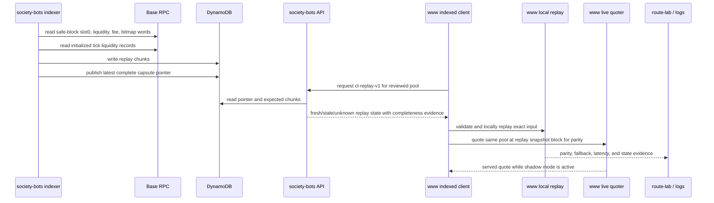
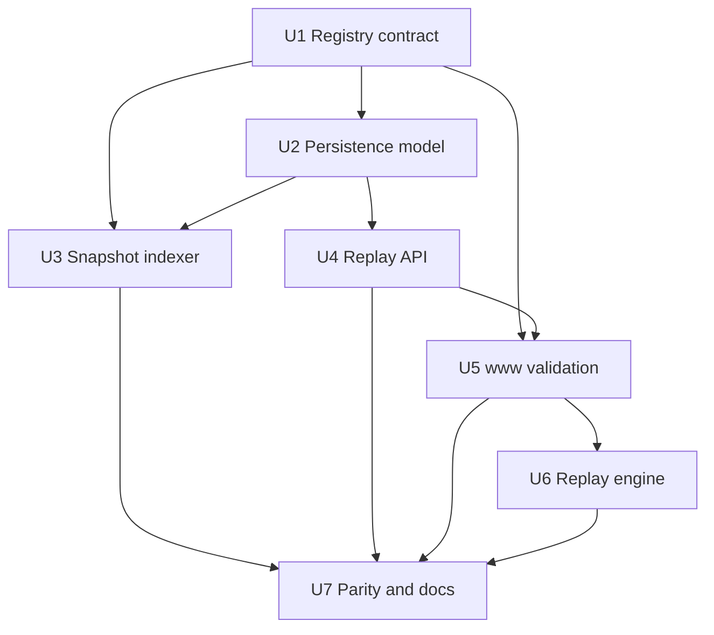

# feat: Add Slipstream CL Replay Snapshot Proof

**Target repos:** `society-bots` and sibling `www`. Paths below are repo-relative within the repo named in each file list.

## Summary

Make `slipstream-usdc-weth-100` the first replay-capable concentrated-liquidity pool in the FAME quote stack. `society-bots` will publish a complete safe-block replay snapshot as raw indexed state, while `www` owns local Slipstream exact-input replay, shadow parity against the live quoter, fallback behavior, and promotion evidence.

---

## Problem Frame

FAME USDC routes often bottleneck through `slipstream-usdc-weth-100`, but concentrated-liquidity amount-out still depends on live quoter calls. The current CL head snapshot lane proves current price and active liquidity, yet it cannot replay swaps that cross initialized ticks because the initialized tick bitmap, per-tick liquidity deltas, and exact dynamic swap fee are missing.

This plan deliberately over-indexes one high-impact pool so correctness can become binary before broadening coverage. The milestone is not "all CL pools are locally quoteable"; it is "one pool has complete replay state, exact same-block shadow parity, and safe live fallback whenever replay is not trustworthy" (see origin: `docs/brainstorms/2026-05-20-slipstream-usdc-weth-100-cl-replay-snapshot-proof-requirements.md`).

---

## Requirements

- R1. Limit replayable CL scope to exactly `slipstream-usdc-weth-100`; every other CL pool remains observational, unsupported, or live-quoted.
- R2. Capture all same-block state needed for exact-input replay across initialized tick crossings: head price, current tick, active liquidity, tick spacing, initialized tick bitmap words, initialized tick liquidity records, exact dynamic fee, pool identity, token order, and block identity.
- R3. Publish replay state only when it is complete for one safe block. Mixed-block reads, missing block identity, missing dynamic fee, missing tick data, incomplete chunks, or inconsistent snapshot hashes make replay state unavailable.
- R4. Use periodic safe-block full snapshots for the first milestone, not event-driven tick maintenance.
- R5. Expose raw replay state from `society-bots`; do not add route selection, output amount, slippage, or quote readiness authority there.
- R6. Preserve existing reserve and CL head behavior. Clients that do not opt into replay state must not accidentally treat CL head rows as replay authority.
- R7. In `www`, validate source registry, pool identity, token direction, freshness, quote block ordering, replay model support, tick completeness, dynamic fee presence, and parser validity before replay.
- R8. On any validation failure, `www` falls back to the live Slipstream quoter and emits one structured fallback reason.
- R9. Keep Slipstream replay math in `www` for the first implementation and compare local replay against the live quoter in shadow mode.
- R10. Require exact same-block parity for deterministic comparison fields, especially `amountOut` and post-swap price where exposed. Tolerance-based production matching is out of scope.
- R11. Validate both WETH -> USDC and USDC -> WETH across tiny, common, larger, and tick-crossing amount bands.
- R12. While shadow mode is active, public/user-facing quote behavior remains live-quoter-backed even when local replay succeeds.
- R13. Surface operator evidence for snapshot age, observed block, state completeness, dynamic fee freshness, fallback reasons, parity result, and live-vs-replay latency.
- R14. Keep the milestone clear: fresh replay state plus shadow parity, not broad CL indexing or public indexed CL quotes.

**Origin actors:** A1 `society-bots` pool-state indexer, A2 `www` quote system, A3 operator/reviewer, A4 FAME swap user.
**Origin flows:** F1 snapshot state is captured, F2 shadow replay is evaluated, F3 promotion is considered.
**Origin acceptance examples:** AE1 complete safe-block replay state is replay-eligible; AE2 missing tick or fee state falls back live; AE3 shadow success still serves live quote; AE4 future-block replay state is unusable; AE5 parity matrix blocks promotion on any deterministic mismatch; AE6 operator output shows freshness, parity, latency, and fallback reasons.

---

## Scope Boundaries

- No event-driven tick maintenance in the first milestone.
- No generic replay for other Slipstream, Slipstream2, Uniswap V3, or Uniswap V4 pools.
- No `society-bots` quote endpoint, route authority, slippage logic, or output amount service.
- No user-facing indexed CL quote result before shadow parity is proven and explicitly enabled in later work.
- No tolerance-based production parity for deterministic fields.
- No stable-pool math, native-wrap changes, router changes, candidate generation changes, or exotic route promotion.
- No dashboards beyond route-lab, logs, and smoke evidence needed to validate this first proof.

### Deferred to Follow-Up Work

- Event-driven tick maintenance after snapshot parity is proven.
- Shared package extraction for CL math after `www` proves the replay engine and call contract.
- Cached route pruning, quote heatmaps, historical liquidity/price charts, market-state dashboards, and route-level performance telemetry beyond the operator evidence in this plan.

---

## Context & Research

### Relevant Code and Patterns

- `society-bots` `src/fame-swap-pool-state/types.ts` already models schema v2, `stateSurface`, `tickSpacing`, quote-model capability, and CL head snapshot eligibility.
- `society-bots` `src/fame-swap-pool-state/registry/base-v1-pools.json` already contains `slipstream-usdc-weth-100` with pool address `0xb2cc224c1c9fee385f8ad6a55b4d94e92359dc59`, WETH as `token0`, USDC as `token1`, and `tickSpacing: 100`.
- `society-bots` `src/fame-swap-pool-state/indexer.ts` already chooses a safe block, reads `slot0` and `liquidity`, writes complete CL head snapshots, and records per-pool failures without publishing partial CL head rows.
- `society-bots` `src/fame-swap-pool-state/dynamodb/pool-state.ts` uses explicit latest-state row types, monotonic writes, strict item parsing, and incomplete batch read errors.
- `society-bots` `src/fame-swap-pool-state/api.ts` already supports opt-in state surfaces and separates success statuses (`fresh`, `stale`, `unknown`, `unsupported`) from request/transport errors.
- `society-bots` `src/wagmi.generated.ts` already includes ABI surface for `tickBitmap` and `ticks`, including `liquidityGross` and `liquidityNet`.
- `www` `src/features/fame-swap/solver/poolStateRegistry.ts` is behind the `society-bots` registry schema and currently treats CL pools as tracked-only unsupported.
- `www` `src/features/fame-swap/solver/quotes/indexedPoolStateClient.ts` currently requests pool ids and parses reserve rows only.
- `www` `src/features/fame-swap/solver/quotes/indexedReserveAdapter.ts` demonstrates the fallback shape: replay only fresh model-compatible rows and delegate stale, malformed, mismatched, or unsupported state to the fallback adapter.
- `www` `src/features/fame-swap/solver/quotes/liveAdapters.ts` currently reads Slipstream `slot0`, reads active liquidity as evidence, and calls the live Slipstream quoter for amount-out.
- `www` `scripts/fame-swap-route-lab.ts` already has an indexed mode, indexed status counts, fallback reason summaries, and public-output redaction discipline.

### Institutional Learnings

- `www` `docs/solutions/architecture-patterns/fame-swap-indexed-pool-state-quote-helper-2026-05-19.md` says helper reachability is not proof of indexed quoting. Provenance, freshness, model compatibility, and selected-leg attribution decide whether indexed state is usable.
- The same learning requires route attribution to reflect actual selected leg quote sources; mixed indexed/live routes must not claim fully indexed context.
- `docs/fame-pool-state-index.md` and `docs/fame-pool-state-handoff.md` state the current authority split: `society-bots` indexes state, while `www` owns quote math, fallback, route-lab, and public quote behavior.

### External References

- Uniswap V3 pool data guidance describes full offchain pool construction as `slot0`, `liquidity`, `tickBitmap`, and `ticks` reads, with multicall used to keep large tick reads same-block.
- Aerodrome Slipstream is a V3-derived CL implementation; its core pool exposes `slot0`, `liquidity`, `ticks`, `tickBitmap`, and a dynamic `fee()` that delegates swap fee lookup to the factory.

---

## Key Technical Decisions

- **Full safe-block snapshot first:** Snapshotting all initialized tick state for one pool is easier to verify than an event reducer. The indexer can recover from any missed run by taking a new complete snapshot.
- **Raw replay state API:** `society-bots` should expose replay primitives and eligibility evidence, not a quote endpoint. This preserves the existing cross-repo contract and keeps route attribution in `www`.
- **Chunked DynamoDB snapshot rows:** Store a latest replay capsule pointer plus deterministic bitmap/tick chunk rows. This avoids item-size risk and lets the API prove completeness before returning replay-capable state.
- **Chunks written before latest pointer:** Write chunk rows first, then publish the latest capsule pointer last. If a run dies midway, old complete state remains the latest replay state and orphan chunks are ignored.
- **Exact dynamic fee from pool state:** Replay must use the dynamic fee read from the pool at the snapshot block, not registry `feeBps` labels. The implementation must verify integer units against the live quoter during parity work.
- **`www` math ownership first:** The initial replay module lives in `www` because quote context, fallback, route attribution, and parity tests already live there. A shared package is follow-up work after the engine proves itself.
- **Exact parity threshold:** Deterministic comparisons must match exactly at the same block. Any mismatch means the state, math, fee units, rounding, or comparison harness is wrong.
- **Shadow before hot path:** Local replay can run beside the live quoter and emit evidence, but live quoter output remains the served result until a later explicit promotion switch.

---

## Open Questions

### Resolved During Planning

- Should milestone one use event-driven tick maintenance or full snapshots? Use full safe-block snapshots first; event maintenance is deferred until complete-snapshot parity is proven.
- Should `society-bots` expose raw state or a quote endpoint? Expose raw state only; `www` remains quote authority.
- Which side owns CL math first? `www`, with shared package extraction deferred.
- What parity threshold is acceptable? Exact deterministic parity for production promotion; no tolerance threshold.

### Deferred to Implementation

- Measured initialized tick count, bitmap word count, provider call count, payload size, and snapshot duration for `slipstream-usdc-weth-100`: this depends on live chain reads and should be captured as a gating metric in the snapshot unit.
- Exact dynamic fee units for Slipstream replay: read `fee()` at the snapshot block and validate units against live quoter parity before any promotion.
- Final chunk size and maximum response payload guard: choose after measuring actual tick count and DynamoDB item sizes, while preserving the plan's chunked-completeness model.
- Exact route-lab amount corpus: pick concrete tiny/common/large/tick-crossing amounts during implementation using current route-lab corpus conventions.

---

## High-Level Technical Design

> *This illustrates the intended approach and is directional guidance for review, not implementation specification. The implementing agent should treat it as context, not code to reproduce.*

### Replay Snapshot State Shape

The intended DynamoDB shape uses the existing table and identity conventions, with a new replay lane:

- Latest pointer row: pool identity key plus `sk: "cl-replay-v1"`. It contains pool identity, token order, observed block, block hash, parent hash, source registry id, state hash, tick spacing, head state, dynamic fee, bitmap/tick counts, word range, tick range, and chunk counts.
- Bitmap chunk rows: same pool identity key plus snapshot-specific sort keys. Each chunk stores ordered `{ wordPosition, bitmap }` records and repeats snapshot id, block hash, source registry id, and state hash.
- Tick chunk rows: same pool identity key plus snapshot-specific sort keys. Each chunk stores ordered `{ tick, liquidityGross, liquidityNet }` records and repeats snapshot id, block hash, source registry id, and state hash.

The API reads the latest pointer, then batch-reads exactly the chunks named by the pointer, splitting reads into bounded batches if the expected chunk count exceeds one DynamoDB batch. Missing chunks, mismatched snapshot identity, mismatched state hash, mismatched block identity, or unprocessed DynamoDB keys make replay state unavailable.

### API Response Shape

The replay API remains `POST /fame/pool-state` with an explicit opt-in surface such as `cl-replay-v1`. A replay entry should be a distinct `stateKind` from `cl-head-snapshot`, carry `status: "fresh" | "stale"` only when a complete capsule exists, and inline the replay arrays for this one-pool proof. The response must include enough evidence for `www` to decide eligibility without a second helper call: block identity, source registry id, state hash, completeness counts, dynamic fee source, head state, bitmap words, initialized ticks, and freshness bounds.

### Freshness and Invalidation Model

- Producer freshness uses `observedThroughBlock`, the same rule as reserve and CL head rows.
- Replay state observed ahead of the `www` quote context block is stale for that quote.
- Registry id mismatch, unsupported pool id, missing dynamic fee, malformed decimal strings, missing chunks, chunk hash mismatch, unsupported direction, replay outside the indexed word range, replay exceptions, or shadow parity mismatch all invalidate local replay for that request.
- There is no event-driven invalidation in milestone one. A newer complete snapshot replaces the latest pointer; stale or invalid state falls back live.

---

## Implementation Units

### U1. Registry and Capability Contract

**Goal:** Align both repos on a replay-capable state surface for exactly `slipstream-usdc-weth-100` while preserving existing reserve and CL head behavior.

**Requirements:** R1, R5, R6, R14.

**Dependencies:** None.

**Files:**
- Modify: `society-bots` `src/fame-swap-pool-state/types.ts`
- Modify: `society-bots` `src/fame-swap-pool-state/registry/index.ts`
- Modify: `society-bots` `src/fame-swap-pool-state/registry/index.test.ts`
- Modify: `society-bots` `src/fame-swap-pool-state/registry/base-v1-pools.json`
- Modify: `www` `src/features/fame-swap/solver/poolStateRegistry.ts`
- Modify: `www` `src/features/fame-swap/solver/poolStateRegistry.test.ts`
- Modify: `www` `scripts/fame-swap-pool-state-registry.ts`

**Approach:**
- Add a replay-capable marker or state surface that can only apply to `slipstream-usdc-weth-100` in this milestone.
- Keep `cl-head-snapshot` separate from `cl-replay-v1`; head snapshots remain diagnostic state, not replay authority.
- Generate the replay marker from `www` metadata and copy it into `society-bots` through the existing registry export path, rather than hand-curating the pool in `society-bots`.
- Preserve unsupported/tracked-only status for every other CL pool, including nearby Slipstream alternatives.

**Patterns to follow:**
- Existing registry generation and `sourceRegistryId` derivation in `www` `src/features/fame-swap/solver/poolStateRegistry.ts`.
- Existing strict runtime registry validation in `society-bots` `src/fame-swap-pool-state/registry/index.ts`.

**Test scenarios:**
- Covers AE1. Happy path: `slipstream-usdc-weth-100` is generated and parsed as the only replay-capable CL pool.
- Edge case: other Slipstream, Slipstream2, Uniswap V3, and Uniswap V4 rows remain CL head, tracked-only, or unsupported but not replay-capable.
- Error path: a replay-capable row missing pool address, token order, tick spacing, or Slipstream venue identity fails registry validation.
- Integration: regenerated `base-v1-pools.json` preserves the same source registry id inputs and adds no hand-authored metadata.

**Verification:**
- Both repos agree that exactly one pool can request `cl-replay-v1`, and old reserve/head clients keep their current behavior.

---

### U2. Replay Snapshot Persistence Model

**Goal:** Add typed DynamoDB state for complete CL replay capsules, including latest pointer and chunk rows.

**Requirements:** R2, R3, R6, R13.

**Dependencies:** U1.

**Files:**
- Modify: `society-bots` `src/fame-swap-pool-state/dynamodb/pool-state.ts`
- Modify: `society-bots` `src/fame-swap-pool-state/dynamodb/pool-state.test.ts`

**Approach:**
- Add types and parsers for a replay latest pointer row, bitmap chunk rows, and tick chunk rows.
- Store bigint values as decimal strings or canonical hex strings consistently with existing DynamoDB parser style; do not use lossy numbers for fee, liquidity, bitmap, or tick liquidity values.
- Include block number, block hash, parent hash, snapshot id, state hash, source registry id, and updated timestamp on all replay rows.
- Make `batchGetLatestReplayStates` read the pointer and expected chunks, returning only complete, internally consistent capsules.
- Treat DynamoDB `UnprocessedKeys` as incomplete batch reads, matching existing helper fail-fast behavior.
- Keep reserve `latest` rows and `cl-head-snapshot-v1` rows unchanged.

**Execution note:** Start with storage parser and completeness tests before indexer/API wiring.

**Patterns to follow:**
- Existing latest reserve and CL head row serialization in `society-bots` `src/fame-swap-pool-state/dynamodb/pool-state.ts`.
- Existing malformed-item and incomplete-batch tests in `society-bots` `src/fame-swap-pool-state/dynamodb/pool-state.test.ts`.

**Test scenarios:**
- Happy path: a complete replay capsule with multiple bitmap and tick chunks round-trips through typed parsers with exact string preservation.
- Happy path: chunks written before the latest pointer are read as one complete capsule once the pointer exists.
- Edge case: reserve and CL head rows for the same pool identity still parse and batch-read exactly as before.
- Error path: a missing expected chunk returns no replay-capable capsule for that pool.
- Error path: a chunk whose block hash, snapshot id, source registry id, or state hash differs from the pointer invalidates the capsule.
- Error path: malformed fee, bitmap, tick, liquidity gross, or liquidity net values fail parsing instead of silently falling back to partial state.

**Verification:**
- The table can hold reserve, CL head, and CL replay state without key collisions, and replay state cannot be returned unless every expected chunk matches the latest pointer.

---

### U3. Safe-Block Full Snapshot Indexer

**Goal:** Capture full replay state for `slipstream-usdc-weth-100` at one safe block and publish only complete capsules.

**Requirements:** R1, R2, R3, R4, R13.

**Dependencies:** U1, U2.

**Files:**
- Modify: `society-bots` `src/fame-swap-pool-state/indexer.ts`
- Modify: `society-bots` `src/fame-swap-pool-state/indexer.test.ts`
- Modify: `society-bots` `src/fame-swap-pool-state/lambdas/indexer.ts`

**Approach:**
- Extend the indexer client abstraction with one-pool replay snapshot reads: `slot0`, `liquidity`, dynamic `fee()`, block identity, full tick bitmap word range, and initialized tick records.
- Compute the bitmap word range from Slipstream tick spacing and the CL tick bounds; use the measured full range for milestone one unless provider limits prove it infeasible.
- Read bitmap words and tick records at the same safe block. Prefer multicall/batched reads where the local viem setup supports same-block calls. If generated ABI coverage is missing, refresh the ABI artifact through the repo's existing generation path rather than hand-editing generated output.
- Derive initialized ticks from nonzero bitmap words, then read `ticks` only for initialized tick indices.
- Measure and log bitmap word count, initialized tick count, tick chunk count, snapshot duration, provider read count, state hash, and failure reason.
- Write chunks first and publish the latest pointer last. If any read or write fails, leave the previous complete pointer intact.
- Keep current reserve and CL head indexing lanes intact. Replay snapshot failure should not corrupt reserve freshness or CL head snapshots.

**Execution note:** Add characterization coverage around the existing safe-block and CL head behavior before adding replay snapshot reads.

**Patterns to follow:**
- Safe-block selection and fake-client tests in `society-bots` `src/fame-swap-pool-state/indexer.ts`.
- Current CL head failure aggregation in `society-bots` `src/fame-swap-pool-state/indexer.test.ts`.

**Test scenarios:**
- Covers AE1. Happy path: fake bitmap words with initialized ticks produce a complete replay capsule observed through the safe block.
- Edge case: zero initialized ticks in a fixture produces a complete empty-tick capsule only if head state and fee are still present.
- Edge case: full snapshot failure for `slipstream-usdc-weth-100` does not prevent reserve reconciliation or CL head snapshot writes for other pools.
- Error path: dynamic fee read failure writes no replay pointer and records a replay failure reason.
- Error path: one tick read fails after bitmap reads; chunks are not published as latest replay state.
- Error path: block identity changes within the read set; the snapshot is rejected as mixed-block state.
- Integration: repeated runs publish newer complete snapshots monotonically and ignore older or partial attempts.

**Verification:**
- Indexer logs and result objects show replay snapshot success or explicit failure, plus sizing metrics needed to decide whether full snapshots are cheap enough.

---

### U4. Replay API Surface

**Goal:** Serve complete `cl-replay-v1` state to opt-in callers without breaking reserve or CL head clients.

**Requirements:** R3, R5, R6, R7, R8, R13.

**Dependencies:** U1, U2.

**Files:**
- Modify: `society-bots` `src/fame-swap-pool-state/api.ts`
- Modify: `society-bots` `src/fame-swap-pool-state/api.test.ts`
- Modify: `society-bots` `src/fame-swap-pool-state/lambdas/api.ts`
- Modify: `society-bots` `src/fame-swap-pool-state/lambdas/api.test.ts`

**Approach:**
- Extend request parsing to accept `cl-replay-v1` as an explicit state-surface opt-in.
- Return replay entries only for replay-capable registry rows and only when the persistence layer returns a complete capsule that matches the current source registry id.
- Apply the existing freshness policy to replay capsules, including stale when `observedThroughBlock` is ahead of `currentBlock`.
- Return per-pool `unknown` for missing or incomplete replay state, while preserving transport-level failure for malformed requests and DynamoDB unprocessed keys.
- Include state completeness evidence in success entries: observed block, block hash, state hash, dynamic fee source, word/tick/chunk counts, and freshness bounds.
- Keep `cl-head-snapshot` responses unchanged and do not include replay arrays unless the caller opts into replay.

**Execution note:** Start with request/response contract tests because this is the cross-repo compatibility boundary.

**Patterns to follow:**
- Existing state-surface parser and freshness handling in `society-bots` `src/fame-swap-pool-state/api.ts`.
- Current Lambda sanitized batch logging in `society-bots` `src/fame-swap-pool-state/lambdas/api.ts`.

**Test scenarios:**
- Covers AE1. Happy path: an opt-in replay request for `slipstream-usdc-weth-100` returns a fresh `cl-replay-v1` entry with full replay arrays and completeness metadata.
- Covers AE2. Error path: a missing tick chunk returns replay-unavailable status instead of a fresh partial entry.
- Covers AE4. Edge case: a capsule observed through a future block relative to the caller is stale.
- Edge case: a caller that requests only reserves or `cl-head-snapshot` does not receive replay arrays.
- Edge case: another CL pool requested with `cl-replay-v1` returns unsupported or unknown according to registry/state, not replay-capable data.
- Error path: malformed `stateSurfaces` still returns the existing invalid-request response class.
- Integration: Lambda batch logs include replay status counts and no raw tick payloads or secrets.

**Verification:**
- `POST /fame/pool-state` can serve replay state only to opt-in clients, and all incomplete or stale conditions are distinguishable enough for `www` fallback telemetry.

---

### U5. `www` Client Validation and Fallback Contract

**Goal:** Teach `www` to request, parse, validate, and attribute replay state without changing served quote behavior.

**Requirements:** R5, R6, R7, R8, R12, R13.

**Dependencies:** U1, U4.

**Files:**
- Modify: `www` `src/features/fame-swap/solver/quotes/indexedPoolStateClient.ts`
- Modify: `www` `src/features/fame-swap/solver/quotes/indexedPoolStateClient.test.ts`
- Create: `www` `src/features/fame-swap/solver/quotes/indexedSlipstreamReplayState.ts`
- Create: `www` `src/features/fame-swap/solver/quotes/indexedSlipstreamReplayState.test.ts`
- Modify: `www` `src/app/api/fame/swap/quote/handler.ts`
- Modify: `www` `src/app/api/fame/swap/quote/route.test.ts`
- Modify: `www` `src/features/fame-swap/solver/quotes/quoteContext.ts`

**Approach:**
- Add an explicit client request option for replay state so normal indexed reserve calls do not suddenly receive large CL replay payloads.
- Parse `cl-replay-v1` entries as a distinct state kind with strict decimal/hex validation for all replay primitives.
- Add a pure validator that converts parsed replay state into a `www` replay input only when source registry id, pool id, pool address, token order, direction, freshness, block ordering, dynamic fee, chunk completeness, and indexed tick range are valid.
- Emit one structured fallback reason for each rejected replay attempt. Reasons should distinguish stale/future state, missing state, incomplete state, malformed state, unsupported direction, source registry mismatch, outside indexed range, replay error, and parity mismatch.
- Wire the quote API only in shadow mode behind a server-side control. Public served quotes continue to use the live adapter while shadow evidence is recorded.
- Keep helper URL and service token server-only and preserve current sanitized helper failure logging.

**Patterns to follow:**
- Strict parser style in `www` `src/features/fame-swap/solver/quotes/indexedPoolStateClient.ts`.
- Fallback-only reserve adapter discipline in `www` `src/features/fame-swap/solver/quotes/indexedReserveAdapter.ts`.
- Server-only helper env and sanitized logging in `www` `src/app/api/fame/swap/quote/handler.ts`.

**Test scenarios:**
- Covers AE2. Error path: missing dynamic fee or tick data produces the matching fallback reason and delegates to the live adapter.
- Covers AE4. Edge case: replay state observed ahead of the quote context block is rejected before replay.
- Happy path: parsed fresh replay state for `slipstream-usdc-weth-100` validates for both token directions.
- Edge case: a replay response for the right pool but mismatched token order is rejected with a typed reason.
- Edge case: state with a valid pointer but outside the indexed word range is rejected before quote output is used.
- Error path: malformed bitmap, liquidity, fee, or tick strings fail parsing and trigger helper fallback without leaking raw payloads.
- Integration: quote API shadow mode records replay validation evidence while the served quote remains live.

**Verification:**
- `www` can safely hold replay state beside live quotes, with every unusable state path mapped to a single operator-readable fallback reason.

---

### U6. Slipstream Local Replay Engine and Shadow Adapter

**Goal:** Implement deterministic exact-input Slipstream replay in `www` and compare it against the live quoter at the same block.

**Requirements:** R2, R7, R8, R9, R10, R11, R12.

**Dependencies:** U5.

**Files:**
- Create: `www` `src/features/fame-swap/solver/quotes/slipstreamClReplay.ts`
- Create: `www` `src/features/fame-swap/solver/quotes/slipstreamClReplay.test.ts`
- Create: `www` `src/features/fame-swap/solver/quotes/indexedSlipstreamReplayAdapter.ts`
- Create: `www` `src/features/fame-swap/solver/quotes/indexedSlipstreamReplayAdapter.test.ts`
- Modify: `www` `src/features/fame-swap/solver/quotes/liveAdapters.ts`
- Modify: `www` `src/features/fame-swap/solver/quotes/adapters.ts` if protocol evidence needs replay/parity fields
- Modify: `www` `src/features/fame-swap/solver/quotes/rankRoutes.ts`
- Modify: `www` `src/features/fame-swap/solver/quotes/rankRoutes.test.ts`

**Approach:**
- Implement a pure bigint replay module for exact-input Slipstream swaps over the provided state: direction, amount in, optional price limit, current sqrt price, current tick, active liquidity, dynamic fee, bitmap words, and tick liquidity net.
- Port or adapt only the required V3-style math: tick bitmap traversal, next initialized tick selection, swap step math, fee application, tick crossing, liquidity net updates, and rounding semantics.
- Fail fast on violated replay assumptions such as unsupported direction, missing next initialized tick, liquidity underflow, price limit outside allowed bounds, or amount/output overflow.
- Wrap the replay module in a shadow adapter that runs local replay against the snapshot block and calls the live Slipstream quoter at that same snapshot block for parity. Shadow mode still returns the normal live quote result for the quote request while attaching sanitized parity evidence.
- Treat local replay mismatch as a fallback/parity failure, not as a tolerated production difference.
- Keep route-level quote context tied to the served live result while shadow mode is active.

**Execution note:** Implement the pure math module test-first with small deterministic fixtures before wiring live shadow comparison.

**Patterns to follow:**
- Current live Slipstream quoter behavior in `www` `src/features/fame-swap/solver/quotes/liveAdapters.ts`.
- Existing bigint reserve replay and price-impact style in `www` `src/features/fame-swap/solver/quotes/snapshotAdapter.ts` and `www` `src/features/fame-swap/solver/quotes/routeMath.ts`.
- Existing route attribution rules in `www` `src/features/fame-swap/solver/quotes/rankRoutes.ts`.

**Test scenarios:**
- Happy path: a swap that stays inside the current tick interval produces deterministic amount-out and post-swap price.
- Happy path: a swap crossing one initialized tick applies `liquidityNet` in the correct direction.
- Happy path: a swap crossing multiple initialized ticks traverses bitmap words and updates active liquidity after each crossing.
- Edge case: exact tick boundary behavior uses the same tick crossing convention as the Slipstream quoter.
- Edge case: tiny amount input handles fee rounding and nonzero/zero output exactly according to the replay math.
- Error path: missing bitmap word or missing initialized tick record before swap completion fails with a typed replay error.
- Error path: liquidity net crossing would underflow active liquidity and is rejected.
- Covers AE3. Integration: shadow adapter returns the live quoter result even when local replay matches exactly.
- Covers AE5. Integration: shadow adapter records a parity mismatch and keeps serving live when local `amountOut` or post-swap price differs.

**Verification:**
- The pure replay engine is deterministic, bigint-only, and strict; the adapter can compare local and live outputs without changing public quote behavior.

---

### U7. Parity Harness, Route-Lab Evidence, and Documentation

**Goal:** Prove the snapshot proof with same-block live-quoter comparisons, route-lab output, smoke checks, and updated handoff docs.

**Requirements:** R10, R11, R12, R13, R14.

**Dependencies:** U3, U4, U5, U6.

**Files:**
- Create: `www` `scripts/fame-swap-slipstream-replay-parity.ts`
- Create: `www` `scripts/fame-swap-slipstream-replay-parity.test.ts`
- Modify: `www` `scripts/fame-swap-route-lab.ts`
- Modify: `www` `scripts/fame-swap-route-lab.test.ts`
- Modify: `www` `docs/fame-swap-route-lab.md`
- Modify: `society-bots` `docs/fame-pool-state-index.md`
- Modify: `society-bots` `docs/fame-pool-state-handoff.md`

**Approach:**
- Add a focused parity harness that fetches replay state and compares local replay against the live Slipstream quoter at the same block for both WETH -> USDC and USDC -> WETH.
- Cover tiny, common, large, and tick-crossing amount bands. The harness should report amount in, direction, live amount out, local amount out, post-swap price where available, initialized ticks crossed where available, latency, observed block, state hash, and fallback/parity status.
- Extend indexed route-lab output with replay-state summary and shadow parity evidence without exposing helper credentials, provider URLs, raw RPC errors, calldata, or executable payloads.
- Update `society-bots` docs to describe replay snapshot storage, freshness, invalidation, provider-limit measurement, and smoke evidence.
- Update `www` route-lab docs to explain shadow replay, exact parity, live fallback, and promotion criteria.
- Define production-safe milestone evidence: complete fresh helper snapshot, both-direction parity corpus, typed fallback cases, route attribution still live in shadow mode, and measured snapshot cost within acceptable limits.

**Patterns to follow:**
- Existing route-lab indexed mode and markdown redaction in `www` `scripts/fame-swap-route-lab.ts`.
- Existing operational rollout checklists in `society-bots` `docs/fame-pool-state-index.md` and `docs/fame-pool-state-handoff.md`.

**Test scenarios:**
- Covers AE5. Happy path: parity harness reports exact match across both directions for fixture-backed local/live comparison doubles.
- Covers AE2. Error path: parity harness reports missing replay state, incomplete state, stale state, and live fallback reasons without crashing the whole matrix.
- Covers AE3. Integration: route-lab shadow output shows live-served quote attribution even when replay parity passes.
- Covers AE6. Integration: route-lab markdown includes snapshot age, observed block, state hash, parity status, latency comparison, and fallback reasons.
- Edge case: route-lab output strips helper secrets, provider URLs, raw RPC details, and executable transaction payloads.
- Documentation check: docs state that the first production-safe milestone is shadow parity, not hot-path indexed CL quotes.

**Verification:**
- A reviewer can inspect one route-lab/parity artifact and answer whether `slipstream-usdc-weth-100` replay is fresh, complete, exact, fast enough, and still safely live-fallback-backed.

---

## System-Wide Impact

- **Interaction graph:** `www` registry generation marks one replay-capable pool; `society-bots` indexes and serves complete replay state; `www` requests, validates, locally replays, compares live, and reports evidence.
- **Error propagation:** Invalid helper requests and incomplete DynamoDB batch reads remain transport errors. Per-pool stale, unknown, unsupported, incomplete, and parity-failed states become typed fallback reasons in `www`.
- **State lifecycle risks:** Replay chunks and latest pointers must avoid exposing partial snapshots. State hash, block identity, and chunk counts are the guardrails.
- **API surface parity:** Existing reserve and CL head clients must keep working. Replay state is opt-in, versioned, and distinct from `cl-head-snapshot`.
- **Integration coverage:** Unit tests cover registry, storage, indexer, API, parser, replay math, fallback, and route attribution. The parity harness covers same-block local-vs-live behavior that unit tests cannot prove.
- **Unchanged invariants:** `society-bots` still does not pick routes or quote amounts. `www` still serves live CL quotes in shadow mode. Public quote payloads still sanitize helper and protocol evidence.

---

## Risks & Dependencies

| Risk | Mitigation |
|------|------------|
| Full tick scan is too large or slow for the pool | Measure word count, initialized tick count, payload size, provider calls, and duration in U3; do not promote if cost is unacceptable. |
| Tick state is stale relative to quote context | Use observed-through freshness, reject future-block state, and serve live when stale. |
| Provider limits or multicall limits truncate bitmap/tick reads | Chunk reads, record expected counts, require complete chunks, and fail closed on any missing/unprocessed read. |
| Mixed-block state creates plausible but wrong quotes | Read at one safe block and include block hash/state hash across all rows; reject mismatched chunks. |
| Dynamic fee units are misunderstood | Read dynamic `fee()` at the snapshot block and validate units through exact same-block live-quoter parity before promotion. |
| Replay math diverges from Slipstream rounding | Keep exact parity as the gate, use bigint-only math, and treat mismatches as bugs or invalid state. |
| Route attribution claims indexed quotes while shadow still serves live | Keep served quote context tied to the live adapter in shadow mode and add route-level tests. |
| API response becomes too large for normal helper use | Require explicit `cl-replay-v1` opt-in and keep replay scope to one pool; add payload metrics before promotion. |
| Registry drift between repos makes state untrustworthy | Preserve `sourceRegistryId` and reject mismatches in both helper API and `www`. |
| Partial writes expose incomplete replay state | Write chunks before latest pointer and validate chunk counts/hash before API response. |

---

## Alternative Approaches Considered

- **Event-driven tick maintenance first:** Rejected for milestone one. It is more efficient long-term, but it requires a correct baseline, log ordering, reorg handling, missed-log recovery, fee event semantics, and reducer verification before we know local replay matches the live quoter.
- **Bounded tick-window snapshot first:** Rejected as the first replay milestone because it creates an "outside indexed range" failure mode before we have proved exact math. It remains useful later for cheaper multi-pool coverage.
- **`society-bots` quote endpoint:** Rejected because quote authority, route attribution, slippage, and public fallback already live in `www`.
- **Shared CL math package first:** Rejected as premature. A shared package is valuable after one concrete engine proves exact Slipstream parity.
- **Tolerance-based parity:** Rejected for deterministic fields. Any nonzero difference in same-block amount-out or post-swap price indicates incomplete state or wrong math.
- **Immediate hot-path local quotes:** Rejected until shadow parity and operator evidence are durable.

---

## Success Metrics

- `society-bots` serves a fresh, complete `cl-replay-v1` response for `slipstream-usdc-weth-100` with non-empty bitmap/tick evidence, dynamic fee, state hash, block identity, and matching source registry id.
- `www` locally replays both WETH -> USDC and USDC -> WETH representative exact-input amounts from the indexed state.
- The parity harness reports exact same-block `amountOut` parity and post-swap price parity where the live quoter exposes it.
- Route-lab output shows live-served quotes in shadow mode, replay parity evidence, fallback reasons, and live-vs-replay latency.
- Existing reserve indexed quoting, CL head snapshots, helper auth, and public quote sanitization continue to pass their focused tests.

---

## Phased Delivery

- **Phase 1: Contract and storage:** Land registry capability, DynamoDB replay rows, and helper API parsing behind opt-in state surface tests.
- **Phase 2: Snapshot production:** Land safe-block full snapshot reads and publish complete capsules with sizing metrics.
- **Phase 3: Shadow consumption:** Land `www` parser, validator, local replay engine, and shadow adapter while keeping live output served.
- **Phase 4: Evidence and rollout:** Land parity harness, route-lab evidence, docs, smoke checks, and promotion gate criteria.

---

## Documentation / Operational Notes

- Update `society-bots` docs before rollout so operators know `cl-head-snapshot` and `cl-replay-v1` are different state surfaces.
- Keep helper secrets server-only in `www`; do not add public env variants or expose raw helper payloads in public quote responses.
- Live smoke evidence should include an authenticated helper call for `slipstream-usdc-weth-100`, snapshot block/hash, state hash, dynamic fee, bitmap/tick counts, and source registry id.
- Soak evidence should cover multiple scheduled indexer intervals with non-regressing observed blocks, successful replay snapshot logs, no Lambda errors/throttles, and no failure queue growth.
- Promotion evidence should live in a PR comment, release checklist, or linked artifact that includes the parity matrix and fallback cases.

---

## Sources & References

- Origin document: `docs/brainstorms/2026-05-20-slipstream-usdc-weth-100-cl-replay-snapshot-proof-requirements.md`
- Prior ideation: `docs/ideation/2026-05-20-slipstream-usdc-weth-100-cl-replay-ideation.md`
- Prior CL head plan: `docs/plans/2026-05-19-001-feat-fame-cl-head-snapshot-plan.md`
- Existing helper docs: `docs/fame-pool-state-index.md`, `docs/fame-pool-state-handoff.md`
- `www` indexed helper learning: `docs/solutions/architecture-patterns/fame-swap-indexed-pool-state-quote-helper-2026-05-19.md`
- Uniswap V3 pool data guide: https://developers.uniswap.org/docs/sdks/v3/guides/pool-data
- Aerodrome Slipstream repository: https://github.com/aerodrome-finance/slipstream
- Aerodrome Slipstream CL pool source: https://github.com/aerodrome-finance/slipstream/blob/main/contracts/core/CLPool.sol
