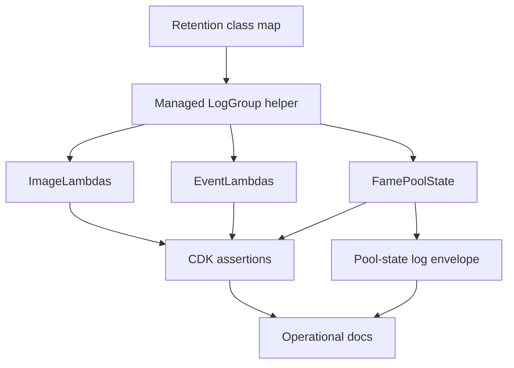

# feat: Add CloudWatch Log Retention Hardening

## Summary

Introduce a CDK-owned log group path for the repo's active Lambda constructs, backed by an explicit retention-class helper and CDK assertions. Pair the infrastructure hardening with narrow pool-state log cleanup so replay diagnostics remain visible without raw tick payloads or routine high-volume INFO noise.

Project identity note: `www` refers to the GitHub project `fame-lady-society/www`. On this machine, that companion checkout is cloned as `../fls-www`, not `../www`.

---

## Problem Frame

The CL replay slice made two operational gaps more expensive: Lambda log groups are currently implicit/unmanaged, and pool-state replay/API logs can become noisy as `www` leans harder on indexed state. This plan implements the retention policy from the origin requirements while preserving the existing quote-authority boundary and passive-alarm posture.

---

## Requirements

- R1. Every active Lambda created by this CDK app has a managed CloudWatch `LogGroup` attached through infrastructure code.
- R2. Managed log groups carry explicit retention and stack-deletion behavior.
- R3. Retention classes are preserved: Ethereum-only, mixed Ethereum/Base, and Discord/app-audit logs retain 30 days; replay-tick and Base operational/eventing logs retain 7 days.
- R4. Active Lambdas in `deploy/lib/image-lambdas.ts`, `deploy/lib/events-lambdas.ts`, and `deploy/lib/fame-pool-state.ts` are classified with no omissions.
- R5. CDK tests assert active Lambda log groups and expected retention, and fail when a new active Lambda lacks a retention decision.
- R6. Inactive Lambda constructs such as `deploy/lib/alchemy-webhook.ts` are not deployed in this pass, but re-enabling them requires explicit retention classification.
- R7. Pool-state indexer and API logs keep stable operational event names.
- R8. Pool-state success logs are compact by default and exclude secrets, raw RPC URLs, raw request bodies, raw tick arrays, and raw replay payloads.
- R9. Replay failures, stale replay requests, incomplete replay state, and unsupported replay surfaces remain operator-visible; ordinary all-fresh traffic should not become a high-volume INFO stream.
- R10. Structured application logs intended for filtering include a clear `level` and `event`.
- R11. Operational docs state retention classes, active Lambda classification, and deployed verification steps.
- R12. Existing passive-alarm posture is preserved; metric filters and paging destinations are not required.
- R13. The work does not change `www` quote behavior, add a `society-bots` quote endpoint, alter route ranking, or change replay tick maintenance.

**Origin actors:** A1 infrastructure implementer, A2 production operator, A3 pool-state/replay reviewer, A4 future maintainer.
**Origin flows:** F1 Lambda log retention is synthesized, F2 runtime logs stay useful without ballooning, F3 future Lambda surfaces are reviewed.
**Origin acceptance examples:** AE1 managed log groups with retention and deletion behavior; AE2 Ethereum/mixed log groups retain 30 days; AE3 replay-tick log groups retain 7 days; AE4 Discord/app log groups retain 30 days; AE5 Base-only operational log groups retain 7 days; AE6 new active Lambdas without retention fail tests; AE7 pool-state logs stay compact and replay failures visible; AE8 retention review shows no quote/route behavior changes.

---

## Scope Boundaries

- Do not split mixed-chain Lambdas just to get per-chain retention.
- Do not add a backend quote endpoint, alter `www` quote behavior, change route ranking, or change replay tick maintenance.
- Do not migrate all repo logging to a new framework.
- Do not enable Lambda native JSON logging format in the first pass; keep the first logging cleanup at the application-envelope level.
- Do not add paging destinations, broad alerting policy changes, dashboards, or Logs Insights query packs.
- Do not deploy or re-enable `deploy/lib/alchemy-webhook.ts` in this pass.

### Deferred to Follow-Up Work

- Metric filters for replay failures, stale replay responses, and slow indexer runs.
- Logs Insights query pack or dashboard once managed log group names stabilize.
- Broader logging-framework cleanup for image, Discord, eventing, and webhook Lambdas.
- Environment-aware log group removal policy if the project later needs production stack deletion to retain logs after stack teardown.

---

## Context & Research

### Relevant Code and Patterns

- `deploy/lib/fame-pool-state.ts` creates three active Lambdas, passive alarms, a 7-day failure queue, and the pool-state dev stack's core construct.
- `deploy/lib/image-lambdas.ts` creates four active Docker image Lambdas: two Base image endpoints and two Ethereum/FLS image endpoints.
- `deploy/lib/events-lambdas.ts` creates active Discord interaction, deferred-message, Fame event, and wrapper event Lambdas.
- `deploy/lib/alchemy-webhook.ts` contains an inactive mixed-chain webhook construct; `deploy/lib/deploy-stack.ts` currently comments it out.
- `deploy/test/fame-pool-state.test.ts` is the current CDK assertion suite and should be extended or complemented rather than replaced.
- `src/fame-swap-pool-state/lambdas/indexer.ts` and `src/fame-swap-pool-state/lambdas/api.ts` currently emit JSON strings manually with stable pool-state event names.
- `src/fame-swap-pool-state/lambdas/api.test.ts` already spies on `console.error` for API transport failures and is the natural place for compact/gated API log assertions.
- `docs/fame-pool-state-index.md` is the existing operational runbook for pool-state logs, passive health signals, rollout checks, and durable follow-ups.

### Institutional Learnings

- FAME indexed state work should keep `society-bots` as state/provenance producer and `www` as quote authority; this plan intentionally avoids quote endpoints and route behavior.
- Replay chunk payloads are large and should stay out of stale/helper diagnostics unless explicitly fresh and requested by the consuming API path.
- The strongest operational evidence for CL replay is structured, compact proof of freshness, state identity, and fallback reasons rather than raw tick payloads.

### External References

- AWS CDK `FunctionProps.logGroup` supports a user-provided log group and notes that Lambda-created default log groups cannot have CDK-managed retention; `logRetention` is deprecated/legacy in favor of `logGroup`: https://docs.aws.amazon.com/cdk/api/v2/docs/aws-cdk-lib.aws_lambda.FunctionProps.html
- AWS Lambda log-level filtering requires JSON log format and uses `level` when filtering application logs: https://docs.aws.amazon.com/lambda/latest/dg/monitoring-cloudwatchlogs-log-level.html
- AWS Lambda JSON log format can wrap supported runtime console output and can increase log message size, so this plan avoids switching Lambda logging format until the app-level envelope is stable: https://docs.aws.amazon.com/lambda/latest/dg/monitoring-cloudwatchlogs-logformat.html

---

## Key Technical Decisions

- **Managed log groups over `logRetention`:** Use `aws_logs.LogGroup` plus Lambda `logGroup` because the current CDK API describes `logRetention` as legacy and managed log groups are better for future metric filters.
- **Central retention helper:** Add one CDK helper that names retention classes and creates log groups, then require each Lambda constructor to opt into a class at the creation site.
- **Destroy on stack deletion for this pass:** Use explicit destroy behavior for managed log groups so PR/dev stack cleanup does not leave unmanaged residue; rely on CloudWatch retention while stacks exist.
- **Mixed-chain uses longest retention:** Any Lambda that emits both Ethereum and Base logs gets the 30-day class.
- **Discord/app audit uses 30 days:** User-facing Discord/app-only logs retain long enough to explain bot-visible incidents.
- **Base/replay operational logs use 7 days:** Base-only image/eventing and replay-tick pool-state logs retain briefly to bound high-volume operational data.
- **Application envelope before Lambda JSON format:** Add `level` and `event` to pool-state logs without enabling Lambda native JSON format in this pass.

---

## Open Questions

### Resolved During Planning

- Exact helper shape for managed log groups: create a small CDK helper module that exposes retention classes and a log-group factory, then pass the returned log group into each Lambda.
- Stack deletion behavior: use explicit destroy behavior in this first pass so short-lived PR/dev stacks clean up after themselves.
- Pool-state log compactness approach: add a small pool-state logging helper or direct equivalent envelope in the pool-state Lambda layer; do not broaden this into a repo-wide logging framework.
- Docs location: update `docs/fame-pool-state-index.md` because it is already the operator-facing runtime and rollout document for this surface.

### Deferred to Implementation

- Exact helper function names and physical log group name format are deferred to implementation, but the synthesized resources must be deterministic and assertion-friendly.
- Exact API success-log gating condition is deferred to implementation, but replay/stale/incomplete/unsupported behavior must remain operator-visible.
- Whether to split CDK log retention assertions into a new test file or extend `deploy/test/fame-pool-state.test.ts` is deferred to implementation, based on construct testability.

---

## High-Level Technical Design

> *This illustrates the intended approach and is directional guidance for review, not implementation specification. The implementing agent should treat it as context, not code to reproduce.*

Retention classification for active Lambdas:

| Surface | Lambdas | Retention class |
|---|---|---|
| Base image/operational | `FameThumb`, `Mosaic` | 7 days |
| Ethereum/FLS image | `FlsThumb`, `FlsMosaic` | 30 days |
| Discord/app audit | `interactionHandler`, `deferredMessage` | 30 days |
| Mixed Base/Ethereum eventing | `FameEvent` | 30 days |
| Ethereum wrapper eventing | `WrapEvent` | 30 days |
| Replay-tick pool-state | `FamePoolStateIndexer`, `FamePoolStateApi`, `FamePoolStateApiAuthorizer` | 7 days |

---

## Implementation Units

### U1. Add Managed Log Group Retention Helper

**Goal:** Create a single typed CDK helper for retention classes and managed log group creation.

**Requirements:** R1, R2, R3, R5, R6.

**Dependencies:** None.

**Files:**
- Create: `deploy/lib/lambda-log-groups.ts`
- Test: `deploy/test/log-retention.test.ts`

**Approach:**
- Define a small retention class vocabulary for `ethereum`, `mixedEthereumBase`, `appAudit`, `baseOperational`, and `replayTick`.
- Map those classes to `aws_logs.RetentionDays.ONE_MONTH` or `aws_logs.RetentionDays.ONE_WEEK`.
- Provide a helper that creates an `aws_logs.LogGroup` with explicit retention and removal policy and returns it for use in Lambda constructors.
- Keep the helper simple and construct-local; do not introduce stage parsing, environment-variable policy, or a global registry service.

**Patterns to follow:**
- CDK construct style in `deploy/lib/fame-pool-state.ts`.
- Existing assertive test style using `Template.fromStack` and `Match` in `deploy/test/fame-pool-state.test.ts`.

**Test scenarios:**
- Happy path: helper-created log groups synthesize as `AWS::Logs::LogGroup` resources with expected `RetentionInDays`.
- Happy path: a replay-tick log group uses 7-day retention.
- Happy path: an Ethereum/app-audit log group uses 30-day retention.
- Edge case: helper creation always sets explicit deletion behavior so the synthesized template is not relying on CloudFormation defaults.

**Verification:**
- The helper provides the only retention vocabulary used by active Lambda constructs, and tests can assert retention without inspecting implementation internals.

---

### U2. Attach Managed Log Groups To Active Lambdas

**Goal:** Apply the retention helper to every active Lambda in the current deploy surface.

**Requirements:** R1, R2, R3, R4, R6.

**Dependencies:** U1.

**Files:**
- Modify: `deploy/lib/image-lambdas.ts`
- Modify: `deploy/lib/events-lambdas.ts`
- Modify: `deploy/lib/fame-pool-state.ts`
- Modify: `deploy/lib/alchemy-webhook.ts`
- Test: `deploy/test/log-retention.test.ts`

**Approach:**
- Attach 7-day Base operational log groups to `FameThumb` and `Mosaic`.
- Attach 30-day Ethereum log groups to `FlsThumb`, `FlsMosaic`, and `WrapEvent`.
- Attach 30-day app-audit log groups to `interactionHandler` and `deferredMessage`.
- Attach 30-day mixed-chain log group to `FameEvent`.
- Attach 7-day replay-tick log groups to the pool-state indexer, API, and authorizer.
- Update the inactive Alchemy webhook construct to use a mixed-chain retention class if it is later re-enabled, without wiring it into the deploy stack.
- If `ImageLambdas` cannot synthesize cleanly in tests because of unused lookup/imports, remove or isolate only the unused lookup needed to make retention assertions deterministic.

**Patterns to follow:**
- Existing Lambda construction blocks in `deploy/lib/image-lambdas.ts`, `deploy/lib/events-lambdas.ts`, and `deploy/lib/fame-pool-state.ts`.
- Existing PR/dev stack hygiene expectation in `docs/fame-pool-state-index.md`.

**Test scenarios:**
- Covers AE2. Happy path: Ethereum/FLS and wrapper-event Lambdas synthesize log groups with 30-day retention.
- Covers AE3. Happy path: pool-state indexer, API, and authorizer synthesize log groups with 7-day retention.
- Covers AE4. Happy path: Discord interaction and deferred-message Lambdas synthesize log groups with 30-day retention.
- Covers AE5. Happy path: Base image Lambdas synthesize log groups with 7-day retention.
- Covers AE6. Integration: the inactive webhook construct, when directly instantiated in a unit test or helper-level assertion, has a mixed-chain retention class ready before any future deploy-stack re-enable.

**Verification:**
- All active Lambda constructors pass a managed log group, and the retention classification table in the plan matches the synthesized resources.

---

### U3. Add CDK Guardrail Assertions For All Active Lambdas

**Goal:** Make missing or incorrect retention fail in tests instead of relying on code review memory.

**Requirements:** R1, R2, R3, R4, R5, R6.

**Dependencies:** U1, U2.

**Files:**
- Create: `deploy/test/log-retention.test.ts`
- Modify: `deploy/test/fame-pool-state.test.ts`

**Approach:**
- Add focused CDK assertions that count active `AWS::Lambda::Function` resources and managed `AWS::Logs::LogGroup` resources for the constructs under test.
- Assert each retention class by synthesized retention days rather than by brittle logical IDs alone.
- Assert Lambda logging configuration points at a managed log group where CDK exposes that relationship in the synthesized template.
- Prefer direct construct tests for `ImageLambdas`, `EventLambdas`, and `FamePoolState` over full `DeployInfraStack` tests if full-stack context lookups make tests noisy.
- Include a deliberately useful failure mode: if a future active Lambda is added without a log group, resource counts or attachment assertions should fail.
- Keep existing pool-state dev stack tests in `deploy/test/fame-pool-state.test.ts` and extend them only where needed to prove the shared `FamePoolState` construct still synthesizes correctly with managed log groups.

**Execution note:** Add or update assertions before changing every construct so missing coverage is visible while implementing U2.

**Patterns to follow:**
- `deploy/test/fame-pool-state.test.ts` resource-count and property assertion style.
- Existing workflow-config tests in `deploy/test/fame-pool-state.test.ts` that enforce operational guardrails through text/template assertions.

**Test scenarios:**
- Covers AE1. Happy path: the pool-state construct synthesizes three Lambdas and three managed log groups with explicit retention/deletion behavior.
- Covers AE2-AE5. Happy path: image and event constructs synthesize retention groups matching the classification table.
- Covers AE6. Error path: adding a Lambda to an active construct without updating the expected retention assertion causes the test suite to fail through resource count or unmatched Lambda/log-group attachment.
- Integration: `FamePoolStateDevStack` still synthesizes the pool-state API route while using managed log groups from the shared construct.

**Verification:**
- CDK tests prove the active Lambda inventory is covered and make retention drift hard to miss.

---

### U4. Compact Pool-State Structured Logs

**Goal:** Keep pool-state replay/indexer diagnostics useful while reducing routine INFO noise and preventing heavy or sensitive payloads from entering logs.

**Requirements:** R7, R8, R9, R10, R13.

**Dependencies:** None, but can land after U1-U3 if infrastructure is the first priority.

**Files:**
- Create: `src/fame-swap-pool-state/lambdas/logging.ts`
- Create: `src/fame-swap-pool-state/lambdas/logging.test.ts`
- Modify: `src/fame-swap-pool-state/lambdas/indexer.ts`
- Modify: `src/fame-swap-pool-state/lambdas/api.ts`
- Modify: `src/fame-swap-pool-state/lambdas/api.test.ts`

**Approach:**
- Add a tiny pool-state Lambda logging helper that emits a JSON object with `level`, `event`, timestamp, and compact event-specific fields.
- Preserve existing event names: `fame-pool-state-indexed`, `fame-pool-state-api-batch`, and `fame-pool-state-api-error`.
- Log indexer replay failure summaries at error level and avoid double-logging the same payload as both error and success when the Lambda is about to throw.
- Gate low-value API success logs so ordinary all-fresh non-replay batches do not always emit INFO; keep replay-surface requests, stale/unknown/unsupported counts, malformed/dependency errors, and incomplete replay conditions visible.
- Explicitly omit service tokens, authorization headers, full RPC URLs, raw request bodies, raw tick arrays, and raw replay payloads from log fields.

**Patterns to follow:**
- Existing pool-state API status count helper in `src/fame-swap-pool-state/lambdas/api.ts`.
- Existing request/error tests in `src/fame-swap-pool-state/lambdas/api.test.ts`.
- Existing `src/utils/logging.ts` log-level normalization concept, but keep this pool-state helper small instead of adopting a broad repo logger.

**Test scenarios:**
- Covers AE7. Happy path: an all-fresh non-replay API batch either emits no INFO success log or emits a compact gated success event without pool payloads.
- Covers AE7. Happy path: a replay-surface API request emits compact replay-relevant counts and metadata, not bitmap words or initialized ticks.
- Covers AE7. Error path: a dependency error logs `level: "error"` with `event: "fame-pool-state-api-error"` and no raw request body.
- Covers AE7. Error path: an indexer result with replay failures formats one error-level `fame-pool-state-indexed` event and the handler still preserves existing fail-fast behavior.
- Edge case: structured log entries include both `level` and `event` so CloudWatch filtering can target them later.

**Verification:**
- Pool-state Lambda tests prove compact logging behavior, existing event names remain stable, and no test fixture with raw tick payloads appears in emitted logs.

---

### U5. Update Operational Documentation And Verification Checklist

**Goal:** Document the retention policy and runtime verification path where operators already look for pool-state rollout evidence.

**Requirements:** R11, R12, R13.

**Dependencies:** U1, U2, U3, U4.

**Files:**
- Modify: `docs/fame-pool-state-index.md`
- Modify: `docs/brainstorms/2026-05-23-cloudwatch-log-retention-hardening-requirements.md` only if implementation invalidates a requirement assumption

**Approach:**
- Add a CloudWatch retention section with the active Lambda classification table and retention windows.
- Add a deploy verification checklist item that confirms managed log groups and retention in the deployed stack.
- Update the Logs section to describe `level` and compact event envelopes for pool-state logs.
- Preserve the passive health signal guidance: no pager/email/chat destinations in this pass.
- Keep the docs clear that this hardening does not change quote authority or `www` fallback behavior.

**Patterns to follow:**
- Existing `docs/fame-pool-state-index.md` sections for Runtime, Logs, Passive Health Signals, Rollout Check, and Durable Follow-Ups.

**Test scenarios:**
- Test expectation: none -- documentation-only unit. CDK and Lambda tests in U3/U4 carry the behavioral assertions.

**Verification:**
- A reviewer can read the docs and verify which log groups should retain 7 days versus 30 days, how to check the deployed stack, and which log events remain operationally important.

---

## System-Wide Impact

- **Interaction graph:** CDK constructs now create log groups before Lambda functions and pass those groups into Lambda logging configuration. Runtime behavior should otherwise remain unchanged except for pool-state log volume/content.
- **Error propagation:** Pool-state replay/indexer failures continue to throw/fail as they do today; the log cleanup changes their envelope, not failure semantics.
- **State lifecycle risks:** Managed log groups become stack-owned resources; explicit deletion behavior avoids orphaned PR/dev log groups, while retention windows bound live log storage.
- **API surface parity:** No public API response shape, registry contract, quote behavior, or `www` caller contract changes are planned.
- **Integration coverage:** CDK assertion coverage is the key cross-layer guard because retention only becomes meaningful after synthesis/deploy.
- **Unchanged invariants:** SQS failure queue retention, DynamoDB replay chunk TTL, passive alarms, helper auth, and `observedThroughBlock` freshness semantics remain intact.

---

## Risks & Dependencies

| Risk | Mitigation |
|------|------------|
| Managed log group names or logical IDs cause deployment replacement surprises | Keep names deterministic but avoid unnecessary hardcoded physical names; validate synthesized templates before deploy. |
| Existing Lambda log streams move to new managed groups and operators search the old default group | Document the managed log group names/verification path in `docs/fame-pool-state-index.md`. |
| CDK tests for image/event constructs are brittle because those constructs were not previously unit-tested | Prefer direct construct assertions and remove only unused lookup/import behavior needed for deterministic synth. |
| Pool-state log gating hides useful early rollout evidence | Keep replay-surface, stale/unknown/unsupported, and failure cases visible; gate only low-value all-fresh non-replay success traffic. |
| Switching Lambda native JSON logging format changes output shape or increases log size | Defer Lambda logging-format changes; emit app-level JSON envelopes first. |
| Destroying log groups on stack deletion loses post-destroy production logs | Accept for this first PR/dev-focused hardening pass; revisit environment-aware removal policy if production teardown audit requirements appear. |

---

## Documentation / Operational Notes

- Update `docs/fame-pool-state-index.md` before PR review so CloudWatch expectations are not trapped in the plan.
- The deploy smoke should include a retention check for replay-tick 7-day groups and Ethereum/app-audit 30-day groups.
- Metric filters and Logs Insights queries should be added later only after managed log group names and compact event envelopes have settled.

---

## Sources & References

- **Origin document:** [docs/brainstorms/2026-05-23-cloudwatch-log-retention-hardening-requirements.md](../brainstorms/2026-05-23-cloudwatch-log-retention-hardening-requirements.md)
- **Ideation document:** [docs/ideation/2026-05-23-fame-pool-state-cleanup-hardening-ideation.md](../ideation/2026-05-23-fame-pool-state-cleanup-hardening-ideation.md)
- Related code: `deploy/lib/fame-pool-state.ts`
- Related code: `deploy/lib/image-lambdas.ts`
- Related code: `deploy/lib/events-lambdas.ts`
- Related tests: `deploy/test/fame-pool-state.test.ts`
- Related runtime docs: `docs/fame-pool-state-index.md`
- AWS CDK Lambda `FunctionProps`: https://docs.aws.amazon.com/cdk/api/v2/docs/aws-cdk-lib.aws_lambda.FunctionProps.html
- AWS Lambda log-level filtering: https://docs.aws.amazon.com/lambda/latest/dg/monitoring-cloudwatchlogs-log-level.html
- AWS Lambda JSON/plain text log format: https://docs.aws.amazon.com/lambda/latest/dg/monitoring-cloudwatchlogs-logformat.html
