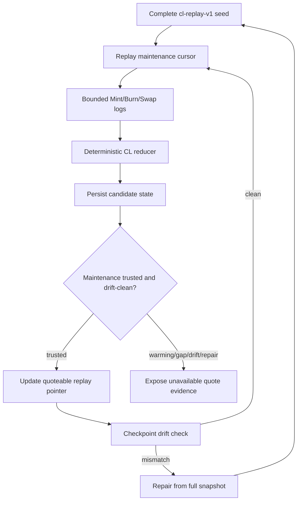

# feat: Add FAME Delta CL Replay Index

## Summary

Implement a shadow-first delta maintenance lane for FAME CL replay state. The plan keeps full snapshots as the seed, checkpoint, and repair artifact, adds a distinct replay-maintenance lifecycle, and only lets compact CL quote rows trust reducer-maintained state after deterministic fixtures and drift evidence prove it is fresh and clean.

Project identity note: `www` refers to the GitHub project `fame-lady-society/www`. On this machine, that companion checkout is cloned as `../fls-www`, not `../www`.

---

## Problem Frame

The existing replay proof captures complete `cl-replay-v1` snapshots for the reviewed replay pool set on each indexer run. That is correct but expensive: the steady-state path rereads the full bitmap and initialized tick universe even when a pool has few or no relevant events.

---

## Requirements

- R1. Cover only the existing reviewed `cl-replay-v1` replay pool set.
- R2. Preserve the authority split: `society-bots` produces replay state and compact quote evidence; `www` validates quote safety and falls back live.
- R3. Keep full replay snapshots as seed, checkpoint, and repair artifacts, not the normal trusted maintenance algorithm.
- R4. Start delta maintenance only from complete replay state.
- R5. Scan bounded pool-event ranges and apply supported CL deltas in deterministic chain order.
- R6. Advance the replay maintenance cursor only after the scanned range has been fully applied.
- R7. Treat event gaps, ambiguous block identity, unsupported replay-affecting events, range-limit failures, and inconsistent reducer output as untrusted state.
- R8. Use full snapshots as low-cadence drift checkpoints.
- R9. Fail closed on drift: compact CL quotes stay unavailable until complete repair reseeds trusted state.
- R10. Expose a small maintenance-state vocabulary for trusted, warming, drift-failed, repairing, and event-gap conditions.
- R11. Return compact CL quoted rows only when replay state is fresh, complete, cursor-current, and drift-clean.
- R12. Return unavailable quote evidence instead of best-effort CL quotes for untrusted replay state.
- R13. Preserve `www` live fallback for unavailable, mismatched, stale, invalid, slow, or producer-untrusted compact CL rows.
- R14. Keep raw replay payloads off the normal hot quote path.
- R15. Promotion evidence must include correctness signals: drift result, quote validation or parity proof, compact quote usage, fallback counts, and unavailable reasons.
- R16. Promotion evidence must include provider-pressure signals: full snapshot count, provider read count, scanned ranges, event counts, applied delta counts, and steady-state cost trajectory.
- R17. Documentation and release evidence must distinguish steady-state reducer proof from emergency spend stoppage, broad CL expansion, or quote-authority changes.

**Origin actors:** A1 (`society-bots` pool-state indexer), A2 (`society-bots` pool-state API), A3 (`www` quote system), A4 (operator/reviewer), A5 (Base RPC provider)

**Origin flows:** F1 (delta state advances), F2 (drift is checked and repaired), F3 (compact CL quotes are consumed safely), F4 (rollout evidence is reviewed)

**Origin acceptance examples:** AE1 (ordered delta application), AE2 (event gap fallback), AE3 (drift fail-closed repair), AE4 (compact quote path stays compact), AE5 (correctness plus provider-pressure evidence)

---

## Scope Boundaries

- No emergency full-snapshot cadence brake, schedule change, or immediate spend-stop requirement.
- No broad CL replay expansion beyond the current reviewed replay pool set.
- No public historical liquidity API, analytics store, or indefinite delta journal.
- No migration of quote authority from `www` into raw indexed replay state.
- No raw replay payloads on the normal compact quote path.
- No WebSocket or pending-log ingestion requirement for this slice.
- No external dedicated indexer service in this plan. If the existing Lambda/table shape proves insufficient, reopen planning before changing service topology.

### Deferred to Follow-Up Work

- Emergency schedule/cadence brake: out of scope. The implementation still needs a planned replay-maintenance mode where the scheduled steady-state path stops calling full replay snapshots every wake after seed/trust conditions are satisfied.
- Active reducer-backed quote activation: trusted producer state can be surfaced only after same-block drift-clean evidence and promotion evidence are reviewed; until then, reducer state stays shadow/unavailable.
- Additional CL venues: keep V4, Slipstream2, and other CL pools outside this delta reducer until the current reviewed replay set proves the model.
- `www` parity harness changes beyond consuming producer trust evidence: keep deeper frontend/router changes in the companion repo plan when needed.

---

## Context & Research

### Relevant Code and Patterns

- `src/fame-swap-pool-state/indexer.ts` already computes safe blocks, scans reserve `Sync` logs through viem, reconciles reserve state, captures CL head snapshots, captures full CL replay snapshots, and returns replay metrics.
- `src/fame-swap-pool-state/dynamodb/pool-state.ts` already models latest rows, chunk-before-pointer publication for replay capsules, cursor rows, strict item parsing, conditional writes, and batch read completeness.
- `src/fame-swap-pool-state/cl-quote.ts` already gates compact CL quotes on fresh replay pointers, matching chunk capsules, registry identity, token direction, and replay math.
- `src/fame-swap-pool-state/lambdas/logging.ts` already has compact structured indexer and quote API summaries with replay sizing and provider-read metrics.
- `src/fame-swap-pool-state/indexer.test.ts`, `src/fame-swap-pool-state/dynamodb/pool-state.test.ts`, `src/fame-swap-pool-state/api.test.ts`, and `src/fame-swap-pool-state/lambdas/logging.test.ts` provide the closest unit-test patterns to extend.
- `docs/fame-pool-state-index.md` and `docs/fame-pool-state-handoff.md` are the operational docs that must stay aligned with replay-state guarantees.

### Institutional Learnings

- No `docs/solutions/` directory exists in this checkout, so planning relies on the origin brainstorm, current repo docs, and current code patterns.
- The repo instructions supplied in the prompt require clean typed TypeScript, no `any`, no unsafe casts or compatibility shims, simple control flow, and fail-fast handling for violated assumptions.
- Existing FAME memory reinforces that `www` is quote-safety authority while `society-bots` produces indexed state/provenance; this plan preserves that boundary.

### External References

- Base `eth_getLogs` docs describe log filtering as an indexing primitive and recommend keeping large ranges bounded for reliability.
- Uniswap V3 pool-data docs confirm that accurate offchain CL modeling needs pool head state and initialized tick data, and that fetching all initialized ticks can be expensive or slow through ordinary RPC.
- Uniswap V3 pool event definitions expose reducer-relevant `Mint`, `Burn`, and `Swap` events; those same semantics are the baseline to validate against Slipstream before trusting venue-normalized deltas.

---

## Key Technical Decisions

- Shadow-first reducer: Build and persist delta-maintained state as a candidate before it becomes quoteable latest replay state.
- Separate maintenance lifecycle: Add replay-maintenance state rather than overloading the reserve cursor or latest replay pointer with warming, gap, repair, and drift status.
- Candidate versus quoteable publication: Candidate reducer state may be persisted for comparison and drift checks; only drift-clean trusted state may update the quoteable `cl-replay-v1` latest pointer.
- Candidate capsule storage: Persist candidate reducer capsules with their own chunk/pointer identity, not only a maintenance metadata row, so the next reducer pass and drift check can read the complete candidate without blessing it as quoteable.
- Snapshot rows remain publication artifact: Continue using the existing chunk-before-pointer replay capsule shape for quoteable state so the API never exposes partial arrays as fresh.
- Explicit activation boundary: Reducer-backed compact quote emission requires a reviewed promotion control; shadow maintenance and drift repair alone must not silently switch hot-path behavior.
- Venue-normalized event reducer: Decode venue-specific logs into a small internal event model, then apply deterministic reducer logic shared by Slipstream and Uniswap V3 where semantics match.
- Slipstream-first proof, Uniswap V3 follow-through: Prove the reducer on the existing Slipstream replay pool first because it already has the heaviest current route-lab history, then apply the same storage and trust contract to the Uniswap V3 replay pool.
- Fail closed on uncertainty: Missing logs, unsupported events, drift mismatch, malformed maintenance rows, and incomplete repair should make compact CL quotes unavailable, not best-effort.
- Test-first for reducer semantics: Reducer and maintenance-state behavior should start from deterministic fixtures before wiring live RPC reads.

---

## Open Questions

### Resolved During Planning

- Bounded log range policy: Use a configurable maximum range with a fail-closed event-gap state when the cursor falls too far behind; exact default belongs to implementation after measuring typical Base lag and provider behavior.
- Maintenance-state vocabulary: Use a small status family aligned to the origin requirements: trusted, warming, drift-failed, repairing, and event-gap, with quote API reasons grouped from those states instead of one reason per internal detail.
- Drift orchestration: Compare reducer state to a full checkpoint in an explicit drift-check path rather than making every scheduled wake perform a full snapshot.
- Promotion evidence shape: Reuse existing structured logs and add a focused smoke/report script rather than requiring a dashboard.

### Deferred to Implementation

- Exact log-range default: final value should be selected after local tests and live dev soak show practical Base RPC behavior.
- Exact Slipstream event surface after fixture work: if U2 cannot prove that `Swap`, `Mint`, and `Burn` plus existing fee reads cover replay-affecting state for the supported Slipstream pool, U3 must keep Slipstream in untrusted shadow mode until the missing event lane is planned.
- Exact DynamoDB row shape: implementer should choose field names that fit existing parser and key conventions while preserving the lifecycle contract.
- Candidate capsule keying: implementation should choose the exact key names, but the model must support reading a complete non-quoteable candidate capsule by maintenance state identity.
- Exact `www` debug display shape: companion repo work may need to map producer-trust reasons into existing `debug.quoteApi` output.

---

## High-Level Technical Design

> *This illustrates the intended approach and is directional guidance for review, not implementation specification. The implementing agent should treat it as context, not code to reproduce.*



---

## Implementation Units

### U1. Model Replay Maintenance State

**Goal:** Add a typed internal state model for replay maintenance lifecycle, cursor position, trust status, and metrics without changing hot-path quote payloads yet.

**Requirements:** R1, R2, R4, R6, R7, R10, R14; supports F1, F2, AE2, AE3

**Dependencies:** None

**Files:**
- Modify: `src/fame-swap-pool-state/dynamodb/pool-state.ts`
- Test: `src/fame-swap-pool-state/dynamodb/pool-state.test.ts`
- Modify: `src/fame-swap-pool-state/indexer.ts`
- Test: `src/fame-swap-pool-state/indexer.test.ts`

**Approach:**
- Add a replay-pool-scoped maintenance row separate from `cursor:${chainId}:quote-model-v1` and separate from the `cl-replay-v1` latest pointer.
- Store enough cursor identity to prove deterministic replay order: observed block, block hash, transaction index, log index, source registry id, current state hash, last checkpoint block/hash, status, and bounded reason metadata.
- Store enough target safe-block identity to let the next run verify the previous cursor block is still canonical before applying more deltas.
- Add a non-quoteable candidate capsule read/write path with chunk-before-candidate-pointer semantics mirroring the latest replay pointer safety model.
- Keep status values intentionally small and typed. Do not add one status per internal error detail.
- Parse maintenance rows strictly and fail fast on malformed status, missing cursor identity, invalid block/hash fields, or source registry mismatch.

**Execution note:** Implement parser and conditional-write behavior test-first; persistent state bugs are more dangerous than missing optimization.

**Patterns to follow:**
- Strict field parsers and item-specific errors in `src/fame-swap-pool-state/dynamodb/pool-state.ts`
- `latestClReplayStateKey`, `cursorKey`, and conditional write style in `src/fame-swap-pool-state/dynamodb/pool-state.ts`
- In-memory database testing patterns in `src/fame-swap-pool-state/indexer.test.ts`

**Test scenarios:**
- Happy path: a trusted maintenance row with complete cursor identity parses to the typed state and can be fetched by replay pool.
- Happy path: a warming maintenance row can be written without a published replay pointer change.
- Edge case: a same-block conditional write from the same source registry is accepted only when it does not rewind cursor order.
- Edge case: maintenance state can represent a cursor block hash mismatch as untrusted without publishing quoteable state.
- Error path: malformed status, bad block hash, missing source registry id, or negative cursor fields throw `PoolStateInvalidItemError`.
- Error path: a stale source registry id does not make a current replay pool trusted.
- Integration: writing maintenance state must not write replay chunks or update the existing `cl-replay-v1` latest pointer.
- Integration: writing a candidate capsule writes complete chunks before the candidate pointer and remains invisible to normal quote reads.

**Verification:**
- Maintenance rows are independently readable, strictly parsed, and cannot accidentally publish quoteable replay state.

---

### U2. Decode and Normalize CL Replay Events

**Goal:** Add a bounded log ingestion surface for supported replay pools, verify the supported replay-affecting event surface, and normalize venue-specific logs into reducer events.

**Requirements:** R1, R5, R7, R16; supports F1, AE1, AE2

**Dependencies:** U1

**Files:**
- Modify: `src/fame-swap-pool-state/indexer.ts`
- Test: `src/fame-swap-pool-state/indexer.test.ts`

**Approach:**
- Extend the indexer client boundary with a replay-log read method for reviewed replay pools.
- Fetch bounded safe-block ranges by replay-pool address and decode through an allowlisted topic set so unsupported logs from reviewed replay pools can be detected.
- Before scanning a new range from persisted maintenance state, verify the stored cursor block hash is still canonical; a mismatch must fail closed to event-gap or repair-needed state.
- Store and verify the target safe-block hash for the applied range so a later run can detect canonicality drift even when no removed log appears in the forward range.
- Normalize `Swap`, `Mint`, and `Burn` into a venue-independent reducer input while retaining venue, pool id, source address, and block/log identity.
- Confirm the supported event surface per venue before U3 treats reducer output as trustable. Fee must be maintained by a supported event, a same-block `fee()` read, or fail-closed unavailable status.
- Treat unknown logs from reviewed replay-pool addresses, removed logs, unsupported replay-affecting events, or an overlarge scan window as a maintenance event gap.

**Execution note:** Characterize exact event decoding with fixtures before wiring reducer state changes.

**Patterns to follow:**
- `getSyncLogs` viem log-reading pattern in `src/fame-swap-pool-state/indexer.ts`
- Address-scoped viem log reads with explicit topic decoding rather than event-filter-only reads for replay maintenance.
- `sortedLogs` and unknown-log fatal behavior in `src/fame-swap-pool-state/indexer.ts`
- Registry replay-scope assertions in `src/fame-swap-pool-state/registry/index.ts`

**Test scenarios:**
- Happy path: Slipstream `Swap`, `Mint`, and `Burn` logs decode into normalized events with stable block/log ordering.
- Happy path: Uniswap V3 `Swap`, `Mint`, and `Burn` logs decode into the same normalized event model where semantics match.
- Edge case: an empty bounded range produces no deltas and can still advance maintenance if the prior state is trusted.
- Error path: a log from an unregistered replay pool address creates an event-gap result before cursor advancement.
- Error path: a venue event outside the supported replay-affecting surface creates an unsupported/event-gap status rather than trusted reducer output.
- Error path: stored cursor block hash mismatch creates event-gap or repair-needed status even when the new forward log range itself is clean.
- Error path: a same-block fee/state change without a supported maintenance path prevents trusted state.
- Error path: removed logs, missing block identity, or a range larger than the configured cap create event-gap status.
- Integration: replay log reads do not alter reserve `Sync` log reads or quote-model cursor behavior.

**Verification:**
- The indexer can produce sorted, typed reducer events for the reviewed replay pools without affecting reserve indexing.

---

### U3. Implement Deterministic CL Delta Reducer

**Goal:** Apply normalized CL events to complete seed state and produce a new replay state candidate with deterministic state hash and trust metadata.

**Requirements:** R3, R4, R5, R6, R7, R8, R9; supports F1, F2, AE1, AE3

**Dependencies:** U1, U2

**Files:**
- Modify: `src/fame-swap-pool-state/indexer.ts`
- Test: `src/fame-swap-pool-state/indexer.test.ts`
- Modify: `src/fame-swap-pool-state/dynamodb/pool-state.ts`
- Test: `src/fame-swap-pool-state/dynamodb/pool-state.test.ts`

**Approach:**
- Build the reducer around existing replay capsule primitives: head price, current tick, active liquidity, fee, bitmap words, initialized ticks, block identity, and state hash.
- For swaps, update the post-swap head state from event data and retain initialized tick liquidity data from the existing capsule.
- For mints and burns, update lower and upper initialized tick liquidity and bitmap membership; update active liquidity when the current tick lies inside the changed range.
- Remove initialized ticks only when liquidity gross becomes zero and update bitmap membership accordingly.
- Produce a candidate replay capsule only when all events in the range are supported and the resulting state is internally consistent.

**Technical design:** *(directional guidance, not implementation specification)*

```text
complete seed + ordered normalized events
  -> apply event deltas to tick map and head state
  -> recompute bitmap words from initialized ticks
  -> recompute state hash from the canonical replay capsule
  -> return trusted candidate or typed untrusted maintenance state
```

**Patterns to follow:**
- `clReplayStateHash` and `clReplayRowsFromSnapshot` canonicalization in `src/fame-swap-pool-state/indexer.ts`
- `initializedTicksForBitmapWord` bitmap/tick conversion behavior in `src/fame-swap-pool-state/indexer.ts`
- Replay math malformed-state handling in `src/fame-swap-pool-state/cl-quote.ts`

**Test scenarios:**
- Covers AE1. Happy path: a swap event updates sqrt price, tick, active liquidity, cursor identity, and state hash.
- Happy path: mint below the current tick updates initialized tick state without changing active liquidity.
- Happy path: mint spanning the current tick updates initialized tick state and active liquidity.
- Happy path: burn that removes all liquidity at a boundary removes the initialized tick and clears its bitmap bit.
- Edge case: multiple events in the same transaction apply by log index and produce deterministic output.
- Error path: applying deltas without complete seed state returns warming or untrusted state instead of a candidate capsule.
- Error path: liquidity underflow, invalid tick spacing, missing event block hash, or inconsistent bitmap/tick state fails closed.
- Integration: candidate rows preserve the existing chunk-before-pointer publication invariant when promoted to latest state.

**Verification:**
- Deterministic fixtures prove reducer output and state hash are stable across Slipstream and Uniswap V3 cases before live RPC is involved.

---

### U4. Wire Shadow Delta Maintenance into the Indexer

**Goal:** Run delta maintenance during scheduled indexing while preserving existing reserve indexing, CL head snapshots, and full replay snapshot behavior as seed/checkpoint machinery.

**Requirements:** R3, R4, R5, R6, R7, R8, R9, R10, R16; supports F1, F2, F4, AE1, AE2, AE3, AE5

**Dependencies:** U1, U2, U3

**Files:**
- Modify: `src/fame-swap-pool-state/indexer.ts`
- Test: `src/fame-swap-pool-state/indexer.test.ts`
- Modify: `src/fame-swap-pool-state/lambdas/indexer.ts`
- Test: `src/fame-swap-pool-state/lambdas/indexer.test.ts`
- Modify: `src/fame-swap-pool-state/lambdas/logging.ts`
- Test: `src/fame-swap-pool-state/lambdas/logging.test.ts`

**Approach:**
- Seed maintenance from the latest complete replay capsule when no trusted maintenance cursor exists.
- On each indexer run, attempt bounded replay-log maintenance for the reviewed replay pools after reserve and CL head safety work.
- Introduce an explicit replay-maintenance mode: seed/checkpoint mode may call full snapshots, but trusted steady-state delta mode must avoid calling the full replay snapshot reader on every scheduled wake.
- Persist candidate reducer state first; update the quoteable replay pointer only when reducer output is trusted, canonicality-verified, and drift-clean.
- Add explicit drift-check entry points and metrics, but keep the default scheduled wake from doing full checkpoint work every time.
- Include metrics for scanned range, changed event count, applied event count, status counts, full snapshot count, provider reads, and drift result.

**Patterns to follow:**
- Existing reserve cursor advancement discipline in `indexFamePoolStates`
- Existing replay failure aggregation and sanitized Lambda logging
- Existing `FamePoolStateIndexerResult` metrics and `indexerResultLogFields`

**Test scenarios:**
- Covers AE1. Happy path: trusted seed plus supported event range advances maintenance cursor and writes trusted candidate state.
- Covers AE2. Error path: event-gap status is persisted and the replay latest pointer is not overwritten.
- Covers AE3. Error path: drift mismatch marks the pool drift-failed and keeps quoted rows unavailable until repair.
- Error path: stored cursor block hash mismatch prevents cursor advancement and quoteable pointer updates.
- Edge case: no new replay events advances cursor without changing state hash when block identity is valid.
- Edge case: trusted steady-state delta mode with no checkpoint due does not call the full replay snapshot reader.
- Edge case: reserve reconciliation failure still prevents cursor advancement as it does today.
- Integration: CL head snapshot failures do not corrupt replay maintenance state.
- Integration: older overlapping runs cannot rewind replay maintenance cursor or latest replay state.
- Logging: indexer logs summarize maintenance status and provider-pressure metrics without raw tick arrays, raw logs, RPC URLs, or request bodies.

**Verification:**
- Scheduled indexer behavior can maintain replay trust state in shadow mode while existing reserve and CL head guarantees remain unchanged.

---

### U5. Gate Compact CL Quotes on Maintenance Trust

**Goal:** Make `/fame/pool-quotes` aware of replay-maintenance trust state so compact CL quoted rows are emitted only when state is fresh, complete, cursor-current, and drift-clean.

**Requirements:** R2, R10, R11, R12, R13, R14, R15; supports F3, AE2, AE4, AE5

**Dependencies:** U1, U4, U6

**Files:**
- Modify: `src/fame-swap-pool-state/cl-quote.ts`
- Test: `src/fame-swap-pool-state/api.test.ts`
- Modify: `src/fame-swap-pool-state/lambdas/logging.ts`
- Test: `src/fame-swap-pool-state/lambdas/logging.test.ts`

**Approach:**
- Fetch maintenance trust state for CL replay pools alongside replay pointers.
- Return existing compact CL quote rows only when maintenance state is trusted, drift-clean, and compatible with the replay pointer being quoted.
- Define pointer compatibility as exact agreement on state hash, snapshot id, observed block, block hash, cursor identity, and source registry id.
- Before U6 lands, producer-trust-aware quote gating must treat reducer-maintained state as unavailable rather than assuming drift-clean status.
- Before reviewed promotion evidence exists, producer-trust-aware quote gating must surface reducer state as shadow/unavailable even if the internal maintenance row is trusted.
- Map warming, event-gap, drift-failed, and repairing states into bounded unavailable quote evidence with enough metadata for `www` debug output and operator diagnosis.
- Keep API metadata allowlisted to enum-like reasons and bounded block/provenance fields; do not include provider error messages, RPC request details, raw logs, or environment-derived strings.
- Preserve compact quoted-row shape: do not add raw bitmap words, initialized ticks, helper URLs, tokens, or raw event logs.
- Keep reserve compact quote behavior unchanged.

**Patterns to follow:**
- `freshLatestStates` filtering and `clReplayStateMatchesRegistry` in `src/fame-swap-pool-state/cl-quote.ts`
- Existing `FamePoolQuoteUnavailableReason` handling
- Existing compact CL quote tests in `src/fame-swap-pool-state/api.test.ts`

**Test scenarios:**
- Covers AE4. Happy path: trusted maintenance state plus complete replay capsule returns the same compact CL quoted row shape without raw replay arrays.
- Covers AE2. Error path: warming maintenance state returns unavailable evidence and does not load tick chunks unnecessarily.
- Error path: drift-failed maintenance state returns unavailable evidence even when a fresh replay pointer exists.
- Error path: event-gap maintenance state returns unavailable evidence with pool identity and observed block metadata.
- Edge case: maintenance state from an older source registry id is treated as untrusted.
- Edge case: trusted maintenance state whose state hash or block identity differs from the replay pointer is treated as untrusted.
- Edge case: trusted internal maintenance state without reviewed promotion evidence returns unavailable/shadow evidence rather than a quoted row.
- Security: unavailable metadata never contains provider error text, RPC URLs, raw log data, bearer tokens, or env-derived strings.
- Integration: a mixed batch can still return reserve quoted rows while CL replay rows are unavailable due to maintenance trust.
- Logging: quote API reason counts include producer-trust failures without logging raw replay state.

**Verification:**
- Compact CL quote responses remain small and fallback-safe while producer maintenance status becomes diagnosable.

---

### U6. Add Drift Check and Repair Operations

**Goal:** Provide explicit full-snapshot checkpoint comparison and repair behavior without making full snapshots the default scheduled maintenance algorithm.

**Requirements:** R3, R8, R9, R10, R15, R16; supports F2, F4, AE3, AE5

**Dependencies:** U1, U3, U4

**Files:**
- Modify: `src/fame-swap-pool-state/indexer.ts`
- Test: `src/fame-swap-pool-state/indexer.test.ts`
- Modify: `src/fame-swap-pool-state/lambdas/indexer.ts`
- Test: `src/fame-swap-pool-state/lambdas/indexer.test.ts`
- Modify: `src/fame-swap-pool-state/lambdas/logging.ts`
- Test: `src/fame-swap-pool-state/lambdas/logging.test.ts`

**Approach:**
- Add an explicit drift-check mode that compares a full checkpoint snapshot with reducer-maintained state at the same block and block hash.
- If same-block comparison is not available, fail closed rather than approximating drift across neighboring blocks.
- Mark mismatch as drift-failed before repair so compact quotes fail closed.
- Repair by reseeding from a complete full snapshot and resetting maintenance cursor/trust only after the repaired state is complete and source-registry-compatible.
- Keep drift-check and repair entry points Lambda-internal or IAM/operator-only. The authenticated read-helper API token must never authorize checkpoint capture, repair, or trust-state mutation.
- Keep drift and repair metrics separate from normal delta metrics so rollout evidence can distinguish snapshot pressure from steady-state event maintenance.

**Patterns to follow:**
- `assertNoClReplaySnapshotFailures` for operational fail-fast behavior
- Full replay snapshot row construction and state hashing in `src/fame-swap-pool-state/indexer.ts`
- Sanitized structured logging in `src/fame-swap-pool-state/lambdas/logging.ts`

**Test scenarios:**
- Covers AE3. Happy path: checkpoint hash matches reducer state and maintenance remains trusted.
- Covers AE3. Error path: checkpoint hash mismatch marks drift-failed and prevents compact CL quoting.
- Error path: checkpoint block/hash cannot be aligned with reducer state, so the pool becomes untrusted pending repair.
- Happy path: repair from a complete checkpoint publishes a repaired trusted state and resets cursor identity.
- Error path: incomplete checkpoint or source-registry mismatch refuses repair and leaves state untrusted.
- Security: a read-helper bearer token cannot trigger drift check, checkpoint capture, repair, or trust-state mutation.
- Edge case: drift check for a pool without seed state records warming or repair-needed status, not trusted.
- Logging: drift-check metrics show checkpoint count, provider reads, compared block, status, and repaired pool count without raw payloads.

**Verification:**
- Operators can run a checkpoint/repair path that proves or restores trust without making every scheduled wake pay full snapshot cost.

---

### U7. Produce Promotion Evidence and Documentation

**Goal:** Add the docs and smoke/report surface needed to prove both correctness and provider-pressure improvement.

**Requirements:** R15, R16, R17; supports F4, AE5

**Dependencies:** U4, U5, U6

**Files:**
- Create: `scripts/fame-pool-state-delta-replay-smoke.ts`
- Create: `scripts/fame-pool-state-delta-replay-smoke.test.ts`
- Modify: `package.json`
- Test: `src/fame-swap-pool-state/lambdas/logging.test.ts`
- Modify: `docs/fame-pool-state-index.md`
- Modify: `docs/fame-pool-state-handoff.md`

**Approach:**
- Add a focused operator smoke/report script that summarizes maintenance status, scanned ranges, event counts, applied delta counts, full snapshot count, provider read count, drift result, compact quote usage, fallback count, and unavailable reasons.
- Make the report schema allowlisted and redacted by construction: no bearer tokens, RPC URLs, raw request/response bodies, raw CloudWatch lines, raw event logs, helper secrets, or environment variable values.
- Structure the script around a testable report-building module and add a package script for operator use, rather than burying all logic in an untested CLI entrypoint.
- Update docs to describe the distinction between full replay snapshots, delta-maintained trusted state, maintenance status, compact quote eligibility, and live fallback.
- Preserve existing deployment guidance that `FAME_POOL_API_URL` is a base URL, not an endpoint-specific path.
- Document that the feature proves cheaper trusted steady-state maintenance rather than emergency spend stoppage.

**Patterns to follow:**
- Existing FAME operational docs in `docs/fame-pool-state-index.md`
- Existing handoff terminology in `docs/fame-pool-state-handoff.md`
- Existing structured log field style in `src/fame-swap-pool-state/lambdas/logging.ts`
- Existing `nodets` TypeScript execution hook in `package.json`

**Test scenarios:**
- Happy path: report output can represent a trusted reducer-maintained pool with drift-clean evidence and lower provider-read count than full snapshot metrics.
- Error path: report output can represent event-gap, drift-failed, and repairing pools without implying compact quote trust.
- Security: report output cannot include token-looking strings, configured RPC URL substrings, raw request/response bodies, or raw CloudWatch log lines.
- Integration: package script invokes the smoke/report entrypoint without changing existing `test` or `types` scripts.
- Documentation: docs describe live fallback, compact quote trust, and snapshot checkpoint semantics consistently.
- Integration: logs and report evidence contain the metrics required by the origin rollout acceptance example.

**Verification:**
- A reviewer can use docs plus smoke/report output to decide whether the delta lane is correct, fallback-safe, and cheaper in steady state.

---

## System-Wide Impact

- **Interaction graph:** The indexer gains a replay-log maintenance lane, DynamoDB gains maintenance rows, `/fame/pool-quotes` reads producer trust state, and `www` continues to consume compact quoted/unavailable rows with live fallback.
- **Error propagation:** Reducer uncertainty becomes maintenance status and unavailable quote evidence; malformed persistent state remains fail-fast at parser boundaries.
- **Authorization boundary:** Helper bearer-token reads remain read-only. Drift check, checkpoint capture, repair, and trust-state mutation are Lambda-internal or IAM/operator-only surfaces.
- **State lifecycle risks:** Partial writes must not publish quoteable replay pointers. Maintenance cursor advancement must be monotonic and coupled to complete event application.
- **API surface parity:** `/fame/pool-quotes` gains producer-trust unavailable reasons; `/fame/pool-state` replay payloads remain opt-in and raw replay arrays stay off the hot path.
- **Integration coverage:** Unit tests prove reducer semantics; API tests prove fallback; live dev soak proves provider-read economics and Base log reliability.
- **Unchanged invariants:** Reserve quote rows, CL head snapshots, service-token auth, base URL env shape, route dispatch fail-fast behavior, and `www` quote authority remain unchanged.

---

## Risks & Dependencies

| Risk | Mitigation |
|------|------------|
| Reducer subtly diverges from actual pool state | Shadow-first rollout, deterministic fixtures, low-cadence drift checks, and fail-closed compact quote gating |
| Base log ranges become too large or provider-limited | Configurable bounded ranges, explicit event-gap status, and smoke evidence for scanned ranges |
| Slipstream event semantics differ from plain Uniswap V3 | Venue-normalized events retain venue metadata; Slipstream-specific fee or event behavior is confirmed before trusting deltas |
| Maintenance status leaks into confusing public API behavior | Keep the status vocabulary small and map it into bounded unavailable quote evidence |
| Operator report or debug evidence leaks secrets or provider internals | Use allowlisted report/API fields and add redaction-focused tests for tokens, RPC URLs, raw logs, and env-derived strings |
| Read-helper credentials mutate trust state or trigger expensive checkpoints | Keep drift/repair behind Lambda-internal or IAM/operator-only entry points; bearer-token API remains read-only |
| Persistent state shape corrupts latest replay publication | Separate maintenance rows from replay pointer rows and preserve chunk-before-pointer writes |
| Plan expands into broad CL indexing | Registry scope remains the current reviewed replay set, with additional pools deferred |

---

## Phased Delivery

### Phase 1: Shadow Maintenance Foundation

- Land maintenance state, event decoding, deterministic reducer fixtures, and shadow indexer metrics.

### Phase 2: Drift, Repair, and Promotion-Gated Compact Quotes

- Add same-block checkpoint comparison and repair flow, then gate compact CL quote rows on trusted drift-clean maintenance state with fallback-safe unavailable reasons. Until same-block drift-clean evidence and reviewed promotion evidence exist, CL rows remain unavailable/live-fallback.

### Phase 3: Promotion Evidence

- Add smoke/report output and documentation for promotion review.

---

## Documentation / Operational Notes

- Update FAME pool-state docs before enabling any producer-trust-dependent quote behavior in a deployed environment.
- Rollout evidence should compare steady-state delta provider reads against existing full snapshot metrics; it should not claim emergency cost reduction from this feature alone.
- Deployment should keep existing helper auth and env shape unchanged.
- A short dev soak should capture several scheduled intervals with advancing maintenance cursor, no drift failures, compact quote fallback counts, and provider-read metrics.

---

## Sources & References

- **Origin document:** [docs/brainstorms/2026-05-29-fame-delta-cl-replay-index-requirements.md](docs/brainstorms/2026-05-29-fame-delta-cl-replay-index-requirements.md)
- Related ideation: [docs/ideation/2026-05-29-fame-delta-cl-replay-index-ideation.md](docs/ideation/2026-05-29-fame-delta-cl-replay-index-ideation.md)
- Related code: `src/fame-swap-pool-state/indexer.ts`
- Related code: `src/fame-swap-pool-state/dynamodb/pool-state.ts`
- Related code: `src/fame-swap-pool-state/cl-quote.ts`
- Related code: `src/fame-swap-pool-state/lambdas/logging.ts`
- Related docs: [docs/fame-pool-state-index.md](docs/fame-pool-state-index.md)
- Related docs: [docs/fame-pool-state-handoff.md](docs/fame-pool-state-handoff.md)
- External docs: [Base `eth_getLogs`](https://docs.base.org/base-chain/api-reference/ethereum-json-rpc-api/eth_getLogs)
- External docs: [Uniswap V3 fetching pool data](https://developers.uniswap.org/docs/sdks/v3/guides/pool-data)
- External docs: [Uniswap V3 pool events](https://github.com/Uniswap/v3-core/blob/main/contracts/interfaces/pool/IUniswapV3PoolEvents.sol)
