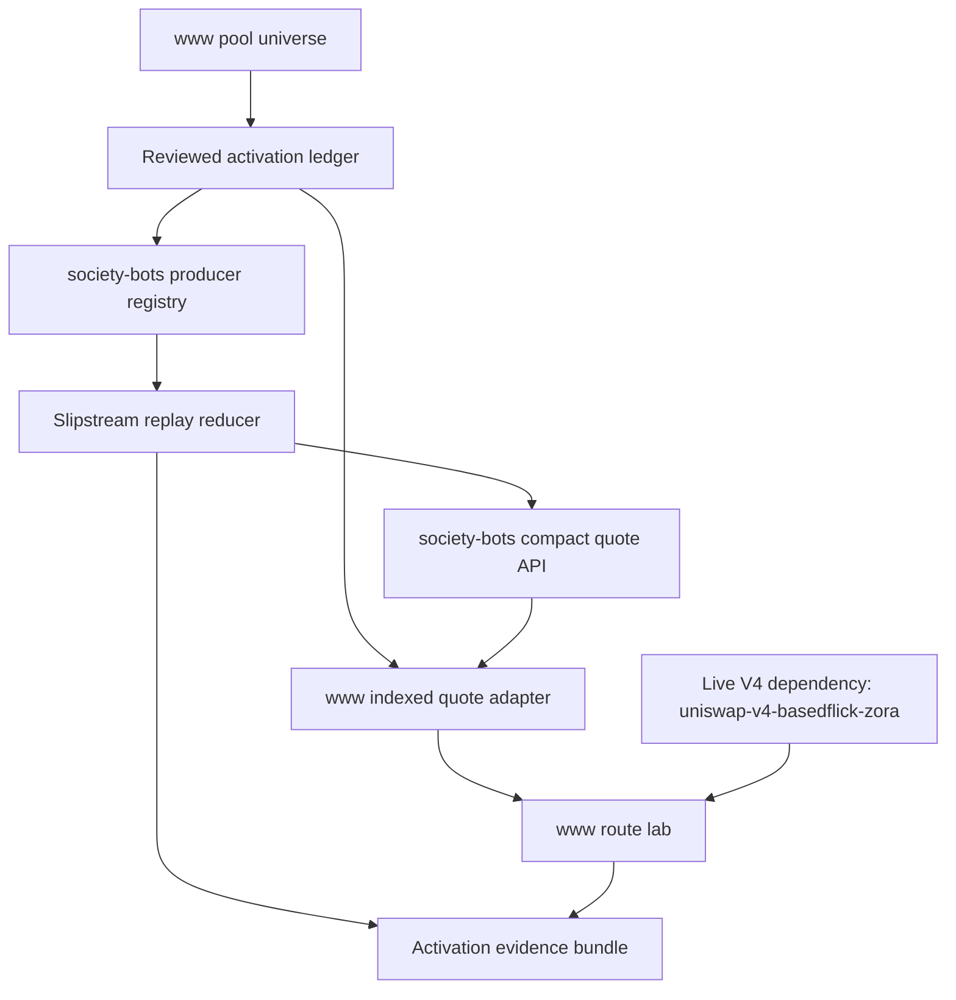
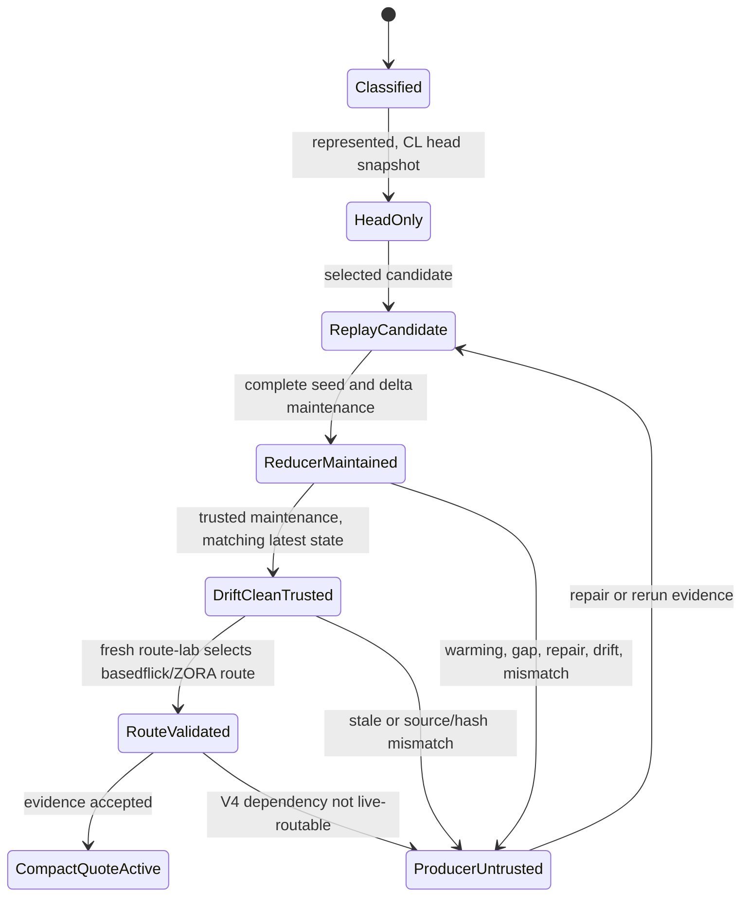

# feat: Add FAME Supported Pool Activation Lane

## Summary

Build a repeatable activation lane for the FAME pool universe that accounts for every upstream `www` pool, aligns the `society-bots` producer and `www` compact-quote consumer contracts, and promotes exactly one additional concentrated-liquidity pool through evidence gates. The v1 candidate is `slipstream-basedflick-fame`.

This plan explicitly accepts that the selected pool is useful only inside route families that also depend on the live `uniswap-v4-basedflick-zora` leg. v1 does not make Uniswap V4 compact-quote active. Promotion is gated on fresh `www` route-lab evidence showing that the basedflick/ZORA route family is still selectable and that the V4 leg remains live-routable while `slipstream-basedflick-fame` is supplied by trusted compact CL quote rows.

Target repos:

| Repo | Role |
| --- | --- |
| `society-bots` | Indexed state producer, reducer provenance, activation evidence, compact quote rows |
| `www` | Pool-universe authority, route validation, quote safety, live fallback |

All file paths below are repo-relative within the named repo.

---

## Problem Frame

Reserve constant-product pools already have compact quote rows, and the CL replay path has proven reduced indexed quoting for a small reviewed set. The next slice is not only "add another allowlist entry." The `www` pool universe is larger than the producer registry, support status is split across repos, and the consumer currently rejects a producer trust state that the producer can already emit.

The current local artifacts show:

- `www` has 26 upstream pools.
- `society-bots` has 21 registry entries plus a producer-only synthetic native wrap entry.
- The missing upstream producer entries are `slipstream-spx-weth`, `slipstream-usdc-weth-migrating-50`, `slipstream-msusd-usdc-a`, `slipstream-weth-mseth`, `slipstream2-msusd-mseth`, and `slipstream2-msusd-usdc-c`.
- `society-bots` currently restricts `cl-replay-v1` to `slipstream-usdc-weth-100`.
- `www` currently lists only `slipstream-usdc-weth-100` as CL replay capable in the checked-out compact quote allowlist.
- The brainstorm's operating baseline says one Aerodrome CL and one Uniswap V3 compact CL pool are already working. This plan treats that as a baseline validation gate, because the checked-out code does not fully show the two-CL baseline.

The selected v1 promotion candidate, `slipstream-basedflick-fame`, appears in the checked-in basedflick/ZORA production route family and is already represented in `society-bots` as Slipstream market state with fee and tick metadata. Every checked-in route that uses it also uses `uniswap-v4-basedflick-zora`, so the activation claim must say "one Slipstream compact CL leg inside a live V4-dependent route family," not "fully indexed route."

---

## Requirements

- R1. Use the `www` FAME pool artifact as the upstream pool universe for activation review.
- R2. Give every upstream pool exactly one current activation status: reserve compact quote active, CL compact quote active, CL replay candidate, CL head-only, tracked-only, blocked, unsupported, or not represented in the producer registry.
- R3. Distinguish not represented in the producer registry from represented but not quote-active.
- R4. Keep the migrating Slipstream pool visible as blocked.
- R5. Make `society-bots` and `www` derive quote-capability and registry decisions from reviewed activation data, or produce a report that shows intentional divergence.
- R6. Define every compact quote type and unavailable reason before activating the new CL compact quote pool.
- R7. Add `producer-untrusted` to the `www` compact quote consumer contract.
- R8. Keep unavailable or untrusted indexed rows row-scoped so unrelated supported rows can still be used.
- R9. Preserve diagnostics that distinguish quoted rows, unavailable rows, stale rows, malformed rows, and producer-untrusted rows.
- R10. Name the protocol-family reducer manifest for every CL compact quote candidate.
- R11. The Slipstream manifest must identify pool identity, fee source, event inputs, tick and bitmap requirements, replay invariants, quote eligibility constraints, and operational gates.
- R12. Slipstream and Uniswap V3 remain separate CL families even when reducer mechanics overlap.
- R13. Slipstream2 must not inherit Slipstream support until factory, fee, event, and replay assumptions are reviewed.
- R14. Uniswap V4 must remain non-compact-quote-active until PoolManager, PoolId, hook, fee, and StateView semantics have a reviewed reducer model.
- R15. CL head snapshots can support diagnostics and planning but do not qualify a pool for compact quote rows.
- R16. A CL pool must move through explicit statuses before compact quote activation: head-only or unrepresented, replay candidate, reducer-maintained, drift-clean trusted, route-validated, compact quote active.
- R17. Promote exactly one additional CL pool in v1: `slipstream-basedflick-fame`.
- R18. Promotion is blocked unless fresh route-lab evidence shows a selected route that uses `slipstream-basedflick-fame` and its required live `uniswap-v4-basedflick-zora` route dependency.
- R19. Preserve exact pool identity, token orientation, fee and factory identity, tick spacing, and route order.
- R20. Promotion fails closed when replay state is stale, incomplete, event-gapped, drift-failed, source-incompatible, state-hash-incompatible, outside quote range, producer-untrusted, or no longer route-selected.
- R21. `www` remains quote safety and route authority.
- R22. `society-bots` remains indexed state, reducer provenance, activation evidence, and compact quote producer.
- R23. Live fallback remains available for absent, unavailable, invalid, stale, slow, producer-untrusted, or route-unselected compact indexed quotes.
- R24. Raw replay payloads stay off the normal compact quote hot path.
- R25. The activation report shows complete pool universe, activation status, producer-registry presence, consumer quote capability, route relevance, and cross-repo deltas.
- R26. Promotion evidence shows correctness signals: drift result, parity or equivalent quote proof, route-lab result, selected route dependency, compact quote used count, fallback count, and unavailable reasons.
- R27. Promotion evidence shows scale signals: provider reads, checkpoint count, scanned ranges, event counts, applied delta counts, maintenance lag, repair duration, and candidate write status.
- R28. Runtime gates prevent operationally unhealthy reducer state from becoming or remaining compact quote active.
- R29. Release evidence states exactly what changed: all pools accounted for, `slipstream-basedflick-fame` promoted, `uniswap-v4-basedflick-zora` remains live dependency, and non-promoted pools remain protected.

**Origin actors:** A1 (`society-bots` pool-state indexer), A2 (`society-bots` pool-state API), A3 (`www` FAME swap system), A4 (operator/reviewer), A5 (Base RPC provider)

**Origin flows:** F1 (pool universe classified), F2 (producer and consumer contracts align), F3 (one additional CL pool promoted), F4 (unsupported/not-ready pools stay safe), F5 (activation evidence reviewed)

**Origin acceptance examples:** AE1 (universe classification), AE2 (`producer-untrusted` fallback), AE3 (protocol manifest gate), AE4 (promotion gate), AE5 (route identity), AE6 (release evidence)

---

## Scope Boundaries

- No activation of every Slipstream, Slipstream2, Uniswap V3, or Uniswap V4 candidate in v1.
- No compact quote activation for Uniswap V4 in this plan.
- No attempt to compact-quote the full basedflick/ZORA route. Only the `slipstream-basedflick-fame` leg may become compact CL quote active.
- No stable-pool quote-model expansion. `scale-equalizer-usdc-frxusd` remains tracked-only until stable math is separately planned.
- No migration of route or quote safety authority from `www` to `society-bots`.
- No removal of live fallback.
- No raw replay payloads on the normal compact quote path.
- No public historical liquidity API, analytics store, or indefinite event journal.
- No token-pair-only normalization. Same-pair pools with different fee, factory, generation, or route order stay distinct.
- No assumption that the brainstorm's two-CL baseline is present in the current checkout. Baseline validation is a prerequisite.

### Deferred to Follow-Up Work

- Slipstream2 reducer manifests and compact quote eligibility.
- Uniswap V4 compact quote model for `uniswap-v4-basedflick-zora` and other V4 pools.
- Stable Solidly reserve math.
- Broader CL promotion ranking after this one-pool lane is proven.
- Operational dashboard work beyond the evidence bundle and structured logs.

---

## Context & Research

### Relevant Code and Patterns

- In `society-bots`, `src/fame-swap-pool-state/registry/base-v1-pools.json` already includes `slipstream-basedflick-fame` as a Slipstream market-state pool with tick spacing and fee metadata, but no replay surface.
- In `society-bots`, `src/fame-swap-pool-state/registry/index.ts` currently hard-stops replay surface to `slipstream-usdc-weth-100`.
- In `society-bots`, `src/fame-swap-pool-state/cl-quote.ts` already emits `producer-untrusted` when CL latest state exists but maintenance is not trusted.
- In `www`, `src/features/fame-swap/solver/quotes/indexedQuoteApiClient.ts` does not yet accept `producer-untrusted`.
- In `www`, `src/features/fame-swap/solver/poolStateRegistry.ts` owns the compact quote capable pool lists consumed by the indexed quote API adapter.
- In `www`, `src/features/fame-swap/artifacts/base-v1-solver-routes.json` has five basedflick/ZORA route artifacts that include `slipstream-basedflick-fame`; all five also include `uniswap-v4-basedflick-zora`.
- In `www`, `docs/fame-swap-contract-followups.md` and `docs/fame-swap-route-lab.md` record live/fork evidence for basedflick/ZORA routes, but the plan must require a fresh rerun before promotion.
- `scripts/fame-pool-state-delta-replay-smoke.ts` already summarizes replay maintenance and quote unavailable reasons and is the closest producer-side evidence builder.
- `scripts/fame-swap-route-lab.ts` already records selected pools, indexed pool state, protocol coverage, edge matrix rows, simulation status, and optimizer evidence.

### Fresh Planning Queries

- The frxUSD/FAME Solidly pool is enabled and compact-quote capable today; it is not the blocker for the frxUSD corridor.
- `slipstream-usdc-frxusd` remains an eligible Slipstream candidate, but it appears in only the frxUSD split/merge route artifact and may not be selected recently.
- `slipstream-basedflick-fame` is more route-relevant in static artifacts, but it is coupled to live V4 route viability through `uniswap-v4-basedflick-zora`.
- Therefore, v1 chooses `slipstream-basedflick-fame` with an explicit route-dependency gate instead of claiming it is independently useful.

### External References

- Uniswap V3 pool-data docs confirm accurate offchain pool modeling needs head state plus full initialized tick data, and that full tick fetches can be expensive through ordinary RPC.
- Uniswap V3 active-liquidity docs explain that initialized ticks and `liquidityNet` govern active liquidity changes as price crosses ranges.
- Uniswap V4 pool-state docs confirm V4 uses PoolManager/PoolId storage and StateLibrary/extsload patterns rather than the v3 per-pool contract shape.
- Aerodrome docs describe concentrated pools, tick spacing, and dynamic fee behavior, which supports keeping Slipstream assumptions explicit.
- Velodrome Slipstream source states the contracts are concentrated-liquidity contracts adapted from Uniswap V3 core/periphery, which is useful context but not a license to collapse Slipstream, Slipstream2, V3, and V4 into one manifest.

---

## Key Technical Decisions

- Activation ledger home: `www` should own the reviewed pool-universe activation ledger because it owns route authority and the upstream pool artifact. `society-bots` should either consume generated activation data or emit a release report showing intentional divergence.
- Selected v1 candidate: Promote `slipstream-basedflick-fame` as the one additional CL pool, contingent on fresh evidence.
- Accepted route dependency: `uniswap-v4-basedflick-zora` is an explicit live route dependency for the selected candidate. It stays live-quoted/validated by `www`, not indexed compact-quoted by `society-bots`.
- Baseline validation: Before claiming one additional CL pool, verify the current compact CL baseline in the active branches. If the user-stated Uniswap V3 baseline is absent, either land that prerequisite first or adjust the release claim.
- Status-first rollout: A pool can be present in the activation ledger and registry before it is quote-active. Presence is not authority.
- Producer trust is product contract: `producer-untrusted` must be understood by `www` before the new CL pool can enter compact quote requests.
- Slipstream manifest first: The selected pool uses the Slipstream family manifest. Slipstream2 and Uniswap V4 stay classified but not promotable.
- Fail closed: Any replay, registry, source id, state hash, freshness, route-selection, or V4 dependency uncertainty produces unavailable evidence and live fallback.
- Evidence over assertions: Promotion requires a single evidence bundle combining producer reducer health with `www` route-lab selection and fallback behavior.

---

## Open Questions

### Resolved During Planning

- Candidate: `slipstream-basedflick-fame`.
- Route dependency: Promotion explicitly accepts `uniswap-v4-basedflick-zora` as live dependency; V4 is not compact-quote activated.
- Ledger home: Primary reviewed activation data should live in `www`, with generated/consumed producer inputs or divergence reports.
- Protocol manifest: The promoted pool uses a Slipstream manifest; Slipstream2 and V4 require separate manifests.
- Evidence shape: Extend the existing producer replay smoke and `www` route lab into one activation evidence bundle.

### Deferred to Implementation

- Exact health thresholds for maximum maintenance lag, repair duration, scan range, and provider reads after measuring the selected pool.
- Exact generated artifact filenames if implementation finds an existing artifact generator naming pattern to reuse.
- Whether the current branch already contains the user-stated Uniswap V3 compact CL baseline or needs prerequisite merge work.
- Exact route-lab corpus subset for the hard promotion gate. The gate must include at least one selected basedflick/ZORA route using both `slipstream-basedflick-fame` and `uniswap-v4-basedflick-zora`.

---

## High-Level Technical Design

> This illustrates the intended approach and is directional guidance for review, not implementation specification.

---

## Implementation Units

### U1. Add The Reviewed Activation Ledger

**Goal:** Give every upstream pool one explicit activation status and make cross-repo divergence reviewable before changing quote authority.

**Requirements:** R1, R2, R3, R4, R5, R25; supports F1, AE1

**Dependencies:** None

**Files:**

| Repo | Files |
| --- | --- |
| `www` | Modify: `src/features/fame-swap/solver/poolUniverse.ts` |
| `www` | Add: `src/features/fame-swap/solver/poolActivation.ts` |
| `www` | Test: `src/features/fame-swap/solver/poolActivation.test.ts` |
| `www` | Add or modify: `scripts/fame-swap-pool-activation-report.ts` |
| `www` | Test: `scripts/fame-swap-pool-activation-report.test.ts` |
| `www` | Add generated artifact if needed: `src/features/fame-swap/artifacts/base-v1-pool-activation.json` |

**Approach:**

- Define a durable activation status vocabulary that covers reserve compact quote active, CL compact quote active, CL replay candidate, CL head-only, tracked-only, blocked, unsupported, and producer-unrepresented.
- Generate the ledger from the existing pool universe and route artifacts, not from the producer registry alone.
- Include route relevance: selected route artifacts, current static artifact membership, and whether a pool is required only with another live route dependency.
- Include producer presence and consumer quote capability as separate fields so coverage and quote authority do not blur together.
- Keep `slipstream-usdc-weth-migrating-50` visible as blocked with its existing reason.
- Mark `slipstream-basedflick-fame` as the v1 selected candidate, not active, until later units satisfy evidence gates.
- Mark `uniswap-v4-basedflick-zora` as live route dependency and V4 compact-quote unsupported.

**Patterns to follow:**

- Artifact manifest/source-hash pattern in `src/features/fame-swap/artifacts/manifest.ts`
- Pool lookup and route-candidate graph patterns in `src/features/fame-swap/solver/poolUniverse.ts`
- Route corpus and route-lab reporting shape in `src/features/fame-swap/solver/routeCorpus.ts` and `scripts/fame-swap-route-lab.ts`

**Test scenarios:**

- Happy path: all 26 upstream pools appear exactly once in the activation report.
- Happy path: `slipstream-basedflick-fame` is `CL replay candidate` with selected-candidate metadata.
- Happy path: `uniswap-v4-basedflick-zora` is classified as live route dependency, not compact-quote active.
- Edge case: producer-only `native-wrap-weth` appears as producer-only divergence, not an upstream pool.
- Edge case: the six currently missing upstream pools are classified as not represented in the producer registry.
- Error path: a new upstream pool without an activation status fails the report.
- Error path: a blocked pool cannot become quote-active through generated defaults.

**Verification:**

- The activation report becomes the first reviewer artifact and proves all upstream pools are accounted for before any new CL quote activation.

---

### U2. Align Producer And Consumer Compact Quote Contracts

**Goal:** Make the consumer understand every row shape and unavailable reason the producer can emit, especially `producer-untrusted`, before widening compact CL quote requests.

**Requirements:** R6, R7, R8, R9, R20, R23; supports F2, F4, AE2

**Dependencies:** U1

**Files:**

| Repo | Files |
| --- | --- |
| `society-bots` | Modify: `src/fame-swap-pool-state/cl-quote.ts` |
| `society-bots` | Test: `src/fame-swap-pool-state/api.test.ts` |
| `society-bots` | Modify: `src/fame-swap-pool-state/fixtures/pool-quotes-v1.json` |
| `www` | Modify: `src/features/fame-swap/solver/quotes/indexedQuoteApiClient.ts` |
| `www` | Test: `src/features/fame-swap/solver/quotes/indexedQuoteApiClient.test.ts` |
| `www` | Modify: `src/features/fame-swap/solver/quotes/indexedQuoteApiAdapter.ts` |
| `www` | Test: `src/features/fame-swap/solver/quotes/indexedQuoteApiAdapter.test.ts` |
| `www` | Modify: `src/features/fame-swap/solver/quotes/fixtures/pool-quotes-v1.json` |

**Approach:**

- Add `producer-untrusted` to the `www` unavailable reason parser and fixture coverage.
- Preserve row-scoped fallback in the indexed quote adapter. A producer-untrusted row should fall back for that edge without invalidating unrelated quote rows.
- Include optional producer status/reason metadata in parsed unavailable rows if the producer emits it, while keeping unknown extra fields either rejected or intentionally versioned according to existing parser style.
- Keep malformed response handling distinct from typed unavailable handling.
- Add diagnostics counts for producer-untrusted rows through existing quote API fallback snapshots.
- Confirm the producer fixture continues to include row metadata that lets `www` report source registry, freshness, and producer state.

**Patterns to follow:**

- Strict response parser in `src/features/fame-swap/solver/quotes/indexedQuoteApiClient.ts`
- Fallback recorder in `src/features/fame-swap/solver/quotes/indexedQuoteApiAdapter.ts`
- Producer unavailable rows in `src/fame-swap-pool-state/cl-quote.ts`

**Test scenarios:**

- Happy path: `producer-untrusted` parses as a valid unavailable row and triggers live fallback.
- Happy path: a batch with one quoted reserve row and one producer-untrusted CL row uses the reserve row and falls back only for the CL row.
- Edge case: producer status/reason metadata is surfaced in diagnostics without becoming route authority.
- Error path: unknown unavailable reason still fails response validation.
- Error path: malformed quoted rows still produce invalid-response/batch-failure diagnostics, not row-scoped unavailable.

**Verification:**

- `www` can safely consume the current producer trust vocabulary before `slipstream-basedflick-fame` is added to compact quote capability lists.

---

### U3. Generate Producer Registry From Activation Data

**Goal:** Let `society-bots` represent the selected candidate and the full activation universe without accidentally making unproven pools quote-active.

**Requirements:** R2, R3, R4, R5, R10, R15, R16, R17, R25; supports F1, F3, AE1, AE3

**Dependencies:** U1, U2

**Files:**

| Repo | Files |
| --- | --- |
| `society-bots` | Modify: `src/fame-swap-pool-state/registry/base-v1-pools.json` |
| `society-bots` | Modify: `src/fame-swap-pool-state/registry/index.ts` |
| `society-bots` | Test: `src/fame-swap-pool-state/registry/index.test.ts` |
| `society-bots` | Modify: `src/fame-swap-pool-state/types.ts` |
| `www` | Modify: `src/features/fame-swap/solver/poolStateRegistry.ts` |
| `www` | Test: `src/features/fame-swap/solver/poolStateRegistry.test.ts` |

**Approach:**

- Replace the single replay pool assertion with activation-data-driven allowlisting that can permit the existing baseline plus `slipstream-basedflick-fame` only when status allows it.
- Add status fields or generated metadata needed for producer registry review, while preserving strict parsing.
- Represent the six upstream missing pools explicitly in the activation report. Add them to the producer registry only if doing so is useful for head-state inventory; otherwise leave them classified as producer-unrepresented with an intentional divergence reason.
- Keep `slipstream-basedflick-fame` as `market-state` with `cl-head-snapshot` until U4/U5 promote it to replay candidate and eventually compact quote active.
- Keep Uniswap V4 entries head-only/unsupported for compact quote activation, including `uniswap-v4-basedflick-zora`.
- In `www`, drive compact quote capability from activation status rather than independent hard-coded lists wherever practical. If hard-coded lists remain, require a report that shows they match activation data.

**Patterns to follow:**

- Existing strict registry parser invariants in `src/fame-swap-pool-state/registry/index.ts`
- Existing `famePoolSupportsCompactQuote` and capability list tests in `src/features/fame-swap/solver/poolStateRegistry.ts`
- Existing source registry id hashing model

**Test scenarios:**

- Happy path: activation metadata allows the current baseline replay pools plus selected candidate states without broad CL activation.
- Happy path: `slipstream-basedflick-fame` can be represented as candidate/head-only before compact quote active.
- Edge case: `uniswap-v4-basedflick-zora` remains not compact quote capable even though it is route-relevant.
- Edge case: `slipstream2-*` pools cannot inherit Slipstream replay support.
- Error path: an unreviewed CL pool with `cl-replay-v1` fails registry parsing.
- Error path: `slipstream-basedflick-fame` cannot be compact-quote active unless activation status and manifest agree.

**Verification:**

- The registry can widen inventory and candidate representation without widening compact quote authority.

---

### U4. Add Slipstream Manifest And Reducer Support For The Candidate

**Goal:** Make `slipstream-basedflick-fame` reducer-maintained under an explicit Slipstream manifest before it can emit compact CL quote rows.

**Requirements:** R10, R11, R12, R13, R14, R15, R16, R19, R20, R27, R28; supports F3, F4, AE3, AE4, AE5

**Dependencies:** U2, U3

**Files:**

| Repo | Files |
| --- | --- |
| `society-bots` | Add or modify: `src/fame-swap-pool-state/cl-reducer-manifests.ts` |
| `society-bots` | Test: `src/fame-swap-pool-state/cl-reducer-manifests.test.ts` |
| `society-bots` | Modify: `src/fame-swap-pool-state/indexer.ts` |
| `society-bots` | Test: `src/fame-swap-pool-state/indexer.test.ts` |
| `society-bots` | Modify: `src/fame-swap-pool-state/dynamodb/pool-state.ts` |
| `society-bots` | Test: `src/fame-swap-pool-state/dynamodb/pool-state.test.ts` |

**Approach:**

- Introduce a reviewed Slipstream manifest that names the candidate pool identity, factory, fee source, tick spacing, supported event surface, required bitmap/tick completeness, and quote range constraints.
- Reuse the existing delta replay maintenance lifecycle from the prior delta replay plan: trusted, warming, drift-failed, repairing, and event-gap.
- Seed the candidate from a complete `cl-replay-v1` snapshot. Do not trust head snapshot alone.
- Apply bounded event maintenance only after validating canonical cursor identity and source registry id.
- Persist reducer-maintained candidate state and maintenance metrics before publishing quoteable latest state.
- Keep Slipstream2 and V4 manifests absent or explicitly unsupported so their pools cannot become compact quote active by sharing this manifest.
- Treat the candidate's 2000 tick spacing as a measured operational risk. It may make tick coverage smaller than tight stable CL pools, but proof must come from actual provider-read and replay metrics.

**Patterns to follow:**

- Maintenance state and candidate capsule patterns from `src/fame-swap-pool-state/indexer.ts`
- Chunk-before-pointer publication in `src/fame-swap-pool-state/dynamodb/pool-state.ts`
- CL quote replay math and failure reasons in `src/fame-swap-pool-state/cl-quote.ts`

**Test scenarios:**

- Happy path: a complete candidate snapshot for `slipstream-basedflick-fame` produces candidate replay state with stable state hash.
- Happy path: trusted maintenance matching the latest replay state allows quote API eligibility.
- Edge case: no events in a bounded range can advance maintenance only when the prior trusted cursor is canonical.
- Edge case: fee, tick spacing, token order, or pool address mismatch prevents trust.
- Error path: unknown replay-affecting events, cursor block hash mismatch, range overflow, or removed logs produce event-gap/producer-untrusted status.
- Error path: stale source registry id or state hash mismatch prevents quoteable publication.
- Error path: Slipstream2 and V4 pools cannot use the Slipstream manifest.

**Verification:**

- The selected pool reaches reducer-maintained and drift-clean trusted states only through explicit manifest and maintenance gates.

---

### U5. Promote `slipstream-basedflick-fame` To Compact Quote Candidate

**Goal:** Wire the selected pool through compact quote generation while preserving fail-closed behavior until promotion evidence is accepted.

**Requirements:** R16, R17, R18, R19, R20, R22, R23, R24, R26, R27, R28; supports F3, F4, AE4, AE5, AE6

**Dependencies:** U2, U3, U4

**Files:**

| Repo | Files |
| --- | --- |
| `society-bots` | Modify: `src/fame-swap-pool-state/cl-quote.ts` |
| `society-bots` | Test: `src/fame-swap-pool-state/api.test.ts` |
| `society-bots` | Test: `src/fame-swap-pool-state/indexer.test.ts` |
| `society-bots` | Modify: `src/fame-swap-pool-state/lambdas/logging.ts` |
| `society-bots` | Test: `src/fame-swap-pool-state/lambdas/logging.test.ts` |
| `society-bots` | Modify: `src/fame-swap-pool-state/fixtures/pool-quotes-v1.json` |

**Approach:**

- Allow `slipstream-basedflick-fame` to have `cl-replay-v1` only when activation status is replay candidate or compact quote active and the Slipstream manifest matches.
- Keep compact quote API behavior row-scoped: unsupported before replay, missing indexed state before seed, stale state when freshness fails, and `producer-untrusted` when maintenance is not trusted.
- Publish quoted rows only when latest replay state, maintenance state, source registry id, state hash, pool identity, token orientation, tick spacing, and freshness all match.
- Include selected-pool metrics in structured logs: provider reads, bitmap/tick counts, scanned log counts, applied events, maintenance status, candidate write status, and quote unavailable reason counts.
- Keep raw replay state out of the compact quote response.

**Patterns to follow:**

- `clReplayMaintenanceCompatible` trust gate in `src/fame-swap-pool-state/cl-quote.ts`
- `freshnessStatus` and source registry mismatch handling in `src/fame-swap-pool-state/cl-quote.ts`
- Existing CL quote fixture shape

**Test scenarios:**

- Happy path: trusted replay state for `slipstream-basedflick-fame` returns `cl-quote-v1` in both token directions.
- Happy path: quoted row includes exact pool address, token0/token1, tokenIn/tokenOut, venue family, tick spacing, fee, snapshot id, state hash, and source registry id.
- Edge case: route request with reversed token direction quotes only when replay math and identity match that direction.
- Edge case: baseline replay pools remain unchanged.
- Error path: stale latest state returns `stale-indexed-state`.
- Error path: warming, repair, event-gap, drift-failed, source mismatch, or state hash mismatch returns `producer-untrusted` or the more specific typed unavailable reason.
- Error path: outside indexed tick range returns typed unavailable and preserves fallback.

**Verification:**

- The producer can serve compact quote rows for the selected pool only when reducer trust and identity gates all pass.

---

### U6. Teach `www` To Use The Promoted Leg With Live V4 Dependency

**Goal:** Let `www` request and validate compact quotes for `slipstream-basedflick-fame` while preserving live handling for `uniswap-v4-basedflick-zora` and all fallback cases.

**Requirements:** R6, R7, R8, R9, R18, R19, R21, R23, R26, R29; supports F2, F3, F4, AE2, AE5, AE6

**Dependencies:** U1, U2, U5

**Files:**

| Repo | Files |
| --- | --- |
| `www` | Modify: `src/features/fame-swap/solver/poolStateRegistry.ts` |
| `www` | Test: `src/features/fame-swap/solver/poolStateRegistry.test.ts` |
| `www` | Modify: `src/features/fame-swap/solver/quotes/indexedQuoteApiAdapter.ts` |
| `www` | Test: `src/features/fame-swap/solver/quotes/indexedQuoteApiAdapter.test.ts` |
| `www` | Modify: `src/app/api/fame/swap/quote/handler.ts` |
| `www` | Test: `src/app/api/fame/swap/quote/handler.test.ts` |
| `www` | Modify: `scripts/fame-swap-route-lab.ts` |
| `www` | Test: `scripts/fame-swap-route-lab.test.ts` |
| `www` | Modify: `scripts/fame-swap-cl-replay-parity.ts` |
| `www` | Test: `scripts/fame-swap-cl-replay-parity.test.ts` |

**Approach:**

- Add `slipstream-basedflick-fame` to CL compact quote capability only after activation status says it is promoted.
- Keep `uniswap-v4-basedflick-zora` out of compact quote capability. It remains quoted/validated through the live adapter.
- Ensure the indexed quote adapter can mix compact indexed and live fallback legs in the same selected route.
- Validate CL row identity by pool address, token0/token1, tokenIn/tokenOut, venue family, fee source, tick spacing, source registry id, and amount.
- Extend route-lab output so a row can state that `slipstream-basedflick-fame` was compact-indexed while `uniswap-v4-basedflick-zora` was live-routed.
- Generalize CL replay parity tooling away from a single hard-coded replay pool so it can prove the selected pool in both directions.
- Make the normal quote handler diagnostics expose used/fallback counts and the route dependency outcome without requiring raw replay payloads.

**Patterns to follow:**

- Existing compact quote wrapping in `src/app/api/fame/swap/quote/handler.ts`
- Row validation and fallback reason handling in `src/features/fame-swap/solver/quotes/indexedQuoteApiAdapter.ts`
- Selected pool reporting in `scripts/fame-swap-route-lab.ts`

**Test scenarios:**

- Happy path: a basedflick/ZORA route can use indexed compact quote for `slipstream-basedflick-fame` and live quote for `uniswap-v4-basedflick-zora`.
- Happy path: route-lab evidence identifies selected pools, quote source per leg, and dependency status.
- Edge case: if `uniswap-v4-basedflick-zora` live quote fails, the selected pool is not promoted even when the Slipstream row is trusted.
- Edge case: producer-untrusted Slipstream row falls back live for that leg without invalidating the V4 leg.
- Edge case: source registry mismatch falls back and records diagnostics.
- Error path: wrong tick spacing, pool address, token direction, amount, or source registry id rejects the compact row.
- Error path: normal quote handler never requests raw replay payloads.

**Verification:**

- `www` can safely use the promoted compact CL leg inside a V4-dependent live route and can explain when it did not.

---

### U7. Produce Activation Evidence And Rollout Docs

**Goal:** Create a single reviewable evidence bundle and update operational docs so the release claim is bounded and repeatable.

**Requirements:** R25, R26, R27, R28, R29; supports F5, AE1, AE6

**Dependencies:** U1, U2, U3, U4, U5, U6

**Files:**

| Repo | Files |
| --- | --- |
| `society-bots` | Modify: `scripts/fame-pool-state-delta-replay-smoke.ts` |
| `society-bots` | Test: `scripts/fame-pool-state-delta-replay-smoke.test.ts` |
| `society-bots` | Add if clearer: `scripts/fame-pool-state-activation-evidence.ts` |
| `society-bots` | Modify: `docs/fame-pool-state-index.md` |
| `society-bots` | Modify: `docs/fame-pool-state-handoff.md` |
| `www` | Modify: `docs/fame-swap-route-lab.md` |
| `www` | Add or modify: `docs/solutions/architecture-patterns/fame-swap-indexed-pool-state-quote-helper-2026-05-19.md` |

**Approach:**

- Extend the producer smoke report to include activation status, selected candidate, route dependency, maintenance trust state, source registry id, provider reads, snapshots, log ranges, event counts, applied events, candidate write status, quoted counts, fallback counts, and unavailable reasons.
- Extend or pair with route-lab output to prove the selected basedflick/ZORA route is current and to show `uniswap-v4-basedflick-zora` remains live-routed.
- Include baseline validation: current compact CL baseline before promotion, new compact CL count after promotion, and exactly one additional pool claim.
- Include explicit non-promotion statuses for Slipstream2, V4, stable pools, missing producer entries, and blocked migrating pool.
- Define operator gates: maintenance trusted, no drift/event-gap/repair status, provider-read volume within configured threshold, route-lab selection present, V4 dependency live, quote API used count positive, fallback counts explained.
- Update docs to state that `slipstream-basedflick-fame` activation does not mean V4 compact quote support exists.

**Patterns to follow:**

- Existing smoke summary structure in `scripts/fame-pool-state-delta-replay-smoke.ts`
- Route-lab recent run documentation in `docs/fame-swap-route-lab.md`
- Operational language in `docs/fame-pool-state-handoff.md`

**Test scenarios:**

- Happy path: evidence bundle states all pools accounted for, one selected candidate promoted, and V4 dependency live.
- Happy path: report shows `slipstream-basedflick-fame` compact quote used count and `uniswap-v4-basedflick-zora` live route dependency.
- Edge case: if route-lab no longer selects basedflick/ZORA, evidence fails promotion while leaving reducer candidate state intact.
- Edge case: if producer state is trusted but provider-read threshold is exceeded, promotion fails closed.
- Error path: missing activation status, missing baseline validation, missing route dependency result, or missing unavailable reason counts fails report validation.

**Verification:**

- A reviewer can decide whether to promote the candidate using one bundle and can see exactly what remains unsupported.

---

## System-Wide Impact

- Producer registry and activation status become cross-repo product surfaces, not private implementation details.
- Compact quote unavailable reasons become a compatibility contract between services.
- `www` route-lab becomes part of the promotion gate, not just a diagnostic script.
- DynamoDB CL replay rows and maintenance rows may grow for one more pool; provider read cost must be measured before promotion.
- `uniswap-v4-basedflick-zora` remains live route dependency, which means route health still depends on current V4 live adapter behavior.
- Docs and release evidence need to explain that one more compact CL leg is promoted, not that all legs of the selected route are indexed.

---

## Risks & Dependencies

- Baseline mismatch: The brainstorm says one Uniswap V3 compact CL pool is already working, but the checked-out code does not show that. Mitigate with an explicit baseline validation gate.
- Route dependency risk: If `uniswap-v4-basedflick-zora` is not live-routable, the selected candidate is not useful for release. Mitigate by making fresh route-lab selection and V4 live dependency a hard gate.
- Over-broad activation: Inventory work could accidentally make too many pools compact quote capable. Mitigate with activation statuses and strict allowlists.
- Consumer contract drift: Producer already emits `producer-untrusted`; consumer must parse it first. Mitigate by landing U2 before U5/U6 activation.
- Provider pressure: `slipstream-basedflick-fame` has tick spacing 2000, but actual replay footprint must still be measured. Mitigate with provider-read and maintenance-lag gates.
- Protocol confusion: Slipstream, Slipstream2, Uniswap V3, and V4 look similar at a distance. Mitigate with manifest-specific activation and explicit unsupported statuses.
- Source registry drift: `www` and `society-bots` can disagree on artifact hashes. Mitigate with source registry id checks and report deltas.

---

## Verification Strategy

- Unit tests for activation status generation, registry parsing, unavailable reason parsing, producer trust gates, and quote row validation.
- Fixture tests for `producer-untrusted`, `slipstream-basedflick-fame` trusted quote rows, and V4 dependency route evidence.
- Script tests for activation report and evidence bundle shape.
- Route-lab runs in `www` for basedflick/ZORA routes with compact indexed quote enabled for the selected Slipstream leg and live quote enabled for the V4 dependency.
- Parity or equivalent quote proof for `slipstream-basedflick-fame` in both token directions.
- No release claim unless evidence shows all pools accounted for, baseline validated, exactly one additional CL pool promoted, and all non-promoted pools explicitly protected.

---

## Sources / Research

- Origin requirements: `docs/brainstorms/2026-05-30-fame-supported-pool-activation-bundle-requirements.md`
- Prior producer plan: `docs/plans/2026-05-29-001-feat-fame-delta-cl-replay-index-plan.md`
- Producer registry and quote code: `src/fame-swap-pool-state/registry/base-v1-pools.json`, `src/fame-swap-pool-state/registry/index.ts`, `src/fame-swap-pool-state/cl-quote.ts`
- Producer evidence script: `scripts/fame-pool-state-delta-replay-smoke.ts`
- `www` pool universe, route artifacts, and route-lab docs: `src/features/fame-swap/artifacts/base-v1-pools.json`, `src/features/fame-swap/artifacts/base-v1-solver-routes.json`, `docs/fame-swap-route-lab.md`, `docs/fame-swap-contract-followups.md`
- `www` compact quote consumer: `src/features/fame-swap/solver/quotes/indexedQuoteApiClient.ts`, `src/features/fame-swap/solver/quotes/indexedQuoteApiAdapter.ts`
- Uniswap V3 pool data docs: https://developers.uniswap.org/docs/sdks/v3/guides/pool-data
- Uniswap V3 active liquidity docs: https://developers.uniswap.org/docs/sdks/v3/guides/managing-liquidity/active-liquidity
- Uniswap V3 events interface: https://github.com/Uniswap/v3-core/blob/main/contracts/interfaces/pool/IUniswapV3PoolEvents.sol
- Uniswap V4 pool state docs: https://developers.uniswap.org/docs/protocols/v4/guides/read-pool-state
- Aerodrome liquidity docs: https://github.com/aerodrome-finance/docs/blob/main/content/liquidity.mdx
- Velodrome Slipstream source: https://github.com/velodrome-finance/slipstream
