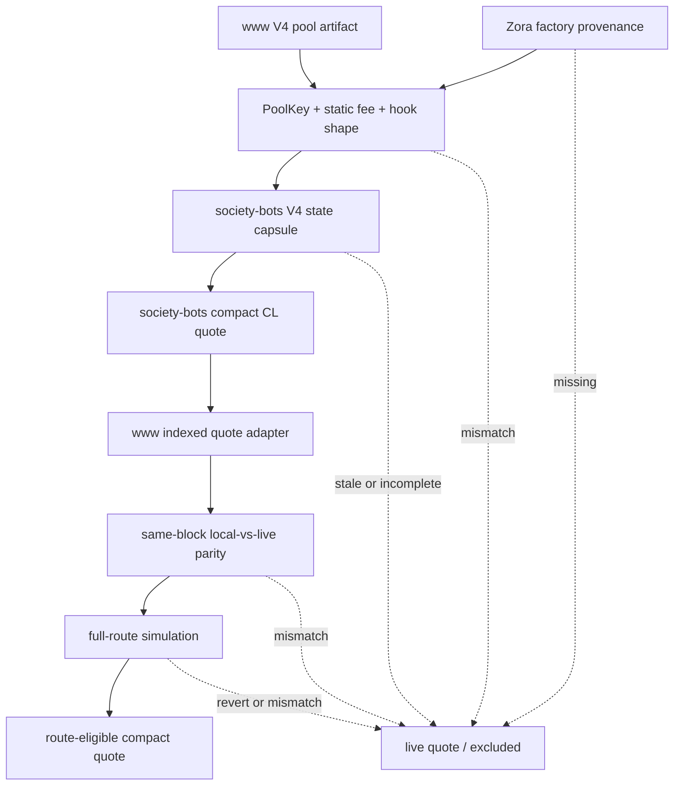
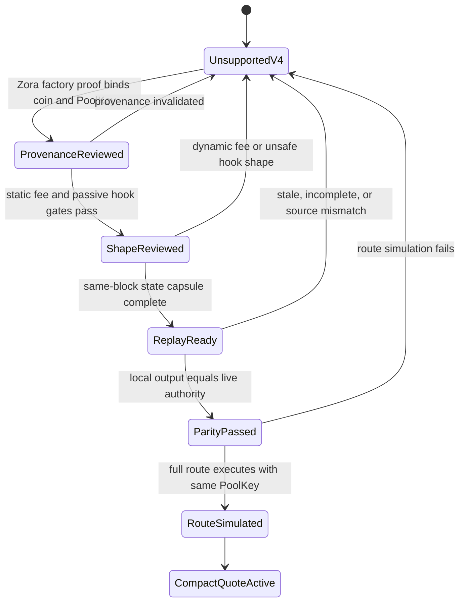

# feat: Enable BASEDFLICK/ZORA V4 Compact Quote Eligibility

## Summary

Enable `uniswap-v4-basedflick-zora` as a route-eligible compact/local quote source only after the target pool proves Zora protocol provenance, the reviewed static-fee passive-hook V4 shape, exact local-vs-live leg parity, and successful full-route simulation.

The implementation keeps this as a one-pool V4/Zora lane. It does not make broad Uniswap V4 compact quoting available, and it keeps `www` in charge of route selection, simulation authority, and live fallback.

Target repos:

| Repo | Role |
| --- | --- |
| `society-bots` | V4/Zora provenance evidence, V4 state producer, compact quote rows, unavailable evidence, activation smoke |
| `fame-lady-society/www` (`../fls-www` locally; `www` below) | Pool artifact authority, route selection, live quote authority, parity and simulation gates, compact quote consumption |

All file paths below are repo-relative within the named repo.

---

## Problem Frame

The current activation lane treats `uniswap-v4-basedflick-zora` as a live V4 dependency while `society-bots` produces compact evidence for selected non-V4 legs. That was the correct boundary before the target V4 pool's fee and hook behavior were separated from broad V4 risk.

The follow-up is narrower. The target pool appears to use a Zora protocol V4 deployment shape with `fee: 30000`, empty `hookData`, and hook permissions limited to `afterInitialize` and `afterSwap`, with no `beforeSwap` or return-delta flags. That can make local CL quote math feasible, but only when the system proves the pool's provenance, PoolKey identity, complete same-block tick state, same-block local-vs-live parity, and executable route behavior.

Local research shows two important implementation constraints:

- `society-bots` currently stores full CL replay state around address-backed Slipstream pools. V4 uses PoolManager/PoolKey identity, so the plan must not squeeze V4 rows through Slipstream-only identity assumptions.
- `www` currently parses and validates `cl-quote-v1` rows as Slipstream rows. The consumer can keep a familiar compact CL quote kind only if V4 source, PoolKey, hook, and provenance evidence are explicit enough to avoid accidental Slipstream treatment.

---

## Requirements

**Activation boundary**

- R1. The v1 feature targets only `uniswap-v4-basedflick-zora`.
- R2. The release claim states that this is not broad Uniswap V4 compact quote support.
- R3. Future Zora-protocol V4 pools remain deferred from v1.
- R4. `uniswap-v4-usdc-eth`, `uniswap-v4-zora-eth`, and other current non-target V4 pools remain non-compact-quote-active until separately reviewed.

**Zora provenance**

- R5. The target pool has on-chain provenance evidence showing that the coin or pool came through the Zora factory path.
- R6. Provenance evidence binds the relevant coin address, PoolKey, pool key hash or pool id, transaction or event source, and chain.
- R7. If Zora provenance cannot be proven, the pool fails closed and remains ineligible.
- R8. Hook address or hook metadata alone cannot qualify a pool for this lane.

**Pool shape and hook safety**

- R9. The target pool matches the reviewed PoolKey identity: PoolManager, currencies, fee, tick spacing, hooks, hookData, and pool id.
- R10. The target pool uses static `fee: 30000`; dynamic-fee sentinel values or unknown fee values fail closed.
- R11. The route being activated uses empty `hookData`.
- R12. Decoded hook permissions show no `beforeSwap`, no `beforeSwapReturnDelta`, and no `afterSwapReturnDelta`.
- R13. The decoded `afterSwap` permission is acceptable only when route execution evidence also passes.
- R14. Hook bytecode or source verification is deferred hardening, not a v1 blocker.

**V4 replay and quote evidence**

- R15. CL head snapshots alone do not qualify the pool for compact quote eligibility.
- R16. Replay state includes the same-block V4 data needed for exact CL quote math: PoolKey identity, head state, active liquidity, initialized tick evidence, block identity, and source registry identity.
- R17. V4 protocol-fee and LP-fee semantics are modeled correctly or proven irrelevant for the target pool at the evidence block.
- R18. Local quote output matches live leg authority for representative BASEDFLICK to ZORA and ZORA to BASEDFLICK exact-input amounts before route eligibility changes.
- R19. Parity authority includes both leg-level live quote comparison and full-route execution simulation.

**Route eligibility and fallback**

- R20. Once all gates pass, `www` may treat the target pool's compact/local quote as route-eligible.
- R21. If any gate is missing, stale, mismatched, or inconclusive, `www` keeps live quote behavior or excludes the compact quote for that route.
- R22. Full-route simulation uses the same PoolKey, hook address, hookData, token orientation, and route amount as the compact quote evidence.
- R23. Route eligibility is row-scoped to the target pool so failures do not invalidate unrelated compact quote pools.
- R24. The activation report is diagnosable: provenance status, shape classification, parity status, simulation status, and fallback reason.

**Release evidence**

- R25. Release evidence shows the exact activation claim: `uniswap-v4-basedflick-zora` moved from live-only V4 dependency to route-eligible compact/local quote source after gates passed.
- R26. Release evidence includes proof for both quote directions or explains why one direction is out of scope for the activated route.
- R27. Release evidence includes provider-read scale, replay state freshness, fallback counts, unavailable reasons, and route-lab or equivalent route evidence.
- R28. Smoke and activation reports continue to account for non-target V4 pools without treating this target as broad V4 precedent.

**Origin trace:** A1 (`society-bots` indexer), A2 (`society-bots` API), A3 (`www` swap system), A4 (operator/reviewer), and A5 (Base RPC / on-chain data sources) remain the actors from the origin document.

---

## Acceptance Examples

- AE1. Given the current FAME universe contains three V4 pools, activation review only admits `uniswap-v4-basedflick-zora` into the v1 V4 quoteability lane; the other V4 pools remain non-compact-quote-active.
- AE2. Given the target pool lacks conclusive Zora factory transaction or event evidence binding the coin and PoolKey, activation keeps the pool ineligible even if static fee and hook bits look correct.
- AE3. Given provenance passes but dynamic fee, non-empty hookData, a before-swap bit, or a return-delta bit is present, classification fails closed.
- AE4. Given complete V4 replay state exists but local output differs from live leg authority for a representative exact-input amount, the pool remains live-only and records the mismatch.
- AE5. Given local leg parity passes but full-route simulation reverts or uses a different PoolKey or hookData, `www` rejects compact quote eligibility.
- AE6. Given provenance, shape, parity, and route simulation all pass, the pool can become route-eligible and the report shows what changed, in which directions, and with what fallback behavior.
- AE7. Given hook source verification has not been added, v1 promotion documents it as deferred hardening because decoded hook bits and route execution evidence passed.

---

## Scope Boundaries

- No generic Uniswap V4 compact quote support.
- No v1 activation for future Zora-protocol V4 pools.
- No v1 activation for `uniswap-v4-usdc-eth` or `uniswap-v4-zora-eth`.
- No eligibility from static fee alone.
- No eligibility from hook bit decoding alone.
- No route eligibility without full route execution proof.
- No requirement to verify hook source or bytecode before this v1 activation.
- No removal of live fallback.
- No change to reserve or existing Slipstream compact quote behavior.

### Deferred to Follow-Up Work

- General V4 compact quote policy for dynamic fees, arbitrary hooks, and non-Zora pools.
- Future Zora-protocol pools after the one-pool gate is proven.
- Hook bytecode/source review and hook registry hardening.
- Stable-pool compact quote activation.
- Broader route optimization changes beyond making this pool route-eligible after proof.

---

## Dependencies / Prerequisites

- Zora provenance must be resolved from on-chain factory event data, a deployment transaction trace, or both. Block explorer labels alone are not sufficient evidence.
- The exact Base StateView ABI and deployed function surface must be verified before implementation, especially tick bitmap and initialized tick reads.
- Base RPC access must support same-block PoolManager/StateView reads at the parity evidence block. If archival or historical calls are unavailable, parity cannot promote the pool.
- `society-bots` and `www` source-registry identity must match for the target pool before either side treats a compact row as route-eligible.
- The live V4 quote authority and route simulation path in `www` must remain available for the release-blocking proof.
- Local/dev diagnostic outputs must remain redacted; no provider URLs, helper auth, signer material, raw calldata-like payloads, or raw tick payloads should enter public responses.

---

## Key Technical Decisions

- **One-pool V4/Zora lane:** v1 is a named pool activation lane. Non-target V4 pools stay represented as non-promoted evidence, not as implicit candidates. This avoids turning one reviewed Zora protocol shape into a broad V4 policy decision.
- **Provenance before shape:** Zora factory provenance is a required admission gate. PoolKey, fee, hook bits, and hookData are shape gates, but they do not substitute for provenance because any unrelated pool could imitate the same superficial shape.
- **V4 identity stays explicit:** V4 state and quote rows must carry PoolKey/PoolManager/hook identity or an equivalent evidence id. They must not rely on Slipstream-only `poolAddress` assumptions because V4 pools are PoolManager/PoolKey-addressed and multiple pools can share surrounding contracts.
- **Compact CL quote compatibility is conditional:** Returning `cl-quote-v1` is acceptable only if the row includes explicit V4 source and identity fields that `www` validates. If that would make the existing wire contract ambiguous, introduce a V4-specific CL quote source under the compact quote contract instead of weakening Slipstream validation.
- **Direct after parity:** There is no shadow-only release state after proof. When provenance, shape, parity, and route simulation pass, `www` can route through the compact quote row, matching the selected release posture while keeping proof gates release-blocking.
- **`www` owns execution authority:** `society-bots` can produce state, quote rows, and evidence, but `www` remains responsible for route selection, live quoter comparison, simulation, and fallback.
- **Targeted validation is required:** Route-lab and parity tooling should be able to request the relevant route, route corpus case, or pool direction so the promotion gate does not require full-corpus compute. Filters should fail loudly when a requested route or pool is missing or ambiguous.
- **Fail closed with typed evidence:** Any missing or stale provenance, V4 shape, state, parity, simulation, source registry, or route dependency produces row-scoped unavailable evidence and live fallback.

---

## Open Questions

### Deferred to Implementation

- Which exact Zora factory event or deployment transaction trace should be recorded as the canonical provenance source for this target, and which fields bind the coin to the PoolKey?
- Which exact StateView ABI version and function names are available at the deployed Base StateView address used by the target pool?
- Which representative exact-input amounts from the current route corpus should be fixed into parity evidence for both BASEDFLICK to ZORA and ZORA to BASEDFLICK?
- Should the compact API preserve `cl-quote-v1` with explicit V4 source fields or introduce a distinct V4 CL quote row kind if parser ambiguity appears during implementation?

---

## High-Level Technical Design

---

## Implementation Units

### U1. Add The V4/Zora Provenance And Shape Gate

**Goal:** Create a reviewed one-pool manifest and classifier for `uniswap-v4-basedflick-zora` that proves Zora provenance and rejects non-target or unsafe V4 shapes before state or quote activation.

**Requirements:** R1-R14, R24, R28; covers AE1, AE2, AE3, AE7

**Dependencies:** None

**Files:**

| Repo | Files |
| --- | --- |
| `society-bots` | Add: `src/fame-swap-pool-state/v4-zora-manifests.ts` |
| `society-bots` | Test: `src/fame-swap-pool-state/v4-zora-manifests.test.ts` |
| `society-bots` | Modify: `src/fame-swap-pool-state/types.ts` |
| `society-bots` | Modify: `src/fame-swap-pool-state/registry/index.ts` |
| `society-bots` | Test: `src/fame-swap-pool-state/registry/index.test.ts` |
| `www` | Modify: `src/features/fame-swap/solver/poolStateRegistry.ts` |
| `www` | Test: `src/features/fame-swap/solver/poolStateRegistry.test.ts` |

**Approach:**

- Add a V4/Zora manifest that records the reviewed target identity: pool id, PoolManager, StateView, currencies, static `fee: 30000`, tick spacing, hook address, hookData expectation, and decoded hook permissions.
- Add provenance evidence fields for the factory transaction/event source. The implementation should bind the coin address, PoolKey, pool id or pool key hash, factory address, and chain from on-chain evidence.
- Prefer factory event data plus transaction hash when both are available. A deployment trace can fill gaps, but the evidence artifact must state which fields were read and must not rely on block explorer labels as proof.
- Keep provenance verification fail-closed. A pool with matching hook bits but no Zora factory proof remains unsupported.
- Add a classifier result that distinguishes target eligible, target blocked by reason, and non-target V4 unsupported.
- Keep `uniswap-v4-usdc-eth` and `uniswap-v4-zora-eth` represented but non-promoted.
- In `www`, surface the target as a reviewed V4/Zora lane candidate only after the manifest/provenance gates pass; do not add other V4 pools to compact quote capability.

**Patterns to follow:**

- `src/fame-swap-pool-state/cl-reducer-manifests.ts` for reviewed per-pool manifest structure and drift tests.
- `src/fame-swap-pool-state/registry/index.ts` for schema validation and fail-fast registry errors.
- `src/features/fame-swap/solver/poolStateRegistry.ts` for artifact-derived source registry and compact quote capability lists.

**Test scenarios:**

- Covers AE1. The target V4 pool is the only V4 pool admitted into the v1 V4/Zora review lane.
- Covers AE2. A fixture without Zora factory event or deployment-trace evidence remains ineligible even when fee and hook shape match.
- Covers AE3. Dynamic fee, non-empty hookData, `beforeSwap`, `beforeSwapReturnDelta`, or `afterSwapReturnDelta` fixtures all fail closed.
- Happy path: the reviewed target manifest accepts the current `www` PoolKey identity and records provenance metadata.
- Edge case: casing differences in addresses do not break valid identity comparison.
- Error path: non-target V4 pools stay unsupported even if their static fee and no-hook shape look simpler.
- Integration: `society-bots` and `www` agree on the target pool's source registry identity and non-target V4 status.

**Verification:** Reviewers can see a typed target manifest, failing drift tests for unsafe shape changes, and a `www` capability set that has not broadened beyond the target.

### U2. Add PoolKey-Backed V4 State Capture

**Goal:** Capture complete same-block V4 CL state for the target pool without reusing Slipstream-only address-backed assumptions.

**Requirements:** R15, R16, R17, R21, R23, R27; supports AE4

**Dependencies:** U1

**Files:**

| Repo | Files |
| --- | --- |
| `society-bots` | Modify: `src/fame-swap-pool-state/indexer.ts` |
| `society-bots` | Test: `src/fame-swap-pool-state/indexer.test.ts` |
| `society-bots` | Modify: `src/fame-swap-pool-state/dynamodb/pool-state.ts` |
| `society-bots` | Test: `src/fame-swap-pool-state/dynamodb/pool-state.test.ts` |
| `society-bots` | Modify: `src/fame-swap-pool-state/api.ts` |
| `society-bots` | Test: `src/fame-swap-pool-state/api.test.ts` |
| `www` | Modify: `src/features/fame-swap/solver/quotes/indexedPoolStateClient.ts` |
| `www` | Test: `src/features/fame-swap/solver/quotes/indexedPoolStateClient.test.ts` |

**Approach:**

- Add a V4 state capsule for the target with PoolKey identity, StateView address, block number/hash, sqrt price, tick, active liquidity, protocol fee, LP fee, bitmap words, initialized tick liquidity, source registry id, and state hash.
- Use Uniswap V4 StateView reads for `getSlot0`, `getLiquidity`, `getTickBitmap`, and `getTickInfo`, keeping all reads pinned to the same block.
- Verify the deployed StateView ABI before coding the read path. If the deployed contract exposes a different tick-reading shape than expected, adapt the V4 capsule around the actual ABI rather than guessing.
- Store V4 rows under a source that makes the V4 family explicit, such as `uniswap-v4-state-view`, rather than `slipstream-pool-state`.
- Keep stale V4 rows metadata-only if raw tick payload size would leak into normal consumer paths.
- Validate static fee and protocol fee handling before a state capsule becomes quoteable. If protocol fee is non-zero and math support is not implemented, return unavailable evidence instead of a quote.
- Preserve existing Slipstream state and quote behavior unchanged.

**Patterns to follow:**

- Existing CL head V4 reads in `src/fame-swap-pool-state/indexer.ts`.
- Existing CL replay row/chunk storage in `src/fame-swap-pool-state/dynamodb/pool-state.ts`.
- Existing `www` raw CL replay client parsing in `src/features/fame-swap/solver/quotes/indexedPoolStateClient.ts`.

**Test scenarios:**

- Happy path: V4 state capture stores pool-key-backed state with no `poolAddress` requirement.
- Happy path: initialized tick rows are derived from bitmap words and same-block tick reads.
- Edge case: empty initialized tick data is valid only if the bitmap evidence proves it.
- Error path: missing PoolKey, StateView, block hash, or provenance marks the state unavailable.
- Error path: protocol fee or LP fee evidence that the local math cannot model prevents quoteable state.
- Integration: existing Slipstream replay tests remain unchanged and still require pool addresses.
- Integration: `www` can parse fresh and stale V4 state rows without treating them as Slipstream rows.

**Verification:** The indexer can produce a same-block V4 state capsule for the target, and stale/malformed/incomplete V4 state is observable but not quote-authoritative.

### U3. Produce Targeted V4 Compact CL Quote Rows

**Goal:** Let `society-bots` return compact exact-input quote rows or typed unavailable rows for `uniswap-v4-basedflick-zora`, with explicit V4 identity and source evidence.

**Requirements:** R16, R17, R18, R21, R23, R24, R26, R27; covers AE4

**Dependencies:** U1, U2

**Files:**

| Repo | Files |
| --- | --- |
| `society-bots` | Modify: `src/fame-swap-pool-state/cl-quote.ts` |
| `society-bots` | Test: `src/fame-swap-pool-state/api.test.ts` |
| `society-bots` | Modify: `src/fame-swap-pool-state/lambdas/logging.ts` |
| `society-bots` | Test: `src/fame-swap-pool-state/lambdas/logging.test.ts` |
| `www` | Modify: `src/features/fame-swap/solver/quotes/indexedQuoteApiClient.ts` |
| `www` | Test: `src/features/fame-swap/solver/quotes/indexedQuoteApiClient.test.ts` |

**Approach:**

- Extend the compact quote API to request and return the target V4 pool by pool id, token direction, amount, and current block.
- Preserve `cl-quote-v1` only if the row clearly includes V4 source and identity fields. Otherwise add a V4-specific CL quote source shape that the consumer can distinguish without ambiguity.
- Include PoolKey or a stable evidence id, hook address, hookData status, static fee, protocol fee status, source registry id, observed block identity, state hash, and max freshness in the quote row.
- Return typed unavailable rows for missing provenance, shape mismatch, missing indexed state, stale indexed state, source mismatch, unsupported non-target V4, fee-model mismatch, malformed replay state, outside tick range, and replay failure.
- Keep unavailable rows row-scoped so other compact quote rows in the same batch can still be used.
- Treat dynamic-fee indicators, non-zero protocol-fee states that are not modeled, or hookData mismatch as quote blockers even if CL tick math can otherwise produce a number.

**Patterns to follow:**

- Existing `constant-product-quote-v1` and `cl-quote-v1` batch response handling in `src/fame-swap-pool-state/cl-quote.ts`.
- Existing row-scoped unavailable handling and producer trust checks.
- Existing `www` quote API client parser contract in `src/features/fame-swap/solver/quotes/indexedQuoteApiClient.ts`.

**Test scenarios:**

- Happy path: BASEDFLICK to ZORA exact-input quote returns a V4-attributed compact CL quote row.
- Happy path: ZORA to BASEDFLICK exact-input quote returns a V4-attributed compact CL quote row.
- Edge case: zero, malformed, or over-uint256 amounts are rejected at request validation without affecting valid rows.
- Error path: non-target V4 pool requests return `unsupported-pool` or a more specific V4 unavailable reason.
- Error path: missing provenance, unsafe hook shape, stale state, source mismatch, and fee-model mismatch each produce typed unavailable rows.
- Error path: dynamic-fee indicators, non-zero unsupported protocol fee, or hookData mismatch prevent `cl-quote-v1` or V4 compact row emission.
- Integration: a batch with one V4 unavailable row and one existing reserve or Slipstream quote still returns usable supported rows.
- Wire contract: `www` parser rejects ambiguous V4 rows that omit required V4 evidence fields.

**Verification:** The compact quote API can serve or decline the target pool with explicit evidence, and existing compact quote rows remain wire-compatible.

### U4. Teach `www` To Consume V4 Compact Rows Safely

**Goal:** Let `www` use compact V4 rows for the target pool only after row metadata, source registry, V4 identity, and route context match local expectations.

**Requirements:** R18, R20, R21, R22, R23, R24; covers AE4, AE5, AE6

**Dependencies:** U1, U3

**Files:**

| Repo | Files |
| --- | --- |
| `www` | Modify: `src/features/fame-swap/solver/poolStateRegistry.ts` |
| `www` | Test: `src/features/fame-swap/solver/poolStateRegistry.test.ts` |
| `www` | Modify: `src/features/fame-swap/solver/quotes/indexedQuoteApiAdapter.ts` |
| `www` | Test: `src/features/fame-swap/solver/quotes/indexedQuoteApiAdapter.test.ts` |
| `www` | Modify: `src/features/fame-swap/solver/quotes/indexedQuoteApiClient.ts` |
| `www` | Test: `src/features/fame-swap/solver/quotes/indexedQuoteApiClient.test.ts` |
| `www` | Modify: `src/features/fame-swap/solver/quoteWire.ts` |
| `www` | Test: `src/features/fame-swap/solver/quoteWire.test.ts` |

**Approach:**

- Add `uniswap-v4-basedflick-zora` to compact quote capability only through the reviewed V4/Zora gate, not through a generic V4 list.
- Validate row direction, amount, chain, source registry id, PoolKey or evidence id, PoolManager, hook address, hookData, fee, tick spacing, token orientation, and V4 source before accepting a row.
- Keep live fallback for unavailable rows, ambiguous rows, source mismatch, row metadata mismatch, malformed rows, and batch failures.
- Preserve route-level quote context rules: a mixed indexed/live route should not claim a fully indexed quote context unless all selected legs share that context.
- Keep debug diagnostics sanitized and row-scoped.

**Patterns to follow:**

- Existing compact quote validation in `src/features/fame-swap/solver/quotes/indexedQuoteApiAdapter.ts`.
- Existing route-level quote attribution tests in `src/features/fame-swap/solver/quotes/rankRoutes.test.ts`.
- Existing debug field privacy behavior in `src/features/fame-swap/solver/quoteWire.ts`.

**Test scenarios:**

- Happy path: a target V4 compact row with matching PoolKey identity is used without calling the fallback adapter.
- Happy path: a route can mix this V4 compact row with other valid compact rows while maintaining correct per-leg attribution.
- Error path: mismatched PoolKey, hook address, hookData, fee, token order, or source registry falls back live.
- Error path: a V4 row with Slipstream-only source is rejected as metadata mismatch.
- Error path: non-target V4 rows are rejected even if otherwise well formed.
- Integration: batch failures and unavailable rows still call fallback only for affected edges.
- Wire contract: public quote debug data exposes evidence identity and fallback reason without leaking RPC URLs, tokens, helper URLs, or raw tick payloads.

**Verification:** `www` can consume a target V4 compact row in local mode, but every identity or trust mismatch returns to live quote behavior.

### U5. Add Targeted Parity And Route Simulation Evidence

**Goal:** Make promotion validation efficient and release-blocking by comparing target local quotes to live V4 authority and simulating the exact route that would use the compact row.

**Requirements:** R18, R19, R20, R21, R22, R25, R26, R27; covers AE4, AE5, AE6

**Dependencies:** U3, U4

**Files:**

| Repo | Files |
| --- | --- |
| `www` | Modify: `scripts/fame-swap-cl-replay-parity.ts` |
| `www` | Test: `scripts/fame-swap-cl-replay-parity.test.ts` |
| `www` | Modify: `scripts/fame-swap-route-lab.ts` |
| `www` | Test: `scripts/fame-swap-route-lab.test.ts` |
| `www` | Modify: `src/features/fame-swap/solver/routeCorpus.ts` |
| `www` | Test: `src/features/fame-swap/solver/graph/candidates.test.ts` |

**Approach:**

- Generalize the existing parity harness so it can target `uniswap-v4-basedflick-zora` by pool id and direction instead of being hardwired to the Slipstream baseline.
- Pin live V4 quotes to the compact row's observed block for exact same-block comparison.
- Compare representative exact-input amounts in both BASEDFLICK to ZORA and ZORA to BASEDFLICK directions, unless the release claim explicitly narrows direction.
- Add route-lab filtering by route id, corpus case id, or selected pool id so validation can request the basedflick/ZORA route directly.
- Make filters strict: an unknown route id, a missing pool id, or a filter that matches multiple ambiguous routes fails the validation command instead of silently running the full corpus.
- Ensure full-route simulation uses the same PoolKey, hook address, hookData, token orientation, amount, and materialized route that the compact quote evidence describes.
- Keep simulation and parity outputs redacted and evidence-focused.

**Patterns to follow:**

- Same-block parity flow in `scripts/fame-swap-cl-replay-parity.ts`.
- Simulation coverage and sanitized markdown output in `scripts/fame-swap-route-lab.ts`.
- V4 live quoter adapter in `src/features/fame-swap/solver/quotes/liveAdapters.ts`.

**Test scenarios:**

- Happy path: targeted parity compares only the requested target pool directions and records exact-match rows.
- Happy path: route-lab can request the relevant basedflick/ZORA route or corpus case without running unrelated corpus rows.
- Error path: route-lab rejects missing or ambiguous target filters so release evidence cannot accidentally come from the wrong route.
- Covers AE4. Any local-vs-live output mismatch fails the parity report and keeps the target non-promoted.
- Covers AE5. A route simulation using different PoolKey, hookData, or amount is rejected as invalid promotion evidence.
- Error path: missing live quote authority, missing compact row, stale row, or source mismatch produces a promotion-blocking result.
- Privacy: route-lab and parity output redact RPC URLs, auth tokens, calldata-like payloads, and signer material.

**Verification:** A reviewer can run a focused target proof and inspect exact leg parity plus full-route simulation without a full-corpus compute pass.

### U6. Extend Activation Smoke And Release Evidence

**Goal:** Turn the V4/Zora gate, quote rows, parity output, and route simulation into one reviewable activation report that promotes only the target pool.

**Requirements:** R20-R28; covers AE1-AE7

**Dependencies:** U1, U2, U3, U4, U5

**Files:**

| Repo | Files |
| --- | --- |
| `society-bots` | Modify: `scripts/fame-pool-state-delta-replay-smoke.ts` |
| `society-bots` | Test: `scripts/fame-pool-state-delta-replay-smoke.test.ts` |
| `society-bots` | Modify: `src/fame-swap-pool-state/lambdas/logging.ts` |
| `society-bots` | Test: `src/fame-swap-pool-state/lambdas/logging.test.ts` |
| `society-bots` | Add: `docs/fame-swap-v4-basedflick-zora-activation.md` |
| `www` | Modify: `docs/fame-swap-route-lab.md` |
| `www` | Test: `scripts/fame-swap-route-lab.test.ts` |

**Approach:**

- Extend the producer smoke report with V4/Zora provenance status, shape status, V4 state freshness, quote availability, unavailable reason counts, provider-read counts, and source registry agreement.
- Continue deriving non-promotion status groups from the activation report instead of hardcoding named exclusion constants.
- Import or reference the focused `www` parity and route simulation outputs as release evidence.
- Require all gates to pass before reporting `uniswap-v4-basedflick-zora` as compact quote active.
- Keep non-target V4 pool status visible and non-promoted.
- Log producer operational health at the same boundary used by quote trust: incomplete state, drift, event gaps, repair status, stale blocks, provider read scale, and parity evidence identity.

**Patterns to follow:**

- Activation evidence grouping in `scripts/fame-pool-state-delta-replay-smoke.ts`.
- Recent smoke-policy cleanup that derives `activationEvidence.nonPromotion` from the activation report.
- Route-lab markdown and JSON report structure in `scripts/fame-swap-route-lab.ts`.

**Test scenarios:**

- Happy path: all gates pass and the evidence reports exactly one target V4 compact quote activation.
- Covers AE1. Non-target V4 pools remain represented and non-compact-quote-active.
- Covers AE2 and AE3. Missing provenance or unsafe shape blocks promotion even if parity artifacts are present.
- Covers AE4. Parity mismatch blocks promotion and records a mismatch reason.
- Covers AE5. Route simulation failure blocks promotion even when leg parity passes.
- Covers AE6. Successful promotion evidence names direction coverage, fallback behavior, source registry id, provider reads, freshness, and route simulation result.
- Covers AE7. Missing hook source verification appears as deferred hardening, not as a failed gate.
- Regression: non-promotion groups can change when activation statuses change without editing smoke constants.

**Verification:** The smoke report becomes the single release review artifact for this slice, with target activation, fallback safety, and non-target V4 exclusions visible.

---

## System-Wide Impact

- **Quote safety:** `www` remains the final authority for route eligibility, so compact quote rows never bypass route simulation or live fallback.
- **Wire contract:** Any V4 compact quote row changes the cross-repo quote API contract. Both producer and consumer parsers must change together or fail closed.
- **Operational load:** V4 exact state requires tick bitmap and initialized tick reads. Targeted validation and state chunking are needed to avoid turning proof runs into full-corpus RPC sweeps.
- **Release review:** Operators need one evidence bundle that distinguishes provenance, shape, state freshness, parity, simulation, and fallback health.
- **Future support:** The one-pool manifest establishes a pattern for future Zora pools, but v1 deliberately avoids making that pattern automatic.

---

## Risks & Mitigations

- **Risk: Zora provenance evidence is harder to bind than expected.** Mitigation: make provenance a fail-closed gate and keep the pool live-only until the factory event or deployment trace binds the coin and PoolKey.
- **Risk: V4 protocol fee or LP fee semantics diverge from local math assumptions.** Mitigation: record `protocolFee` and `lpFee` from StateView, model them explicitly, and return unavailable evidence when unsupported fee state appears.
- **Risk: `afterSwap` hook behavior affects execution despite passive-looking quote math.** Mitigation: require full-route simulation with the same PoolKey and hookData after leg parity passes.
- **Risk: V4 rows are accepted by Slipstream-shaped consumer validation.** Mitigation: require explicit V4 source and identity fields and add negative tests for ambiguous rows.
- **Risk: tick reads are too expensive for routine operation.** Mitigation: keep validation targeted, measure provider-read scale in smoke output, and preserve live fallback if freshness or read budgets fail.
- **Risk: cross-repo artifact drift creates false promotion.** Mitigation: source registry ids, artifact hashes, and pool identity checks must match between `society-bots` and `www`.
- **Risk: the plan overfits to the current `www` artifact instead of on-chain truth.** Mitigation: use the artifact as local expectation, but make on-chain provenance, PoolKey, StateView, and parity evidence the promotion authority.
- **Risk: same-block reads differ across providers or historical RPC capability.** Mitigation: record block hash and provider-read outcome in evidence, retry on a single pinned provider for proof, and fail closed when same-block reads cannot be reproduced.

---

## Documentation / Operational Notes

- Update release evidence docs only after focused parity and route simulation pass.
- Keep local/dev-only diagnostic details redacted from public quote responses and markdown output.
- Do not present hook source verification as complete; record it as deferred hardening until a later slice reviews the hook bytecode/source path.
- Preserve the GitHub/local repo naming convention in docs: GitHub repo `fame-lady-society/www`, local clone `../fls-www`.

---

## Sources / Research

- Origin requirements: `docs/brainstorms/2026-06-03-uniswap-v4-basedflick-zora-quoteable-pool-requirements.md`
- Focused ideation: `docs/ideation/2026-06-01-uniswap-v4-basedflick-zora-quoteable-pool-ideation.md`
- Prior activation lane: `docs/plans/2026-05-31-001-feat-fame-supported-pool-activation-lane-plan.md`
- `society-bots` producer registry: `src/fame-swap-pool-state/registry/base-v1-pools.json`
- `society-bots` registry parser: `src/fame-swap-pool-state/registry/index.ts`
- `society-bots` CL quote API: `src/fame-swap-pool-state/cl-quote.ts`
- `www` pool artifact: `src/features/fame-swap/artifacts/base-v1-pools.json`
- `www` pool-state registry: `src/features/fame-swap/solver/poolStateRegistry.ts`
- `www` compact quote adapter: `src/features/fame-swap/solver/quotes/indexedQuoteApiAdapter.ts`
- `www` route lab: `scripts/fame-swap-route-lab.ts`
- Uniswap V4 pool data guide: https://developers.uniswap.org/docs/sdks/v4/guides/pool-data
- Uniswap V4 hook permissions source: https://github.com/Uniswap/v4-core/blob/main/src/libraries/Hooks.sol
- Uniswap V4 LP fee source: https://github.com/Uniswap/v4-core/blob/main/src/libraries/LPFeeLibrary.sol
- Zora protocol factory interface: https://github.com/ourzora/zora-protocol/blob/main/packages/coins/src/interfaces/IZoraFactory.sol
