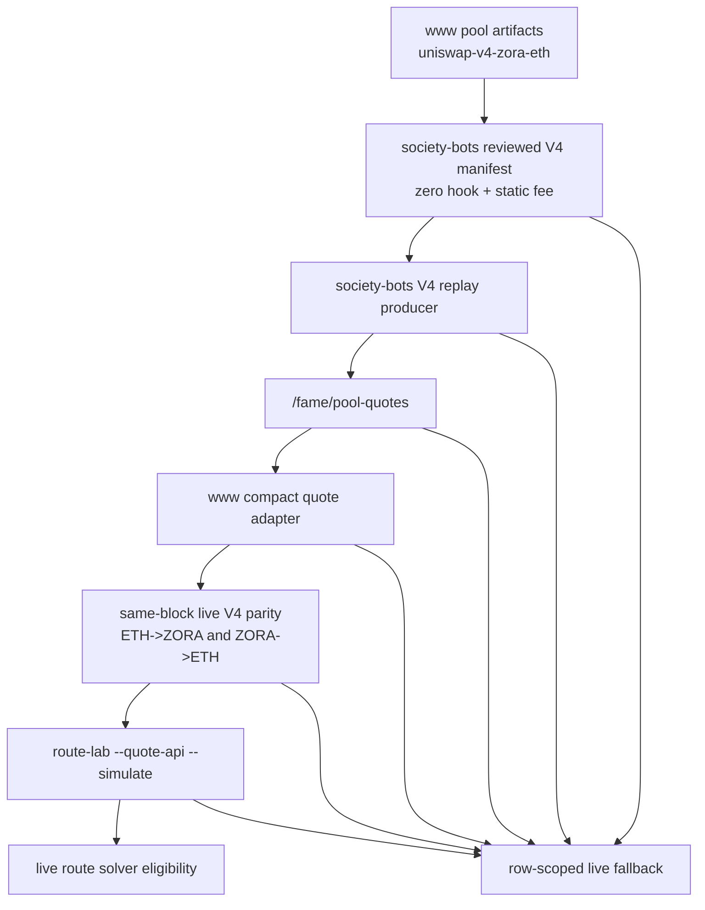
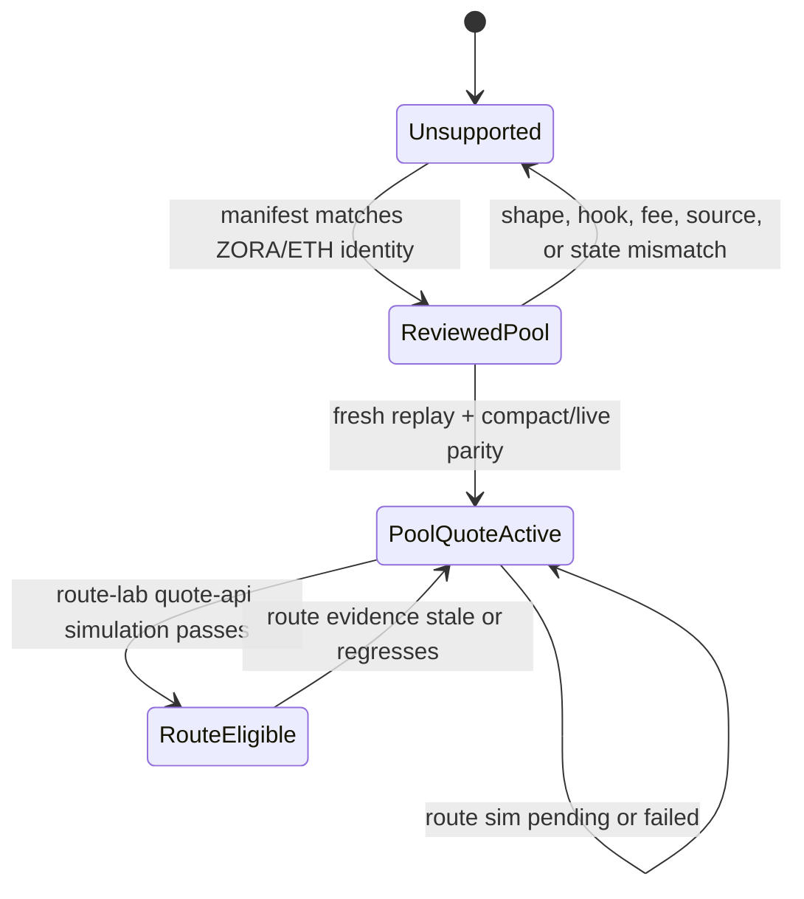

# feat: Enable ZORA/ETH V4 Compact Quote Eligibility

## Summary

Add `uniswap-v4-zora-eth` as a second named Uniswap V4 compact quote lane for the FAME route universe.

This is a narrow no-hook/static-fee pool activation slice. It does not widen the existing `uniswap-v4-basedflick-zora` approval into broad V4 support, and it does not activate `uniswap-v4-usdc-eth`, V3 ZORA/USDC, stable pools, Slipstream2, or gauge-cap logic.

The intended release claim has two separate levels:

1. Pool-level quote API support: `/fame/pool-quotes` can return validated compact CL quotes for the reviewed ZORA/ETH V4 pool, or typed unavailable rows when evidence is missing, stale, mismatched, or unsafe.
2. Route-solver eligibility: `www` may let the live route solver select compact rows for native ETH routes only after route-lab parity and `--quote-api --simulate` prove the exact route legs.

Target repos:

| Repo | Role |
| --- | --- |
| `society-bots` | reviewed V4 pool manifests, V4 replay producer, compact quote rows, unavailable evidence, activation smoke/reporting |
| `fame-lady-society/www` (`../fls-www` locally; `www` below) | pool artifact authority, compact row validation, live quote parity, route-lab simulation, final route-solver eligibility |

All file paths below are repo-relative within the named repo.

---

## Problem Frame

`uniswap-v4-basedflick-zora` already passed the prior live quote API, parity, and route-lab simulation gate. The current code now has a useful V4 replay/quote spine, but many names and guards are still intentionally shaped around that one BASEDFLICK/ZORA lane.

`uniswap-v4-zora-eth` should be treated as a separate reviewed pool rather than a generic V4 expansion. The checked-in artifacts show a simpler pool shape than BASEDFLICK/ZORA:

| Field | Expected ZORA/ETH reviewed shape |
| --- | --- |
| Pool id / PoolKey | `0xd694bd7285eeeee19d3d5da38f613859168c422d628def88a0c95dad12071f3a` |
| Currency 0 | native ETH zero address |
| Currency 1 | ZORA `0x1111111111166b7fe7bd91427724b487980afc69` |
| Fee | `3000` V4 LP fee, 0.30% |
| Tick spacing | `60` |
| PoolManager | `0x498581ff718922c3f8e6a244956af099b2652b2b` |
| StateView | `0xa3c0c9b65bad0b08107aa264b0f3db444b867a71` |
| Hooks | zero address |
| Hook data | empty / `0x` |

That shape removes the special Zora-protocol hook/provenance question from the BASEDFLICK/ZORA lane, but it introduces a different risk: accidentally reusing BASEDFLICK/ZORA provenance requirements or, worse, treating "V4 and static fee" as enough to admit every V4 row.

The plan is to promote exactly one more V4 pool through a named manifest, verify both native ETH directions, and keep the route solver behind a separate simulation gate.

---

## Requirements

**Activation boundary**

- R1. The slice targets only `uniswap-v4-zora-eth`.
- R2. `uniswap-v4-basedflick-zora` remains active under its existing reviewed gate and must not regress.
- R3. `uniswap-v4-usdc-eth` remains unsupported/non-promoted.
- R4. No V3, Slipstream2, stable, gauge-cap, or broad Uniswap V4 activation is included.
- R5. Non-target V4 accounting must come from activation evidence/report data, not a new permanent hardcoded exclusion list.

**Reviewed pool identity**

- R6. The reviewed shape binds chain, venue, PoolManager, StateView, PoolKey/pool id, native ETH currency0, ZORA currency1, fee, tick spacing, hook address, and hook data.
- R7. A row with a non-zero hook address is ineligible for this lane.
- R8. A row with non-empty hook data is ineligible for this lane.
- R9. Dynamic-fee sentinel values or fee/LP-fee ambiguity fail closed.
- R10. Protocol-fee behavior is either proven zero in the row or represented with an explicit unavailable reason.
- R11. The ZORA/ETH lane does not require or inherit BASEDFLICK/ZORA Zora-coin provenance evidence.

**Producer quote API**

- R12. CL head snapshots alone do not qualify the pool for compact quote support.
- R13. V4 replay state must include same-block PoolKey identity, slot0, liquidity, bitmap/tick evidence, block identity, source registry id, source id, LP fee, protocol fee, and state hash.
- R14. `/fame/pool-quotes` can return compact quotes for both ETH -> ZORA and ZORA -> ETH when the reviewed state is fresh and complete.
- R15. `/fame/pool-quotes` returns typed unavailable rows, not thrown errors, for missing state, stale state, source registry mismatch, malformed state, shape mismatch, fee mismatch, outside indexed range, replay failure, and producer-untrusted states.
- R16. Existing Slipstream and BASEDFLICK/ZORA quote rows keep their current wire behavior.

**Consumer validation**

- R17. `www` validates ZORA/ETH compact rows against a pool-specific reviewed manifest rather than the BASEDFLICK/ZORA manifest.
- R18. `www` treats malformed, stale, mismatched, or unsupported ZORA/ETH compact rows as row-scoped fallback to live quoting.
- R19. The current test expectation that ZORA/ETH is a "non-target V4 pool" is replaced with a narrower expectation: ZORA/ETH is targetable only after its activation gate, while USDC/ETH remains non-target.
- R20. Native ETH zero-address orientation is validated in quote parsing, live parity, and router payloads.

**Parity and route eligibility**

- R21. Same-block compact-vs-live parity must pass for ETH -> ZORA and ZORA -> ETH at route-relevant amounts.
- R22. Route-lab `--quote-api --simulate` must pass for `solver-eth-zora-basedflick-fame`.
- R23. Route-lab `--quote-api --simulate` must pass for `solver-fame-basedflick-zora-eth`.
- R24. Route-solver eligibility is not implied by pool-level quote API support; it flips only after the route-lab simulation evidence is fresh and named.
- R25. The activation report must separate pool-level quoted count, unavailable/fallback count, route selected count, and simulated swap result.

---

## Acceptance Examples

- AE1. Given the registry contains three V4 pools, the activation report shows BASEDFLICK/ZORA and ZORA/ETH under named V4 compact quote gates, and USDC/ETH remains non-promoted.
- AE2. Given a ZORA/ETH row has the wrong PoolManager, StateView, PoolKey, currency orientation, fee, tick spacing, hook address, or hook data, the quote API returns unavailable with a shape/fee reason.
- AE3. Given ZORA/ETH replay state is fresh and same-block parity passes, `/fame/pool-quotes` returns quoted compact rows for ETH -> ZORA and ZORA -> ETH.
- AE4. Given pool-level ZORA/ETH quotes pass but route-lab simulation fails, the report says pool-level quote API support is present while route-solver selection remains blocked.
- AE5. Given route-lab simulation passes for both native ETH route artifacts with quote API enabled, the solver may select compact ZORA/ETH rows for those routes.
- AE6. Given a future V4 pool shares static fee and zero-hook shape but has no reviewed manifest, it remains unsupported.

---

## Scope Boundaries

- No broad V4 compact quote support.
- No activation for `uniswap-v4-usdc-eth`.
- No activation for V3 ZORA/USDC in this slice.
- No stable-curve validation work in this slice.
- No Slipstream2 or gauge-cap support in this slice.
- No route-solver eligibility without `--quote-api --simulate` evidence.
- No removal of live quote fallback.
- No AWS/manual data mutation path as the primary activation mechanism.

### Deferred to Follow-Up Work

- V3 ZORA/USDC compact quote or live-route connector planning.
- Stable pool quote math and parity harness.
- Slipstream2/gauge-cap support.
- Generic no-hook V4 pool template after at least two named V4 lanes are proven.
- Hooked or dynamic-fee V4 compact quote policy.

---

## Dependencies / Prerequisites

- Current `www` pool artifacts remain the source of truth for the ZORA/ETH PoolKey and route fixtures.
- Base RPC reads support same-block StateView calls and bitmap/tick collection at the evidence block.
- Route-lab simulation account `0x499e194d7a106AC1305ed4f96c6CEaAff650462D` or an equivalent configured simulation account can execute the native ETH route checks.
- The `fls-www` route-lab simulation deadline fix is present; commit `ef5d3f7` is the known fix.
- Existing BASEDFLICK/ZORA V4 compact quote tests remain green before and after the change.

---

## Key Technical Decisions

- KTD1. Represent V4 compact support as a map of reviewed named pool manifests, not a single `FAME_V4_ZORA_QUOTE_LANE_POOL_ID` constant and not a broad venue allowlist.
- KTD2. Model ZORA/ETH as a zero-hook/static-fee reviewed pool. Do not require `zoraProvenance` for this lane, and do not reuse BASEDFLICK/ZORA's Zora protocol approval evidence.
- KTD3. Keep `cl-quote-v1` as the quote kind if the row carries enough V4-specific source, PoolKey, fee, protocol-fee, hook, and manifest identity for `www` to distinguish V4 from Slipstream.
- KTD4. Preserve row-scoped fallback: one bad compact ZORA/ETH row cannot invalidate reserve, Slipstream, or BASEDFLICK/ZORA quote paths.
- KTD5. Treat pool-level quoteability and route-solver selection as different release states with different evidence.
- KTD6. Make non-promotion reporting evidence-driven so the smoke output can say why USDC/ETH stayed unsupported without hardcoding it as a special exclusion forever.

---

## High-Level Technical Design

---

## Implementation Units

### U1. Generalize Named V4 Reviewed Pool Manifests

**Repo:** `society-bots`

**Files:**

- `src/fame-swap-pool-state/v4-zora-manifests.ts`
- `src/fame-swap-pool-state/v4-zora-manifests.test.ts`
- `src/fame-swap-pool-state/types.ts`
- `src/fame-swap-pool-state/registry/base-v1-pools.json`

**Work:**

- Replace the single-pool manifest API with a reviewed V4 manifest registry keyed by pool id.
- Keep the BASEDFLICK/ZORA manifest behavior exactly as-is, including its provenance requirement.
- Add a ZORA/ETH reviewed manifest with native ETH currency0, ZORA currency1, fee `3000`, tick spacing `60`, zero hook address, and `hookData: "0x"`.
- Add a lane capability such as `provenanceRequired: false` or `reviewEvidenceKind: "zero-hook-static-fee"` for ZORA/ETH.
- Keep dynamic-fee and unsafe-hook checks shared across V4 lanes.
- Ensure `uniswap-v4-usdc-eth` is classified as non-promoted because it lacks a reviewed manifest, not because it appears in a permanent deny list.

**Validation:**

- Manifest tests prove BASEDFLICK/ZORA still classifies as eligible only with provenance.
- ZORA/ETH classifies as eligible with exact identity and no provenance.
- ZORA/ETH blocks wrong fee, wrong tick spacing, wrong orientation, wrong PoolManager, wrong StateView, non-zero hook, non-empty hook data, and dynamic fee.
- USDC/ETH remains unsupported/non-promoted.

### U2. Extend Producer Replay and Quote API Admission

**Repo:** `society-bots`

**Files:**

- `src/fame-swap-pool-state/indexer.ts`
- `src/fame-swap-pool-state/api.ts`
- `src/fame-swap-pool-state/cl-quote.ts`
- `src/fame-swap-pool-state/dynamodb/pool-state.ts`
- `src/fame-swap-pool-state/lambdas/indexer.ts`
- `src/fame-swap-pool-state/lambdas/logging.ts`
- `src/fame-swap-pool-state/api.test.ts`
- `src/fame-swap-pool-state/indexer.test.ts`

**Work:**

- Replace hardcoded `FAME_V4_ZORA_QUOTE_LANE_POOL_ID` checks with reviewed-manifest lookup.
- Allow `v4ClReplayPools` and `isV4ClReplayPool` to include ZORA/ETH when the reviewed manifest admits it.
- Generalize V4 replay latest/candidate rows so ZORA/ETH can omit BASEDFLICK/ZORA `zoraProvenance` while still carrying explicit reviewed-pool evidence.
- Keep V4 row keys based on PoolKey/pool id and StateView identity.
- Emit `protocolFeeStatus: "zero"` or a typed unavailable reason; do not silently quote through non-zero/unknown protocol fee.
- Update Lambda defaults/log summaries so "selected V4 Zora" evidence can describe multiple named V4 lanes.

**Validation:**

- API tests quote ZORA/ETH both directions from fresh replay rows.
- API tests return unavailable for ZORA/ETH missing state, stale state, source-registry mismatch, malformed replay state, shape mismatch, fee mismatch, non-zero protocol fee, and producer-untrusted state.
- API tests keep USDC/ETH unsupported.
- Indexer tests prove ZORA/ETH V4 replay rows are written through the normal deploy/indexer path.
- Logging tests or snapshots show both V4 lanes can be summarized without overwriting each other.

### U3. Teach `www` To Validate ZORA/ETH Compact Rows

**Repo:** `fame-lady-society/www`

**Files:**

- `src/features/fame-swap/solver/poolStateRegistry.ts`
- `src/features/fame-swap/solver/quotes/indexedQuoteApiAdapter.ts`
- `src/features/fame-swap/solver/quotes/indexedQuoteApiAdapter.test.ts`
- `src/features/fame-swap/solver/quotes/indexedQuoteApiClient.ts`
- `src/features/fame-swap/artifacts/base-v1-pools.json`
- `src/features/fame-swap/artifacts/base-v1-solver-routes.json`

**Work:**

- Mirror the reviewed V4 manifest map from `society-bots` or consume a generated/shared manifest if available in the current pipeline.
- Change compact-quote capability checks from BASEDFLICK/ZORA-only to reviewed-manifest lookup.
- Add ZORA/ETH validation for PoolKey, PoolManager, StateView, currencies, fee, tick spacing, hook address, hook data, source, source registry id, and protocol fee status.
- Do not require `quote.zoraProvenance` for ZORA/ETH.
- Update the existing "does not request compact rows for non-target V4 pools" test so USDC/ETH remains non-target and ZORA/ETH is targetable only when its activation evidence is present.

**Validation:**

- Indexed adapter requests compact rows for ZORA/ETH only when the reviewed activation gate is enabled.
- Indexed adapter accepts valid ZORA/ETH rows and falls back live for stale/mismatched/malformed rows.
- Existing BASEDFLICK/ZORA adapter tests remain green.
- USDC/ETH still makes no compact quote request.

### U4. Add Parity and Route-Lab Evidence for Native ETH Routes

**Repo:** `fame-lady-society/www`

**Files:**

- `src/features/fame-swap/solver/quotes/liveAdapters.test.ts`
- `src/features/fame-swap/solver/quotes/deterministicAdapter.ts`
- `src/features/fame-swap/solver/routeCorpus.ts`
- `scripts/fame-swap-cl-replay-parity.ts`
- `scripts/fame-swap-route-lab.ts`
- `docs/fame-swap-route-lab.md`

**Work:**

- Extend the parity harness to target `uniswap-v4-zora-eth`.
- Run same-block compact-vs-live V4 parity for ETH -> ZORA and ZORA -> ETH at route-relevant amounts.
- Run route-lab with quote API and simulation for:
  - `solver-eth-zora-basedflick-fame`
  - `solver-fame-basedflick-zora-eth`
- Record quote API row usage, unavailable count, fallback count, selected route, simulated output, and protected minimum.
- Preserve the fixed simulation deadline behavior from commit `ef5d3f7`.

**Validation:**

- Parity output shows both ZORA/ETH directions match within the existing strict tolerance.
- Route-lab `--quote-api --simulate` shows `0 unavailable` and `0 fallback` for required compact rows, or explains any non-blocking live dependency separately.
- Route simulation succeeds for the native ETH route pair before route-solver eligibility is claimed.

### U5. Update Activation Smoke, Evidence, and Docs

**Repo:** `society-bots`

**Files:**

- `scripts/fame-pool-state-delta-replay-smoke.ts`
- `docs/fame-swap-v4-basedflick-zora-activation.md`
- `docs/fame-swap-v4-zora-eth-activation.md`
- `docs/fame-pool-state-index.md`
- `docs/ideation/2026-06-06-next-fame-pool-activation-slice-ideation.md`

**Work:**

- Add a new ZORA/ETH activation evidence section instead of folding it into the BASEDFLICK/ZORA activation doc.
- Update smoke parsing/reporting so multiple named V4 lanes can be active, blocked, or pending independently.
- Keep the BASEDFLICK/ZORA doc narrow and avoid rewriting its gate into broad V4 language.
- Make non-promotion rows report from the activation ledger/source of truth.
- Capture the final release evidence in a way reviewers can read without inferring route selection from pool quoteability.

**Validation:**

- Smoke reports BASEDFLICK/ZORA and ZORA/ETH independently.
- Smoke reports USDC/ETH as non-promoted with a source-derived reason.
- The docs explicitly say ZORA/ETH pool-level quote API support is not route-solver eligibility until route-lab simulation passes.

---

## Validation Plan

Run the validation in two phases so the release claim stays honest.

**Phase 1: pool-level quote API support**

- `society-bots` unit tests for V4 manifest classification, DynamoDB V4 replay rows, indexer admission, quote API success, and quote API unavailable reasons.
- `society-bots` smoke for activation evidence showing ZORA/ETH pool-level status.
- `www` unit tests for indexed quote adapter validation and fallback behavior.
- Same-block live parity for ETH -> ZORA and ZORA -> ETH.

**Phase 2: route-solver eligibility**

- `www` route-lab with `--quote-api --simulate` for `solver-eth-zora-basedflick-fame`.
- `www` route-lab with `--quote-api --simulate` for `solver-fame-basedflick-zora-eth`.
- Evidence must include selected route id, compact row attribution, unavailable count, fallback count, simulated output, and protected minimum.

Do not claim Phase 2 if only Phase 1 passes.

---

## Risks and Mitigations

| Risk | Mitigation |
| --- | --- |
| BASEDFLICK/ZORA-specific provenance leaks into ZORA/ETH and blocks the simpler lane | Add explicit per-lane evidence kind and tests proving ZORA/ETH does not require `zoraProvenance`. |
| ZORA/ETH admission accidentally enables USDC/ETH or future static-fee V4 pools | Use reviewed manifest lookup, evidence-driven non-promotion, and USDC/ETH regression tests. |
| Native ETH zero address is mishandled in quote validation or route payloads | Add bidirectional ETH/ZORA tests and route-lab simulation for both native route artifacts. |
| V4 protocol fee or dynamic fee semantics are under-modeled | Fail closed unless protocol fee is zero and LP fee matches the reviewed static fee at the evidence block. |
| Full tick replay is too expensive for the ZORA/ETH pool | Keep provider-read counts in evidence; block promotion if read scale exceeds the existing maintenance/replay threshold. |
| Pool-level quote success is mistaken for live route selection readiness | Keep separate status fields and require `--quote-api --simulate` before solver eligibility. |
| Logs and smoke remain hardcoded to one selected V4 pool | Update Lambda/logging/smoke to summarize named V4 lanes independently. |

---

## Open Questions

- Should the implementation rename `v4-zora-manifests.ts` to a generic V4 reviewed-pool manifest module, or keep the filename for a smaller diff and only generalize exported names?
- Should ZORA/ETH activation ship both route directions together, or can pool-level quote API support land before either route is solver-eligible? This plan assumes pool-level support can land first, but route-solver eligibility needs both route simulations.
- What exact route-relevant amount bands should parity use beyond the checked-in route corpus amounts?
- Should reviewed manifest parity be generated from `www` artifacts into `society-bots`, or manually mirrored with tests in this slice?

---

## Rollout / Handoff

1. Land producer manifest/replay/API changes in `society-bots` with tests showing ZORA/ETH pool-level quote API support and USDC/ETH non-promotion.
2. Land `www` consumer validation and fallback changes while keeping live route selection unchanged.
3. Run same-block parity for both ZORA/ETH directions.
4. Run route-lab `--quote-api --simulate` for both native ETH route artifacts.
5. Update activation docs and smoke evidence with separate Phase 1 and Phase 2 statuses.
6. Only after Phase 2 evidence is attached, allow the route solver to select ZORA/ETH compact rows in live user swaps.

---

## Sources

- `docs/ideation/2026-06-06-next-fame-pool-activation-slice-ideation.md`
- `docs/plans/2026-06-04-001-feat-v4-basedflick-zora-quoteable-pool-plan.md`
- `src/fame-swap-pool-state/v4-zora-manifests.ts`
- `src/fame-swap-pool-state/indexer.ts`
- `src/fame-swap-pool-state/cl-quote.ts`
- `src/fame-swap-pool-state/dynamodb/pool-state.ts`
- `src/fame-swap-pool-state/lambdas/indexer.ts`
- `src/fame-swap-pool-state/lambdas/logging.ts`
- `scripts/fame-pool-state-delta-replay-smoke.ts`
- `../fls-www/src/features/fame-swap/solver/poolStateRegistry.ts`
- `../fls-www/src/features/fame-swap/solver/quotes/indexedQuoteApiAdapter.ts`
- `../fls-www/src/features/fame-swap/solver/quotes/liveAdapters.test.ts`
- `../fls-www/src/features/fame-swap/artifacts/base-v1-pools.json`
- `../fls-www/src/features/fame-swap/artifacts/base-v1-solver-routes.json`
- `../fls-www/docs/fame-swap-route-lab.md`
- Uniswap V4 pool data guide: https://developers.uniswap.org/docs/sdks/v4/guides/pool-data
- Uniswap V4 reading pool state guide: https://developers.uniswap.org/docs/protocols/v4/guides/read-pool-state
- Uniswap V4 hooks concept guide: https://developers.uniswap.org/docs/protocols/v4/concepts/hooks
- Uniswap V4 dynamic fees concept guide: https://developers.uniswap.org/docs/protocols/v4/concepts/dynamic-fees
