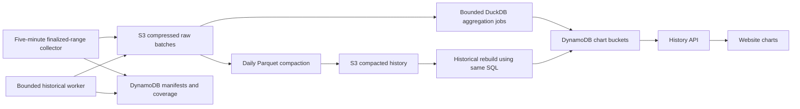

# Affordable FAME trade and liquidity history

## Outcome and decisions

Build a durable history service in `society-bots` that records every required event for explicitly covered Base pools, preserves periodic liquidity observations, and serves precomputed charts. Archive in S3; use DynamoDB for coverage, processing progress, and chart summaries. Reuse the existing provider, viem, ABIs, reviewed registry, Lambda, and CDK. Use DuckDB for SQL aggregation and Parquet compaction, subject to a bounded packaging/runtime proof.

The website (`fame-lady-society/www`) owns chart rendering. Its implementation is a separate change against the published history response contract. The operator approved this plan on 2026-10-03. Increment 1 has a tested collector/archive implementation and bounded live read-only rehearsals. Increment 2 has a working local raw → DuckDB/Parquet → candles → HTTP proof, including an offline Lambda Linux container run and a fresh Parquet-only rebuild. Production acceptance and cloud worker/API integration remain incomplete. No deployment, paid subscription, or production historical ingestion has been performed. See `docs/fame-market-history.md` for tested scope, revisions, and remaining operator inputs.

Decisions from the discussion:

- Collect both trades and liquidity events; also preserve sampled liquidity measurements.
- A five-minute collection interval must not imply sampling trades. Read every required event between committed checkpoints.
- Preserve raw evidence so summaries can be rebuilt without another chain download.
- Keep a resumable, slow historical backfill available; use the same decoding and archive format as ongoing ingestion.
- Several dollars per day for ongoing ingestion is unacceptable. Establish measured costs before production collection.
- Avoid an always-running analytics database or mandatory indexing subscription.
- Deliver working increments; deployment is the gate, without disabled UI or feature flags.

## Verified repository baseline

Inspected `origin/main` at `81aca9aaa698312ca236c43771274c201b171c87` on 2026-10-03. These are source findings, not verification of deployed AWS state or a historical bill.

| Existing component | Reusable behavior / limitation |
| --- | --- |
| `src/fame-swap-pool-state/indexer.ts` | Reserve pools now use safe-head `getReserves` snapshots; selected CL pools consume intervening events for quote-state maintenance. Neither is a complete durable market archive. |
| `src/fame-swap-pool-state/registry/base-v1-pools.json` | Generated reviewed pool/token/venue identities. Do not hand-edit the generated artifact or equate quote eligibility with history eligibility. |
| `src/fame-swap-pool-state/dynamodb/pool-state.ts` | Conditional updates and content-before-pointer patterns; current state and short-lived replay artifacts are not historical records. |
| `src/fame-event/lambdas/messaging/index.ts` | Existing V2/V3 log reads, but transaction/receipt and notification enrichment are unnecessary for basic pool candles. Do not restore this path as the history service. |
| `deploy/lib/fame-pool-state.ts` | Existing scheduled Lambda, on-demand DynamoDB, failure destination, and bounded API patterns. |
| `src/fame-swap-pool-state/lambdas/logging.ts` | Compact operational logging conventions. Never log whole event batches or RPC credentials. |

Commit `21fa90c` deliberately removed reserve Sync polling to reduce RPC work. `docs/fame-pool-state-index.md` still describes that older scan: correct it during implementation. CL swap normalization retains price/tick/liquidity but drops trade amounts, so archive before reducing. Current V4 log queries filter event types at the shared PoolManager but not pool IDs; history queries must include indexed pool-ID filters.

## Scope and data meaning

### First supported universe

Start with actual direct-FAME pools from the reviewed registry whose event ABIs can be validated. Implement and test the V2/volatile Solidly/Aerodrome, V3/Slipstream, and reviewed V4 event families required by that universe. Native wrapping is not a market. Do not include busy non-FAME connector pools merely because the router tracks them.

During the first implementation step, generate an inventory showing chain, address or V4 pool ID, tokens/decimals, event family, start block, and coverage status. Confirm each venue ABI against its owning contract source. Unknown families are explicitly unsupported, never silently described as complete. A later registry change creates a new coverage scope and records the new pool's start; it cannot retroactively claim coverage under an older filter.

### Trade history

- Preserve every matching raw Swap log, block number/hash/timestamp, transaction hash/index, log index, emitting address, topics, data, pool identity, and schema/filter revision.
- Normalize signed amounts and token orientation with exact integers. Persist uint256/int256 values as decimal strings or lossless bytes; never round the canonical archive through JavaScript Number or DuckDB floating point.
- Define candle price as normalized quote-token amount divided by base-token amount for each eligible execution. Keep post-swap spot price separately where the event provides it.
- Calculate open/close by `(blockNumber, transactionIndex, logIndex)`, not timestamp alone. High/low are execution-price extrema; volume is summed absolute base and quote amounts per pool.
- Validate zero/ambiguous amounts explicitly and preserve the source event with a classification; do not silently drop undecodable data while claiming derived coverage.
- First API exposes pair-denominated, per-pool OHLCV and trade counts. Cross-pool token candles, economic-user volume, and historical USD conversion are outside this increment. Routing through multiple pools can double-count aggregate economic volume.

### Liquidity history

- Archive relevant raw state-changing events alongside swaps: V2-family Sync/Mint/Burn and each supported CL family's initialization, liquidity changes, collection/donation events as applicable to its ABI.
- Preserve periodic existing reserve/CL-head observations separately. Read the persisted latest rows during history collection and deduplicate by their actual observed block/hash. A read at 12:05 of state observed at 12:03 remains a 12:03 observation.
- This captures available observations at the history cadence; it does not promise to preserve every intermediate one-minute quote-poller snapshot. If a row is stale/missing, expose a gap rather than fabricate freshness.
- Store reserve balances or CL active liquidity/tick/price with their units and observation provenance. Active CL liquidity is not total token inventory or USD TVL. Do not sum these levels over time or across incomparable pools.
- Full historical CL depth requires initialization/seed state and all relevant subsequent events. Retaining events enables that future reconstruction; depth, position accounting, fee accounting, and exact historical TVL are not claimed by the initial chart service.

## Architecture

Use a dedicated `src/fame-market-history/` module and `deploy/lib/fame-market-history.ts` construct. Share existing identities/ABIs where appropriate without refactoring the quote engine into a generic indexing framework. History has independent cursors and failure handling; quote-state bootstrap/repair must never move a history cursor.

### Collection and finality

1. Resolve the provider's Base `finalized` head and validate chain identity. Verify actual tag support and semantics in the provider rehearsal; do not silently substitute `latest` or a confirmation-offset head. Expect chart delay beyond the five-minute schedule due to finality, and return both block time and ingestion time.
2. Select a bounded inclusive range from the next uncommitted block through that head. Group compatible address/topic filters; include V4 indexed pool IDs in the RPC request.
3. Use adaptive bounded range splitting for provider size/range errors. Apply request, response-size, memory, retry, and wall-clock limits; count attempts inside transport retries as well as top-level calls. Never silently truncate results or skip failed subranges.
4. Fetch header timestamps once per distinct event-bearing block; also fetch/validate range boundary identities. Cache immutable block headers. No per-trade receipts, transaction lookups, ENS, balances, or fresh tick-universe reads.
5. Validate returned logs against the requested range/filter, reject removed logs, order and deduplicate by `(chainId, blockHash, logIndex)`, and preserve raw events before normalization.
6. Upload compressed JSONL batches and verify checksum/size. Commit the batch manifest and advance the contiguous cursor atomically with a DynamoDB transaction conditioned on the expected prior cursor/revision.
7. A successful zero-event query still commits a coverage manifest. A failed query never becomes an empty successful range.

Use a single scheduled live collector with bounded execution and reserved concurrency one. Persist work boundaries so retries reuse deterministic object identities. The cursor conditional write remains necessary for retries/manual invocations. Unreferenced S3 uploads after a crash are harmless; consumers read committed manifests, not arbitrary object listings.

The first live start is an explicitly recorded finalized block chosen at activation. Earlier blocks are missing history, not empty markets. Backfill fills the earlier range using pool creation blocks where verified.

Finalized ingestion reduces reorganization churn but still validate boundary hashes. On contradiction, stop advancing that scope, mark affected coverage invalid, retain raw evidence, and execute an explicit bounded replacement/reaggregation procedure. Do not append both canonical and orphaned events to visible results. A registry/filter change likewise requires a new revision and deliberate coverage reconciliation.

### Storage and publication

- Dedicated private S3 bucket with encryption, public access blocked, least-privilege access, production retain-on-stack-deletion, and no automatic expiry for committed canonical history.
- Raw object paths identify schema, chain, scope revision, block range, and content identity. JSONL uses lossless amounts and includes block timestamps to avoid later enrichment RPCs.
- Dedicated on-demand DynamoDB history table: collector cursors, committed range manifests, compaction manifests, aggregation work/progress, and chart buckets. No raw trade rows and no table scans on normal paths.
- Partition chart data by pool, resolution, and UTC month; sort by bucket time. Index archive work by scope and range so bounded replay/compaction can enumerate manifests without scanning the bucket/table.
- Keep objects immutable. Publish replacement manifests with conditional revisions. Each dataset revision identifies a non-overlapping active file set; queries never union both raw and compacted copies of the same coverage.
- Retain compressed raw evidence and compacted Parquet initially. Include both copies in the storage estimate. Any later raw-retention change requires proving that the retained representation preserves all original fields; summaries alone are never a substitute.

### Aggregation and Parquet

Use one versioned SQL definition for live, backfill, and repair aggregation. Package the maintained DuckDB Node client in a Lambda container image so native dependencies are explicit. First prove the image builds, runs offline with its required extensions, and fits runtime/memory budgets on representative batches; do not install extensions at invocation time. Existing experimental Parquet dependencies are not automatically the chosen implementation.

Archive commits create bounded aggregation work transactionally with publication. Workers recompute affected five-minute buckets from their committed, canonical inputs and replace complete bucket records. A per-scope lease plus conditional source revision prevents an older worker from overwriting newer results. Advance aggregation progress only after all its required writes succeed. Retries replace the same results; they do not increment volume counters.

Roll hourly/daily buckets from complete smaller buckets, preserving first/last ordering keys, extrema, base/quote volumes, counts, and coverage. Missing coverage differs from an empty fully scanned interval. No-trade intervals have zero volume and null execution OHLC; any carried-forward display price must be separately labeled. An open or incompletely covered candle is explicitly partial.

Use fixed, documented decimal precision for derived prices with overflow detection and a tested rational/decimal conversion at the boundary. The exact original amounts remain recoverable. Do not imply the chart's rounded decimals are exact raw chain values.

Daily compaction partitions by schema/chain/date and uses pool as a column initially. Compact bounded chunks rather than assuming an arbitrarily busy day fits one invocation. Verify counts, event-identity digest, schema, exact amount round-trips, and source coverage before publishing a manifest. Late backfills or repairs produce replacement partition revisions and schedule affected bucket rebuilds.

Proposed serving retention: five-minute buckets 90 days; hourly/daily buckets long term. S3 retains detailed history long term. API rejects unsupported old high-resolution requests clearly; it does not run an unbounded S3 query on the request path. Old fine-grained data remains exportable/rebuildable by bounded offline work.

### API and website boundary

Add a bounded server-to-server route through the existing API authentication pattern, for example `/fame/history`, accepting reviewed pool ID, metric, resolution, and UTC range. Enforce a maximum range/point count per resolution and pagination where needed. Return pair/units, bucket values, aggregation version, completeness, latest covered block/time, and gaps. Unknown pools/metrics and malformed requests fail explicitly.

Do not expose bucket names, raw RPC endpoints, or internal manifests. Website rendering/caching belongs in a subsequent `www` PR. The API must be useful and integration-tested independently of that UI.

## Backfill without an ongoing subscription

Provide an operator-run bounded command/job accepting pool scope, inclusive start/end blocks, and a request/work allowance. The end is pinned to a finalized block. It writes the same archive and normalization schema as live collection, with separate progress and a lower priority/budget. It must stop cleanly at its limit and resume without redoing committed work. It must not trigger social notifications.

Partition range ownership so backfill normally ends before live coverage starts. Overlap tests still must prove event deduplication and correct coverage union. Candle completeness follows continuous block coverage, not the number of rows returned.

Use existing RPC first. Benchmark HyperSync as a possible one-time bulk source if RPC is costly; only add its adapter when measured benefit warrants it. Source changes must retain identical event identity and raw evidence and pass cross-provider checks. Verify historical coverage and provider terms before choosing a paid ingest. Slowing identical requests reduces spending rate, not necessarily total cost.

## Cost controls and evidence

No claim that the previous $2–3+/day bill was caused by one particular component: billing attribution remains unverified. Avoid repeating known expensive patterns: full CL reconstruction, broad PoolManager scans, per-trade enrichment, repeated timestamp reads, and raw-payload logging.

Use one chain/pool-filtered collection run every five minutes initially. Configure bounded request attempts, range size, response bytes, retry count, and invocation duration. Persist remaining work when budgets are exhausted; expose lag rather than discarding data. A shared daily provider-request allowance covers live and backfill with reserved capacity for live collection. Price-weight methods when estimating spend; a request counter is not a universal dollar cap.

Proposed planning target: **at most $10/month incremental ongoing cost** for the initial reviewed pool scope, excluding the separately estimated one-time backfill. This is a design target, not a user-approved exact budget or an achieved estimate. Resolve the final budget during implementation planning before production activation. Do not use free credits to disguise steady-state economics.

Record a reproducible cost worksheet:

- Provider calls/attempts by method, provider billing units, bytes returned, event counts, and successfully covered blocks.
- Lambda requests, duration, memory, native-runtime startup cost, and compaction/rebuild peaks.
- S3 PUT/GET/LIST/storage for both raw and Parquet, DynamoDB reads/writes/storage, logs, ECR/container storage, and any networking charges.
- 30-day projection using measured quiet and busy ranges; separate annual storage growth and backfill totals.
- Live lag and catch-up throughput under the configured budget; lower cost is not a success if the backlog grows indefinitely.

Use current provider prices and actual billed-unit observations where available. HTTP batching reduces transport overhead but does not necessarily reduce billed method units. Avoid NAT gateways or provisioned databases for this path. Do not add Firehose, Kafka, Glue jobs, or a paid permanent ingestion service without measured justification.

Rehearse a bounded sample, then a monitored finite soak spanning quiet and active periods. Production acceptance requires actual incremental provider/AWS evidence meeting the agreed target. If it does not fit, tune filters/batching and scope transparently; do not silently replace complete trades with sampled prices.

## Implementation sequence and acceptance

### 1. Event inventory, collection, and durable archive

Deliver an end-to-end bounded collector with S3 publication, conditional coverage/cursors, raw event validation, and existing-state liquidity observations. Establish the pool/ABI matrix and provider finalized-tag behavior first. Correct stale pool-state documentation. Supply a dry-run/cost-report mode that cannot send notifications or advance production cursors.

Acceptance: representative reserve, CL, and reviewed V4 ranges match independent RPC evidence by event identity; filters exclude unrelated pools; empty ranges are recorded; uploaded objects round-trip exact values; retries and failed writes cannot skip data. Demonstrate request accounting and bounded catch-up before expanding the range.

### 2. Aggregation, Parquet, and history API

Deliver the packaged DuckDB worker, five-minute execution candles, sampled liquidity series, verified daily Parquet compaction, bounded authenticated API, and explicit coverage semantics. Use the shared versioned aggregation implementation for both normal and rebuilt data.

Acceptance: raw and Parquet rebuilds yield identical candles; same-timestamp trades retain chain order; gaps are distinguishable from no-trade periods; container cold starts and busy-window processing fit budget. Hourly/daily rollups and serving retention complete this step before offering long-range API queries.

### 3. Resumable historical ingest and website integration contract

Deliver bounded backfill/rebuild commands with independent progress, range ownership, provider allowance, replacement partitions, and interrupted-run recovery. Establish cost per historical range before requesting a full historical run. Publish API fixtures/examples for a separate website chart PR.

Acceptance: adjacent live/backfilled ranges produce continuous verified coverage; overlaps cannot duplicate trades; repairs replace orphaned revisions; a paused ingest resumes from the last durable range. Older unavailable history remains explicitly unavailable until populated.

## Required verification scenarios

- Source failure or provider range-limit error cannot produce a successful empty manifest.
- Crash after object upload but before manifest publication: retry publishes once; orphan objects are invisible.
- Crash after manifest commit but before aggregation: pending work is recoverable without refetching chain data.
- Stale/concurrent writer cannot regress a cursor, active manifest, or chart bucket revision.
- Multiple trades in one block/timestamp, reversed token orientation, very large amounts, zero/invalid amounts, multi-hop swaps, and unrelated V4 pools.
- Registry change/new pool does not inherit false historical coverage.
- Missing/stale liquidity state does not become a fresh sample; active liquidity is never mislabeled TVL.
- Boundary hash conflict invalidates coverage and derived data until repaired.
- Backfill/compaction retry and overlap do not duplicate events, volume, or files in the active dataset.
- Quiet intervals, missing intervals, and partial intervals have distinct API results.
- Request/retry/day allowances and worker deadlines stop safely with persistent progress; logs contain no secrets or event payload dumps.
- CDK asserts private retained S3, scoped IAM, on-demand table, bounded schedules/concurrency, log retention, failure destinations, and useful lag/failure metrics.

Run focused Jest tests for changed modules, `yarn types`, deploy tests/build, and CDK synthesis for affected stacks using the repository's installed tooling. Verify the DuckDB container with actual native execution and representative fixtures; mocks alone are insufficient. No Rust/Bun runtime checks apply to this TypeScript-only repository unless the implementation expands into those runtimes.

## Rollout and recovery

Deployment enables the collector; no separate feature flag. Choose and record a live start block, filter revision, budget, and finalized-head policy. Retain the first committed manifests and measured cost/coverage report as release evidence. Keep quote-state behavior independent.

On runaway cost or repeated failures, disable the history schedule through infrastructure rollback/operations; retain S3 and checkpoints. Resume from the last verified range. Roll back the chart API/worker independently of collection where possible. Never delete retained data as part of stack removal or roll back by advancing past missing ranges.

Outstanding deployment inputs: exact monthly budget, verified provider plan/range limits/finality behavior, complete initial pool inventory with ABI provenance, and measured DuckDB Lambda packaging/cost results. These do not prevent implementing the bounded first increment, but production affordability and complete coverage cannot be asserted before they are resolved.

## Research references

Reviewed during the 2026-10-03 discussion; recheck prices when implementing:

- [Alchemy method costs](https://www.alchemy.com/docs/reference/compute-unit-costs) and [pricing](https://www.alchemy.com/pricing): method-weighted accounting, not historical bill attribution.
- [HyperSync clients](https://docs.envio.dev/docs/HyperSync/hypersync-clients), [Base support](https://docs.envio.dev/docs/HyperSync/hypersync-supported-networks), and [pricing](https://envio.dev/pricing/hypersync): candidate bulk backfill source; the quoted $70/month Starter tier is not adopted for ongoing ingestion.
- [DuckDB Parquet](https://duckdb.org/docs/stable/data/parquet/overview.html) and [S3 support](https://duckdb.org/docs/current/core_extensions/httpfs/s3api): reuse established file/query tooling.
- [DynamoDB sort-key guidance](https://docs.aws.amazon.com/amazondynamodb/latest/developerguide/bp-sort-keys.html): bounded pool/time queries for serving summaries.
- [DynamoDB incremental exports](https://docs.aws.amazon.com/amazondynamodb/latest/developerguide/S3DataExport_Requesting.html): not the selected ingestion path; exporting overwritten latest state cannot recover intervening events.
