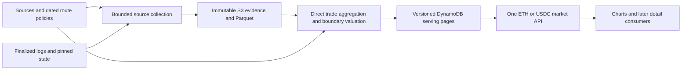

# Consolidated FAME market history

## Outcome and scope

Provide one backend-owned view of FAME liquidity and trading on Base, expressed in
ETH or USDC. Multiple pool/route price series belong inside that view; consumers
must not discover conversion routes, fetch each pool independently, or calculate
market totals. Adding a supported pool should add configuration and historical
coverage, not a separate consumer integration or a reset of existing history.

This is a research-backed implementation plan. Local backfill and PR creation are
authorized; production merge/deployment and data deletion require operator action. Repository research is grounded in
main `c909b7fdef4a819b6f410137c10a967726011c4b`. Preserve the currently working API
until the replacement passes an end-to-end rehearsal. The user accepts delayed
finalized data, rebuilding derived history, and a breaking consumer cutover in
exchange for complete direct-FAME evidence, honest sampled conversion, and low operating cost.

Initial product: five-minute buckets over a bounded 24-hour request, market
inventory value and gross execution volume, and per-pool bucket-end spot series,
in one selected currency. Retain complete direct-FAME event history; sample
conversion pools at every five-minute boundary. Do not index connector event
streams or enumerate liquidity ticks in this increment. Event/transaction detail endpoints follow later. Preserve their
identities and evidence now. No oracle dependency, synthetic consensus FAME price,
price-level depth chart, execution routing engine, or paid monitoring platform.
USDC is labeled USDC, never silently relabeled USD; WETH is the ETH accounting unit.
cbBTC is an ERC-20 asset identified by its address, not assumed equivalent to BTC.

## Accepted accuracy and cost decision

Complete FAME event collection and sampled conversion are separate promises.
Direct-pool trades, native amounts and identities are retained within verified
coverage. Converted spot samples describe actual on-chain state at bucket-end
blocks; they do not describe every price between samples. Converted volume is
actual quote-token volume marked at that bucket's closing conversion rate, not
execution-time ETH/USDC notional. This deliberate accounting convention uses an
end-of-bucket observation and must not be presented as information known at trade time.

The default chart uses per-pool converted spot samples with actual pool volume
beneath it and market totals separately. A quiet FAME pool can move between samples
because its conversion route moved. Equal samples do not prove the intervening
price was flat. Do not synthesize exact converted OHLC from endpoint samples or
mix execution-price candles with spot samples as if they were the same series.
Native-pair spot OHLC can be reconstructed from qualified direct-pool events;
shipping that optional dataset is not a prerequisite for the sampled market view.

Exact converted OHLC and execution-time conversion are deferred. Later rebuilding
requires historical connector events and starting state in addition to retained
FAME evidence. Snapshot retention alone cannot guarantee that upgrade; historical
provider availability, qualification and replay cost remain prerequisites.

## Research findings and reuse

| Area | Current implementation | Consequence |
|---|---|---|
| Direct pools | `model.ts:historyScope` includes every registered FAME pool; `rpc.ts` archives all logs for those addresses | Swaps and reserve-changing Sync events are already retained, including internal-call emissions. Transaction traces are not needed to retrieve logs. Coverage begins at recorded boundaries, not pool launch. |
| Membership | One scope hash includes the entire direct-pool list; V4 direct pools are rejected | Adding a pool changes archive identity. Separate source coverage from market membership before expanding. |
| Connectors | `valuation-rpc.ts` samples reviewed routes at range boundaries | Reuse the reader, but observe every bucket boundary rather than only collector range boundaries. Intrabucket connector extrema remain unknown. |
| Prices | `market.ts` combines executions; `reference.ts` uses one designated FAME/WETH pool | Mixed price definitions caused the chart discrepancy. Use explicitly identified bucket-end spot series; keep execution prices separate. |
| Stable pools | `valuation-rpc.ts:reservePrice` already implements the stable invariant derivative | Reuse exact arithmetic; do not use reserve ratio for stable pools. Review deployed variants. |
| Liquidity | `valuation.ts` values pool custody snapshots at each pool's spot | Keep an explicit inventory-value definition; custody is not executable depth or active CL liquidity. |
| Persistence | Immutable S3 evidence, DuckDB/Parquet, transactional DynamoDB publication | Keep these components. Rebuild derived representations without discarding valid raw history. |
| Limits | Collector defaults: 500 blocks, 5,000 events, 256 requests/run; reference collector has a separate allowance. Worker: 512 MB/2 minutes; current publisher max 90 candles | Measure direct-pool capture plus per-bucket shared snapshots and materialization. Connector event throughput is deferred. |
| Serving | Bounded DynamoDB-only API; current nested rows assume one scope and ETH/USD | New market contract and publication layout are required; no request-time RPC, DuckDB, or backfill. |

Relevant existing plans: [original archive](2026-10-03-001-feat-affordable-market-history-plan.md),
[API](2026-10-05-001-feat-market-history-api-plan.md),
[backfill](2026-10-06-001-feat-market-history-backfill-plan.md),
[reference prices](2026-10-07-001-feat-market-reference-prices-plan.md), and
[BASED FLICK V4 connector qualification](2026-06-04-001-feat-v4-basedflick-zora-quoteable-pool-plan.md).
Their status paragraphs can predate deployments; code and verified run receipts
are the evidence for what exists. The new ETH/USDC consumer contract supersedes
mixed-pool execution candles as the chart default, not the archived evidence.

### Initial source inventory

Keep all five current direct pools in the consolidated catalog:

| Direct pool | Pricing family | Existing connector candidates |
|---|---|---|
| `scale-equalizer-weth-fame` | Volatile Solidly | `uniswap-v3-usdc-weth-5bps` |
| `uniswap-v2-fame-direct` | Uniswap V2, WETH quote | Same WETH/USDC connector |
| `scale-equalizer-frxusd-fame` | Volatile Solidly | `scale-equalizer-usdc-frxusd` stable pool, then WETH/USDC for ETH |
| `scale-equalizer-scale-fame` | Volatile Solidly | `scale-equalizer-usdc-scale`, then WETH/USDC for ETH |
| `slipstream-basedflick-fame` | Slipstream CL | Existing BASEDFLICK/ZORA V4 connector and ZORA/WETH V3 connector; WETH/USDC when needed |

These are candidates from the registry and current valuation policy, not fresh
proof that every deployed connector supports historical snapshot reads. Qualify
reserves/slot0 reads, token orientation, active-liquidity validity and deployed
stable/hook behavior. BASEDFLICK requires the correct V4 StateView and PoolId;
its existing quote capability does not prove historical snapshot availability.
Connector event adapters and tick enumeration are not release prerequisites.

FAME/cbBTC is an onboarding case: no address or supported cbBTC route has been
established by this research. Find the exact pool and qualify its connectors before
including its converted values. Do not invent addresses or make symbol-based joins.

## Consumer contract

One market endpoint accepts `currency=ETH|USDC`, resolution, and bounded time range.
Proposed replacement schema: `fame-market-api-v2`. Coordinate its deployment with
fls-www; remove obsolete chart mapping after cutover rather than retaining an
indefinite v1 adapter. Keep reference/original execution evidence in storage.

The response contains:

- Market identity, currency, bucket interval, immutable publication identifier,
  pricing/membership revisions, and chain/published timestamps.
- A pool catalog, including unsupported, pending, and excluded pools with reasons.
- Market buckets: valued pool-held inventory, gross FAME base execution volume,
  gross quote volume valued at the bucket-end rate in the selected currency, execution count, and distinct
  transaction count. Include expected/included/excluded identities and coverage.
- Series catalog: stable identity `(direct pool, route policy, currency, price
  method)`, constituent pool identities, effective interval, and display label.
- Series buckets: bucket-end spot price, observation block/hash/timestamp, direct
  pool volume in native atoms and selected currency, counts and provenance.
  Return `priceMethod=bucket-end-spot`, `conversionMethod=bucket-end-spot`, and
  `samplingIntervalSeconds=300`; no converted OHLC fields in the initial contract.
- Separate direct-event coverage, price observation availability, inventory
  observation coverage and conversion method. Complete event coverage never means
  complete intrabucket conversion history.
- Separate progress for source collection, reconstruction, inventory observations,
  publication, and historical jobs. Report oldest dependency and missing intervals;
  a fresh HTTP response does not imply fresh underlying data.

No fabricated market OHLC formed by interleaving different pools. A selected
primary series may drive a headline price; return its identity and method, never
label it an all-market price. Default can remain FAME/WETH Equalizer, while totals
cover all expected pools. Alternate routes may produce alternate series, but must
not multiply a pool's contribution to totals. Exactly one effective accounting route
per quote asset/currency is selected for totals in each policy interval.

A missing pool or route is not zero. Distinguish `complete`, `partial`, and
`unavailable` per metric and series. Return an available subtotal and explicit
exclusions when only some inventory/volume is valued. Base-token volume can remain
complete even when quote conversion fails. Do not calculate a dollar-weighted
coverage percentage when the excluded value is unknown. A supported pool with
verified zero activity contributes zero volume; an unindexed pool contributes
unknown activity. Expected membership is historical, not today's pool list applied
retroactively to every bucket.

Summary covers the entire configured market even when the consumer requests only
selected series. Bound response bytes and read work. The initial five-series,
24-hour response must fit the existing 2 MiB application cap. Later larger catalogs
use optional series selection and snapshot-pinned pagination on this same market
contract; never silently truncate totals or hide omitted series. Full transaction
lists are separate paginated detail reads, not embedded in every history response.

## Data flow

## Source registry and conversion policy

Split three concepts currently coupled in `Scope`:

1. **Source identity:** chain, address or manager/PoolId, protocol family, token
   addresses/decimals, decoder revision, deployment/qualification evidence, and
   filter revision. Raw source identity is independent of market membership.
2. **Market membership:** FAME pools with effective block intervals and whether they
   contribute to totals. Onboard or retire a source without resetting other cursors.
3. **Route policy:** an effective-dated ordered path to ETH or USDC. Validate each
   edge's direction and units, reject cycles/repeated pools and any connector path
   through FAME. Initially cap routes at three connector edges, enough for the
   current BASEDFLICK path to USDC; longer paths require an explicit review. Pin
   reviewed paths; no runtime best-price path switching.

Store one canonical direct-pool event stream and one connector observation per
source/boundary/revision, referenced by every dependent route. Deduplicate shared
connector calls across pools and currencies. Maintain independent direct-event and
snapshot progress so a missing connector observation cannot erase FAME collection
progress. Two names for the same on-chain pool resolve to one source identity.

An onboarding record specifies discovery/start block, family proof, direct-pool
required events, snapshot calls, spot function, inventory capability, route dependencies
and historical availability. Existing-family onboarding is configuration plus
capability qualification; connector-only sources need snapshot qualification. A new family or hook behavior requires a reviewed adapter and tests.
Raw capture, spot pricing, swap volume and inventory valuation are separate
capabilities; unsupported inventory need not hide otherwise valid trades.

Route changes create explicit series/policy boundaries. Do not silently stitch
new-route closes onto old-route opens. A configured priority fallback, if ever
needed, must be another published policy interval with provenance, not an implicit
substitution when a source fails.

## Direct-pool capture and shared bucket observations

### Direct FAME evidence

Retain today's all-log direct-pool capture with bounded transport, adaptive ranges,
immutable uploads and conditional checkpoints. Preserve swaps, reserve/state
changes, raw amounts, transaction identities and event positions for later native
candles and transaction detail. A future direct V4 pool requires reviewed manager
and PoolId filters; never download the entire unrelated manager log stream.

Deduplicate by `(chain, blockHash, transactionHash, logIndex)` and order by
`(blockNumber, transactionIndex, logIndex)`. Cache headers across sources/jobs;
fetch event-containing and boundary headers, not every empty block. Empty successful
ranges establish event coverage. Retain finalized hash provenance; conflicts stop
affected publication and enter explicit repair. Native spot reconstruction, when
implemented, needs a valid preceding seed and family-correct transitions; block-end
state must not be applied before earlier logs in the same block.

### One shared observation per five-minute boundary

Buckets are half-open `[t,t+300)`. Select the greatest finalized canonical block
whose timestamp is strictly less than `t+300`. Verify boundary selection against
the successor block; events exactly at the boundary belong to the next bucket.
Record the selected number, hash and actual timestamp. Do not extrapolate block
numbers from a presumed fixed block time or substitute `latest` during backfill.

At that same block, read direct-pool spot state, every distinct connector used by
active routes, and direct-pool token balances. Batch with the existing pinned
Multicall reader, caching immutable token metadata. Chunk oversized Multicalls
under bounded transport limits while keeping every chunk pinned to the same block.
Persist successes and explicit failures with source/ABI/policy revisions.

- V2/volatile Solidly: reserve-based marginal price with decimals and orientation.
- Stable Solidly: deployed invariant derivative, not a reserve ratio or assumed peg.
- V3/Slipstream: family-correct slot0 sqrt price and active liquidity validity.
- V4 connector: reviewed StateView getSlot0/getLiquidity by PoolId, with supported
  hook behavior. No attribution of manager-wide balances to a pool.

No full tick bitmap/tick enumeration or connector Swap/Mint/Burn replay is required
for these spot observations. Spot is not an executable finite-size swap quote.
Use exact rational/bigint arithmetic through the route and round at serialization.
Reject zero reserves, invalid price/liquidity or unsupported state explicitly.

Sample every due bucket, including no-trade buckets. A collector batch crossing
several boundaries creates several independently pinned observations; one end-of-
batch read cannot fill them. Keep snapshot collection/checkpoints independent of
direct-event collection, with bounded catch-up and separate refill/repair progress.
Never carry an old connector sample forward and label it observed at a new boundary.
An old last-swap time alone does not invalidate a successful fresh state read.

### Price, volume and failure semantics

For each pool/route/currency, multiply the direct-pool spot by the connector rate
from that same boundary block. Return a sample, not an inferred intrabucket range.
The chart uses these prices consistently during trading and quiet buckets; actual
execution prices remain a separate dataset. Connecting endpoints is a display
choice and must not imply observed intermediate states. Flat markers describe
sampled equality only; missing observations remain gaps.

Sum actual direct-pool non-FAME quote amounts within the bucket, then convert that
sum using the bucket-end route rate. Preserve native quote atoms, base atoms and
counts even if conversion is unavailable. This yields closing-rate-valued gross
volume, not execution-time notional; it cannot support exact historical execution
pricing or slippage claims. An identity conversion (e.g. WETH to ETH) needs no
connector and introduces no currency-conversion approximation.

Separate event completeness from snapshot availability: a price can be observed
while volume is still pending, and complete trades can have unavailable conversion.
Only fully covered event ranges may report zero trades. A failed observation is
unknown, not zero or a frozen price. Retry transient errors in bounded runs;
unrecoverable historical state is an explicit terminal gap for that source/bucket
so later observations can progress. Do not replace failed historical reads with
current state. Repair can later fill a gap and republish affected buckets.

Persist method identifiers and sampling resolution independently of coverage.
No field or UI may label converted intrabucket OHLC as complete because every
five-minute observation was successfully collected.

## Consolidated liquidity and trade accounting

Define the initial liquidity metric as **pool-held inventory value**. For separately
addressed pools, take both token balances at one shared finalized bucket-end block
and mark them using that pool's spot plus its approved conversion route. This can
include fees/donations; it is not deployable liquidity, active CL liquidity, or
slippage/depth. Include the method and observation block in the contract. V2 reserves
remain the price input; custody balances must not silently replace reserves.

Batch historical balance reads for all direct pools in one pinned Multicall per
bucket, caching immutable token metadata. Do not pretend spot events reconstruct
arbitrary ERC-20 balance changes. Price observations and inventory
observations have separate coverage; publish their ages honestly. Later event-based
inventory optimization requires proof against those reads, including transfers,
fees, donations, rebases and protocol-specific settlement.

Sum each distinct FAME pool once. Connector holdings are not FAME market inventory.
A connector that is itself a direct FAME pool cannot serve as a conversion edge.
For a future singleton direct pool, require verified per-pool accounting before
including its inventory; manager-wide ERC-20 balances are never a substitute.
Missing balances, missing valuation or unsupported behavior yield explicit exclusions.

Gross market volume sums direct-pool executions once each, regardless of how many
series refer to them. Distinct transaction count deduplicates transaction hashes
across included direct pools. A multi-pool transaction can legitimately contribute
several executions to gross volume. Do not call this unique user/economic volume,
identify an ultimate user from a router sender, or infer wallet net flows without
separate receipt/trace analysis. Preserve raw addresses and execution positions so
future transaction details can explain that distinction.

## Persistence, publication and rebuild

Keep S3 for immutable raw evidence and compacted Parquet, DuckDB for deterministic
replay/aggregation, and DynamoDB for source/job checkpoints and bounded serving.
Do not introduce connector tick storage. Persist source manifests,
direct events, bucket observations and derived artifacts with checksums and decoder,
route, membership and arithmetic revisions. Fine-grained source retention has no
new automatic deletion policy in this change.

Normalize existing direct-pool archives into source manifests without recapturing
valid ranges. This is an explicit rebuild/import tool, not a permanent legacy
runtime path. A manifest maps canonical source coverage to existing immutable
objects. New source ingestion proceeds independently of the old whole-market hash.

One materializer aggregates direct events once and joins each bucket to its exact
boundary observations and dated route policy. Reuse shared asset conversion rates;
fan derived prices out to affected pool series without duplicating their volume.
Historical and live jobs use the same arithmetic and bucket logic. DuckDB handles
bounded partition scans and reductions; pricing adapters interpret contract state.
Do not use an ASOF fallback to substitute an earlier or later snapshot for a missing
boundary. Direct-event frontiers and observation frontiers advance independently;
publish explicit partial metrics instead of blocking every series on one failure.

Replace publication's assumption that every pool row fits in one transaction.
Stage bounded immutable serving pages and publish a small manifest pointer with a
fenced conditional update after verifying every page and checksum. Readers pin that
manifest/publication, so they cannot observe a partly rebuilt market. Reuse unchanged
page references; do not rewrite a whole day after each five-minute update. Prototype
time-page packing and manifest lookup before fixing the schema in milestone 1:
prove five-series 24-hour reads and 20-pool growth within item, response, latency
and read-work limits. Preserve the current seven-second read-work deadline and
2 MiB response cap unless a measured change is explicitly reviewed.
Use explicit limits and opaque cursors rather than unbounded manifests or fan-out.

DynamoDB limits matter: 400 KiB items, 1 MiB Query pages, and at most 100 transaction
actions/4 MiB. The current 90-candle publisher ceiling is not a scalable market
membership design. Stage large publications outside the small atomic activation
transaction; expired writers cannot activate their staged output.

Backfill/rebuild jobs freeze source set, policy intervals, from/to blocks, starting
state/observation requirements, source coverage and output generation. Separate live, backward-fill and
repair progress. Process bounded historical windows and checkpoint completed observations and
event coverage. Extending backward must not force rebuilding all later history. For sampled outputs, repair the affected boundary observations, bucket volume and
policy-dependent outputs. If repairing a native-state replay dataset, propagate
state corrections forward until convergence is proven rather than stopping at one
bucket. Do not require connector replay to repair a sampled bucket. Never change the live start marker to initiate a backfill.

First rebuild the currently served 24 hours, including predecessor context. Retain
existing raw evidence and old published generation until comparison and cutover
succeed. Switch the consumer and active generation deliberately; keep rollback
artifacts, not two permanent API implementations. Delete obsolete derived data
only under a separately reviewed retention decision.

## Efficiency and operational awareness

Keep the existing schedules and runtime initially. No daily hard stop, extra paid
alarms, or new always-on service. Bound runs by time, requests, response bytes,
events and memory; commit verified progress and resume. Reserve forward-processing
capacity before historical work. Share connector snapshots across every route;
connector activity does not increase snapshot call counts.

The [local measurement](../research/2026-10-07-market-connector-measurement.md)
queried four disjoint 500-block windows. WETH/USDC produced 205–508 events and
182–449 KB per window, versus 2–11 ZORA/WETH events. The entire probe used 43 RPC
requests and 1.48 MB of responses. Header fetching dominated modeled event-indexing
requests. This is a sparse sample, not a full-day bill or proof that event indexing
would be expensive. The approved initial design avoids those connector log/header
reads entirely; do not present their extrapolated volume as the snapshot budget.

Measure the actual sampled design before release:

1. Freeze one hour and one day of direct-event ranges and all five-minute boundaries.
   Measure pinned state/bootstrap reads, boundary lookup/header cache, retries,
   Multicall chunks, response bytes, CPU, memory and publication lag.
2. Compare cold refill with incremental collection. A day has 288 boundaries; one
   combined Multicall per boundary is a target, not a guaranteed total RPC count.
   Include boundary searches, direct-log/header calls, failed reads and chunking.
3. Rehearse 20 direct pools sharing connectors; distinguish synthetic scaling from
   live provider evidence. Verify processing exceeds incoming work under existing
   schedules, limits and available invocation time.
4. Report provider billing units separately from request counts, plus S3 requests/
   bytes, measured Parquet sizes, Lambda GB-seconds and DynamoDB reads/writes.
   Gzip probe sizes are not measured storage costs. Optimize shared reads, cached
   metadata/headers and small-file compaction before proposing new infrastructure.

Prior reference refill used 3,132 RPC requests and 1.43 MB of archive objects for
284 samples. Reuse its bounded refill mechanics, but do not assume its request count
is optimal or representative of the new combined snapshot design. Challenge current
500-block live windows and eight-archive reconstruction context in the rehearsal.

Use structured existing logs and API progress for requests, bytes, coverage,
throughput, lag and no-progress reasons. Overclaw can consume these later; no new
monitoring integration is required now. API latency remains independent of chain
replay: all consumer data is precomputed.

## Components to reuse versus build

| Choice | Decision |
|---|---|
| viem + existing bounded RPC transport | Reuse ABI encoding/decoding and RPC; do not implement an Ethereum client. |
| DuckDB + Parquet | Reuse native runtime and SQL analytics; add versioned normalized source records and deterministic reducers. |
| S3/DynamoDB/Lambda | Retain storage/serving boundaries; revise identity and publication layout rather than replacing the stack. |
| Existing pool-family math and registry | Reuse after protocol-specific proof; quote simulation capability is not historical replay proof. |
| Ponder | An existing EVM indexing framework worth knowing, but replacing ingestion alone does not solve route policy, inventory semantics or consolidated publication. No migration without a measured advantage. |
| SQD Portal | Deferred candidate bulk source for a future exact connector-history rebuild. Prove Base coverage, event filters, ordering, completeness, hashes and provider cost before substituting inputs. Keep the same archive contract. |
| Custom work | Source/membership separation, family qualification, shared bucket snapshots, market accounting, coverage semantics, immutable publication and rebuild tools. |

The difficult part is correct market semantics, direct-event completeness and
consistent boundary observations. Avoid a graph database, generic plugin system, dynamic routing service or
transaction tracing pipeline for this increment.

## Implementation progress

First local slice implemented: sampled route/response contract, rational valuation,
shared pinned reader and a four-bucket live read-only probe. See the
[implementation receipt](../research/2026-10-07-sampled-market-implementation.md)
for proof and limitations. Milestone 1 remains in progress: full source qualification,
production serving proof remains incomplete. A contiguous day has now passed local
archive import, snapshot collection, Parquet valuation replay, native-volume comparison
and loopback HTTP checks: see the [rebuild receipt](../research/2026-10-08-sampled-market-backfill.md). Production collector/publisher wiring and a separate `view=sampled-market` read path
are implemented and tested locally; see the [rollout guide](../research/2026-10-08-sampled-production-wiring.md).
No deployment or consumer cutover has occurred. Historical production import and
stable membership expansion remain follow-up work.

## Reviewable milestones

1. **Contract and qualification:** define sampled v2 response fixtures, dated source/
   route catalog, snapshot capability matrix, native/converted volume semantics and
   separate coverage/method fields. Qualify all five current routes and prototype
   bounded serving pages. Exit: every pool is represented, exclusions explicit,
   historical calls and expected snapshot workload demonstrated. No production writes.
2. **Independent archives and observations:** import existing direct evidence into
   stable source identities; collect all bucket-end direct/connector state and
   balances with shared pinned reads. Separate live, refill and repair cursors.
   Exit: one frozen 24-hour dataset, explicit unrecoverable gaps, resumable jobs,
   and no connector event indexing or full tick enumeration.
3. **Market materialization:** per-route ETH/USDC spot samples, native and closing-
   rate-valued volume, distinct transactions, inventory and metric coverage. Prove
   immutable serving pages and crash-safe activation. Exit: a local HTTP API serves
   the complete consolidated response from archived inputs with no request-time RPC.
4. **Rebuild and release:** independently review math, source provenance, snapshot
   semantics, failures, API limits and measured costs. Rebuild the served 24 hours,
   compare with compatible existing evidence, coordinate fls-www chart/label cutover,
   then merge/deploy through existing CI and verify ongoing collection/publication.
   Preserve rollback artifacts. BASEDFLICK must be qualified or explicitly excluded;
   do not advertise all-pool coverage while a route is unpriced.
5. **Onboarding proof:** add one identified FAME pool (ideally cbBTC) via configuration
   and existing adapters where supported. Prove old coverage survives, shared routes
   add no duplicate connector reads, and consumer integration stays unchanged.
   A new protocol family requires an explicit adapter, not a configuration-only claim.

Later: native-pair spot OHLC, individual transaction/execution detail, longer ranges,
pagination and freshness improvements. Exact converted OHLC/execution-time valuation
is a separately reviewed upgrade: qualify connector event adapters, acquire complete
historical events and preceding state, and merge dependencies in total chain order.
Endpoint samples cannot recover missed extrema. Keep method/revision identity so a
future higher-resolution dataset cannot silently change an existing series' meaning.

## Acceptance tests and assumptions to challenge

- Disagreeing FAME pools produce separate samples and additive, deduplicated totals;
  alternate routes do not duplicate volume/inventory. Historical membership governs
  expected pools, including explicitly unsupported or pending ones.
- Connector-only movement changes the next sample with zero FAME trades. A spike
  that reverses between boundaries is intentionally absent; tests assert no invented
  high/low. Equal endpoint samples never imply verified intrabucket flatness.
- A multi-boundary collection batch observes each historical boundary separately.
  An event exactly at the boundary belongs to the next bucket; pinned reads use
  the last block strictly before it. Irregular timestamps and finality are tested.
- All hops, direct price and balances share one block even when Multicall is split.
  Shared connectors are fetched once per boundary/revision, including both currencies.
- Stable invariant, inverse orientation, decimals, tiny prices, multi-hop rounding,
  zero liquidity, V4 PoolId identity and unsupported hooks produce correct values
  or explicit exclusions. No peg assumptions or manager-balance attribution.
- Actual quote-token amounts convert at the closing rate; fixture with different
  execution-time and closing rates proves the published method and expected result.
  Identity routes need no conversion sample. Duplicate logs and alternate series
  cannot inflate volume; multi-pool transactions count distinct hashes once.
- Missing events leave volume pending even if price is available. Missing connector
  state leaves native volume available and converted metrics unavailable/partial.
  Balance failure affects inventory independently. Never fill gaps with old/latest
  state or label unknown activity zero. A failed old observation does not stop live
  collection or all later historical buckets; repair remains possible.
- Adding pools/routes preserves source checkpoints and creates explicit policy
  boundaries. Frozen rebuild jobs retain their input scope and revisions.
- Interrupt after upload, staging, checkpoint and activation; test competing writers,
  lost successful responses, checksum failure, pagination and unpublished output.
  Repeated materialization from the same inputs yields identical canonical results.
- Run a real contiguous historical day through snapshots, direct-event aggregation,
  Parquet and serving under actual Lambda limits; verify item/response caps and
  enough throughput for ongoing five-minute publication. Synthetic 20-pool tests
  separately challenge sharing, response sizes and bounded work.
- Validate both currencies through API and consumer charts, including quiet,
  conversion-moving, pending and gapped buckets. Check method labels and ensure
  no execution candles are silently mixed into the spot series.

Release assumptions to challenge: historical state-read availability; direct-pool
log completeness; deployed snapshot math and hook behavior; route manipulation
exposure; boundary-read costs; and meaningful inventory definitions across families.
Pool spot is manipulable and represents its source, not an executable aggregate
quote or a safe lending oracle. No claim that sampled conversion is exact between
observations or that future connector history is guaranteed recoverable.

Operator assistance is needed for unknown pool identities, refreshed AWS/RPC access
if expired, provider billing references and merge/release decisions. These do not
block document work. Earlier Blockscout account limits do not make Chainlink a
requirement; qualify snapshot sources with approved provider access and verified
contracts. This plan introduces no oracle dependency.

## External research (primary sources, consulted 2026-10-07)

- [Ethereum JSON-RPC](https://ethereum.org/developers/docs/apis/json-rpc/): address/topic log filters and block-addressed reads underpin bounded collection; no trace requirement for emitted logs.
- [Uniswap V2 pair source](https://github.com/Uniswap/v2-core/blob/master/contracts/UniswapV2Pair.sol): reserve and swap events; deployed fork behavior still requires qualification.
- [Uniswap V3 pool events](https://github.com/Uniswap/v3-core/blob/main/contracts/interfaces/pool/IUniswapV3PoolEvents.sol): separate price/liquidity and collection events; swaps alone are not full inventory accounting.
- [Uniswap V4 manager interface](https://github.com/Uniswap/v4-core/blob/main/src/interfaces/IPoolManager.sol) and [architecture](https://developers.uniswap.org/docs/protocols/v4/concepts/poolmanager): shared manager and per-pool identity require filtered capture and distinct accounting.
- [DuckDB ASOF join](https://duckdb.org/docs/lts/guides/sql_features/asof_join): relevant to deferred event-ordered reconstruction; initial sampled conversion uses exact boundary joins, with no stale-sample fallback.
- [DynamoDB constraints](https://docs.aws.amazon.com/amazondynamodb/latest/developerguide/Constraints.html) and [transactions](https://docs.aws.amazon.com/amazondynamodb/latest/developerguide/transaction-apis.html): bound items, reads and atomic activation; no cross-request snapshot inferred from ordinary Queries.
- [Ponder repository](https://github.com/ponder-sh/ponder): existing TypeScript EVM indexing framework; not a substitute for market semantics.
- [SQD EVM Portal](https://docs.sqd.ai/migrate-to-portal-with-real-time-data-on-evm/): alternative bulk source worth benchmarking, not an assumed cost or completeness improvement.
